# CUDA编程之快速入门
CUDA（Compute Unified Device Architecture）的中文全称为计算统一设备架构。做图像视觉领域的同学多多少少都会接触到CUDA，毕竟要做性能速度优化，CUDA是个很重要的工具，CUDA是做视觉的同学难以绕过的一个坑，必须踩一踩才踏实。CUDA编程真的是入门容易精通难，具有计算机体系结构和C语言编程知识储备的同学上手CUDA编程应该难度不会很大。本文章将通过以下五个方面帮助大家比较全面地了解CUDA编程最重要的知识点，做到快速入门：

+ GPU架构特点
+ CUDA线程模型
+ CUDA内存模型
+ CUDA编程模型
+ CUDA应用小例子

## 1. GPU架构特点
首先我们先谈一谈串行计算和并行计算。我们知道，高性能计算的关键利用多核处理器进行并行计算。

当我们求解一个计算机程序任务时，我们很自然的想法就是将该任务分解成一系列小任务，把这些小任务一一完成。在串行计算时，我们的想法就是让我们的处理器每次处理一个计算任务，处理完一个计算任务后再计算下一个任务，直到所有小任务都完成了，那么这个大的程序任务也就完成了。如下图所示，就是我们怎么用串行编程思想求解问题的步骤。
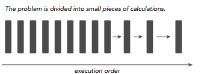
但是串行计算的缺点非常明显，如果我们拥有多核处理器，我们可以利用多核处理器同时处理多个任务时，而且这些小任务并没有关联关系（不需要相互依赖，比如我的计算任务不需要用到你的计算结果），那我们为什么还要使用串行编程呢？为了进一步加快大任务的计算速度，我们可以把一些独立的模块分配到不同的处理器上进行同时计算（这就是并行），最后再将这些结果进行整合，完成一次任务计算。下图就是将一个大的计算任务分解为小任务，然后将独立的小任务分配到不同处理器进行并行计算，最后再通过串行程序把结果汇总完成这次的总的计算任务。
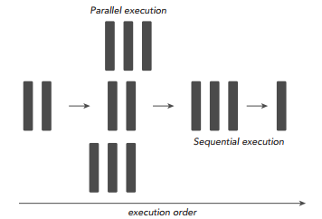
所以，一个程序可不可以进行并行计算，关键就在于我们要分析出该程序可以拆分出哪几个执行模块，这些执行模块哪些是独立的，哪些又是强依赖强耦合的，独立的模块我们可以试着设计并行计算，充分利用多核处理器的优势进一步加速我们的计算任务，强耦合模块我们就使用串行编程，利用串行+并行的编程思路完成一次高性能计算。

接下来我们谈谈CPU和GPU有什么区别，他们俩各自有什么特点，我们在谈并行、串行计算时多次谈到“多核”的概念，现在我们先从“核”的角度开始这个话题。首先CPU是专为顺序串行处理而优化的几个核心组成。而GPU则由数以千计的更小、更高效的核心组成，这些核心专门为同时处理多任务而设计，可高效地处理并行任务。也就是，CPU虽然每个核心自身能力极强，处理任务上非常强悍，无奈他核心少，在并行计算上表现不佳；反观GPU，虽然他的每个核心的计算能力不算强，但他胜在核心非常多，可以同时处理多个计算任务，在并行计算的支持上做得很好。

GPU和CPU的不同硬件特点决定了他们的应用场景，CPU是计算机的运算和控制的核心，GPU主要用作图形图像处理。图像在计算机呈现的形式就是矩阵，我们对图像的处理其实就是操作各种矩阵进行计算，而很多矩阵的运算其实可以做并行化，这使得图像处理可以做得很快，因此GPU在图形图像领域也有了大展拳脚的机会。下图表示的就是一个多GPU计算机硬件系统，可以看出，一个GPU内存就有很多个SP和各类内存，这些硬件都是GPU进行高效并行计算的基础。
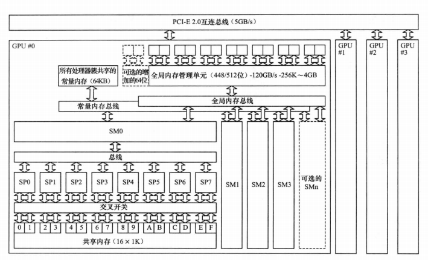
现在再从数据处理的角度来对比CPU和GPU的特点。CPU需要很强的通用性来处理各种不同的数据类型，比如整型、浮点数等，同时它又必须擅长处理逻辑判断所导致的大量分支跳转和中断处理，所以CPU其实就是一个能力很强的伙计，他能把很多事处理得妥妥当当，当然啦我们需要给他很多资源供他使用（各种硬件），这也导致了CPU不可能有太多核心（核心总数不超过16）。而GPU面对的则是类型高度统一的、相互无依赖的大规模数据和不需要被打断的纯净的计算环境，GPU有非常多核心（费米架构就有512核），虽然其核心的能力远没有CPU的核心强，但是胜在多，
在处理简单计算任务时呈现出“人多力量大”的优势，这就是并行计算的魅力。

整理一下两者特点就是：

+ `CPU`：擅长流程控制和逻辑处理，不规则数据结构，不可预测存储结构，单线程程序，分支密集型算法
+ `GPU`：擅长数据并行计算，规则数据结构，可预测存储模式
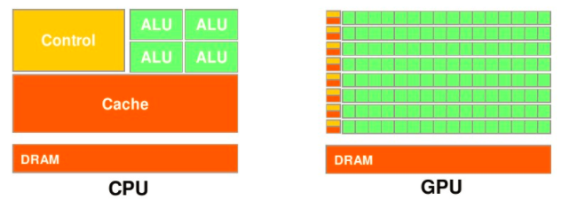

现在的计算机体系架构中，要完成CUDA并行计算，单靠GPU一人之力是不能完成计算任务的，必须借助CPU来协同配合完成一次高性能的并行计算任务。

一般而言，并行部分在GPU上运行，串行部分在CPU运行，这就是异构计算。具体一点，异构计算的意思就是不同体系结构的处理器相互协作完成计算任务。CPU负责总体的程序流程，而GPU负责具体的计算任务，当GPU各个线程完成计算任务后，我们就将GPU那边计算得到的结果拷贝到CPU端，完成一次计算任务。
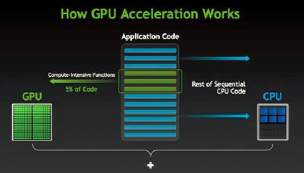

所以应用程序利用GPU实现加速的总体分工就是：密集计算代码（约占5%的代码量）由GPU负责完成，剩余串行代码由CPU负责执行。

## 2. CUDA线程模型
下面我们介绍CUDA的线程组织结构。首先我们都知道，线程是程序执行的最基本单元，CUDA的并行计算就是通过成千上万个线程的并行执行来实现的。下面的机构图说明了GPU的不同层次的结构。

CUDA的线程模型从小往大来总结就是：

1. Thread：线程，并行的基本单位
2. Thread Block：线程块，互相合作的线程组，线程块有如下几个特点：
    + 允许彼此同步
    + 可以通过共享内存快速交换数据
    + 以1维、2维或3维组织
3. Grid：一组线程块
    + 以1维、2维组织
    + 共享全局内存
4. Kernel：在GPU上执行的核心程序，这个kernel函数是运行在某个Grid上的。

    + One kernel <-> One Grid
每一个block和每个thread都有自己的ID，我们通过相应的索引找到相应的线程和线程块。

+ threadIdx，blockIdx
+ Block ID: 1D or 2D
+ Thread ID: 1D, 2D or 3D
理解kernel，必须要对kernel的线程层次结构有一个清晰的认识。首先GPU上很多并行化的轻量级线程。kernel在device上执行时实际上是启动很多线程，一个kernel所启动的所有线程称为一个网格（grid），同一个网格上的线程共享相同的全局内存空间，grid是线程结构的第一层次，而网格又可以分为很多线程块（block），一个线程块里面包含很多线程，这是第二个层次。线程两层组织结构如上图所示，这是一个gird和block均为2-dim的线程组织。grid和block都是定义为dim3类型的变量，dim3可以看成是包含三个无符号整数（x，y，z）成员的结构体变量，在定义时，缺省值初始化为1。因此grid和block可以灵活地定义为1-dim，2-dim以及3-dim结构，kernel调用时也必须通过执行配置<<<grid, block>>>来指定kernel所使用的网格维度和线程块维度。举个例子，我们以上图为例，分析怎么通过<<<grid,block>>>>这种标记方式索引到我们想要的那个线程。CUDA的这种<<<grid,block>>>其实就是一个多级索引的方法，第一级索引是(grid.xIdx, grid.yIdy)，对应上图例子就是(1, 1)，通过它我们就能找到了这个线程块的位置，然后我们启动二级索引(block.xIdx, block.yIdx, block.zIdx)来定位到指定的线程。这就是我们CUDA的线程组织结构。

这里想谈谈SP和SM（流处理器），很多人会被这两个专业名词搞得晕头转向。

+ **SP：最基本的处理单元，streaming processor**，也称为CUDA core。最后具体的指令和任务都是在SP上处理的。GPU进行并行计算，也就是很多个SP同时做处理。
+ **SM：多个SP加上其他的一些资源组成一个streaming multiprocessor**。也叫GPU大核，其他资源如：warp scheduler，register，shared memory等。SM可以看做GPU的心脏（对比CPU核心），register和shared memory是SM的稀缺资源。CUDA将这些资源分配给所有驻留在SM中的threads。因此，这些有限的资源就使每个SM中active warps有非常严格的限制，也就限制了并行能力。
需要指出，每个SM包含的SP数量依据GPU架构而不同，Fermi架构GF100是32个，GF10X是48个，Kepler架构都是192个，Maxwell都是128个。

简而言之，SP是线程执行的硬件单位，SM中包含多个SP，一个GPU可以有多个SM（比如16个），最终一个GPU可能包含有上千个SP。这么多核心“同时运行”，速度可想而知，这个引号只是想表明实际上，软件逻辑上是所有SP是并行的，但是物理上并不是所有SP都能同时执行计算（比如我们只有8个SM却有1024个线程块需要调度处理），因为有些会处于挂起，就绪等其他状态，这有关GPU的线程调度。

下面这个图将从硬件角度和软件角度解释CUDA的线程模型。
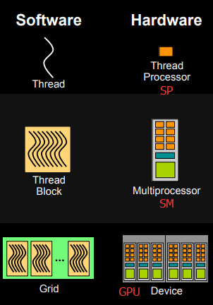

+ 每个线程由每个线程处理器（SP）执行
+ 线程块由多核处理器（SM）执行
+ 一个kernel其实由一个grid来执行，一个kernel一次只能在一个GPU上执行
block是软件概念，一个block只会由一个sm调度，程序员在开发时，通过设定block的属性，告诉GPU硬件，我有多少个线程，线程怎么组织。而具体怎么调度由sm的warps scheduler负责，block一旦被分配好SM，该block就会一直驻留在该SM中，直到执行结束。一个SM可以同时拥有多个blocks，但需要序列执行。下图显示了GPU内部的硬件架构：
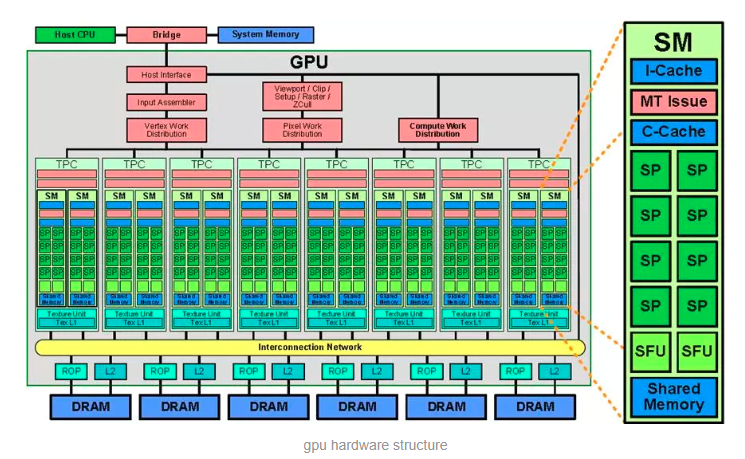
## 3. CUDA内存模型
CUDA中的内存模型分为以下几个层次：

+ 每个线程都用自己的registers（寄存器）
+ 每个线程都有自己的local memory（局部内存）
+ 每个线程块内都有自己的shared memory（共享内存），所有线程块内的所有线程共享这段内存资源
+ 每个grid都有自己的global memory（全局内存），不同线程块的线程都可使用
+ 每个grid都有自己的constant memory（常量内存）和texture memory（纹理内存），），不同线程块的线程都可使用
线程访问这几类存储器的速度是register > local memory >shared memory > global memory

下面这幅图表示就是这些内存在计算机架构中的所在层次。
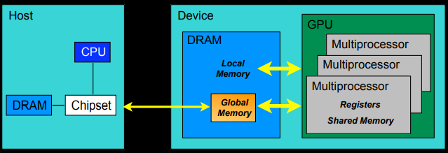

## 4. CUDA编程模型
上面讲了这么多硬件相关的知识点，现在终于可以开始说说CUDA是怎么写程序的了。

我们先捋一捋常见的CUDA术语：
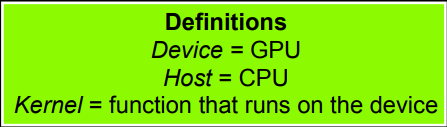
**第一个要掌握的编程要点**：我们怎么写一个能在GPU跑的程序或函数呢？

通过关键字就可以表示某个程序在CPU上跑还是在GPU上跑！如下表所示，比如我们用__global__定义一个kernel函数，就是CPU上调用，GPU上执行，注意__global__函数的返回值必须设置为void。

**第二个编程要点**：CPU和GPU间的数据传输怎么写？

首先介绍在GPU内存分配回收内存的函数接口：

+ `cudaMalloc()`: 在设备端分配global memory
+ `cudaFree()`: 释放存储空间
CPU的数据和GPU端数据做数据传输的函数接口是一样的，他们通过传递的函数实参（枚举类型）来表示传输方向：

+ cudaMemcpy(void dst, void src, size_t nbytes,
enum cudaMemcpyKind direction)

`enum cudaMemcpyKind`:

+ `cudaMemcpyHostToDevice`（CPU到GPU）
+ `cudaMemcpyDeviceToHost`（GPU到CPU）
+ `cudaMemcpyDeviceToDevice`（GPU到GPU）
**第三个编程要点**：怎么用代码表示线程组织模型？
我们可以用dim3类来表示网格和线程块的组织方式，网格grid可以表示为一维和二维格式，线程块block可以表示为一维、二维和三维的数据格式。
```C
dim3 DimGrid(100, 50);  //5000个线程块，维度是100*50
dim3 DimBlock(4, 8, 8);  //每个线层块内包含256个线程，线程块内的维度是4*8*8
```
接下来介绍一个非常重要又很难懂的一个知识点，我们怎么计算线程号呢？

**1.使用N个线程块，每一个线程块只有一个线程，即**
```C
dim3 dimGrid(N);
dim3 dimBlock(1);
```
此时的线程号的计算方式就是
```C
threadId = blockIdx.x;
```
其中threadId的取值范围为0到N-1。对于这种情况，我们可以将其看作是一个列向量，列向量中的每一行对应一个线程块。列向量中每一行只有1个元素，对应一个线程。

**2.使用M×N个线程块，每个线程块1个线程**
由于线程块是2维的，故可以看做是一个M*N的2维矩阵，其线程号有两个维度，即：
```C
dim3 dimGrid(M,N);
dim3 dimBlock(1);
```
其中
```C
blockIdx.x 取值0到M-1
blcokIdx.y 取值0到N-1
```
这种情况一般用于处理2维数据结构，比如2维图像。每一个像素用一个线程来处理，此时需要线程号来映射图像像素的对应位置，如
```C
pos = blockIdx.y * blcokDim.x + blockIdx.x; //其中gridDim.x等于M
```
**3.使用一个线程块，该线程具有N个线程，即**
```C
dim3 dimGrid(1);
dim3 dimBlock(N);
```
此时线程号的计算方式为
```C
threadId = threadIdx.x;
```
其中threadId的范围是0到N-1，对于这种情况，可以看做是一个行向量，行向量中的每一个元素的每一个元素对应着一个线程。

**4.使用M个线程块，每个线程块内含有N个线程，即**
```C
dim3 dimGrid(M);
dim3 dimBlock(N);
```
这种情况，可以把它想象成二维矩阵，矩阵的行与线程块对应，矩阵的列与线程编号对应，那线程号的计算方式为
```C
threadId = threadIdx.x + blcokIdx*blockDim.x;
```
上面其实就是把二维的索引空间转换为一维索引空间的过程。

**5.使用M×N的二维线程块，每一个线程块具有P×Q个线程，即**
```C
dim3 dimGrid(M, N);
dim3 dimBlock(P, Q);
```
这种情况其实是我们遇到的最多情况，特别适用于处理具有二维数据结构的算法，比如图像处理领域。

其索引有两个维度
```C
threadId.x = blockIdx.x*blockDim.x+threadIdx.x;
threadId.y = blockIdx.y*blockDim.y+threadIdx.y;
```
上述公式就是把线程和线程块的索引映射为图像像素坐标的计算方法。

## CUDA应用例子
我们已经掌握了CUDA编程的基本语法，现在我们开始以一些小例子来真正上手CUDA。

首先我们编写一个程序，查看我们GPU的一些硬件配置情况。
```C
#include "device_launch_parameters.h"
#include <iostream>

int main()
{
    int deviceCount;
    cudaGetDeviceCount(&deviceCount);
    for(int i=0;i<deviceCount;i++)
    {
        cudaDeviceProp devProp;
        cudaGetDeviceProperties(&devProp, i);
        std::cout << "使用GPU device " << i << ": " << devProp.name << std::endl;
        std::cout << "设备全局内存总量： " << devProp.totalGlobalMem / 1024 / 1024 << "MB" << std::endl;
        std::cout << "SM的数量：" << devProp.multiProcessorCount << std::endl;
        std::cout << "每个线程块的共享内存大小：" << devProp.sharedMemPerBlock / 1024.0 << " KB" << std::endl;
        std::cout << "每个线程块的最大线程数：" << devProp.maxThreadsPerBlock << std::endl;
        std::cout << "设备上一个线程块（Block）种可用的32位寄存器数量： " << devProp.regsPerBlock << std::endl;
        std::cout << "每个EM的最大线程数：" << devProp.maxThreadsPerMultiProcessor << std::endl;
        std::cout << "每个EM的最大线程束数：" << devProp.maxThreadsPerMultiProcessor / 32 << std::endl;
        std::cout << "设备上多处理器的数量： " << devProp.multiProcessorCount << std::endl;
        std::cout << "======================================================" << std::endl;     
        
    }
    return 0;
}
```
我们利用nvcc来编译程序。
```shell
nvcc test1.cu -o test1
```
输出结果：因为我的服务器是8个TITAN GPU，为了省略重复信息，下面只显示两个GPU结果
```shell
使用GPU device 0: TITAN X (Pascal)
设备全局内存总量： 12189MB
SM的数量：28
每个线程块的共享内存大小：48 KB
每个线程块的最大线程数：1024
设备上一个线程块（Block）种可用的32位寄存器数量： 65536
每个EM的最大线程数：2048
每个EM的最大线程束数：64
设备上多处理器的数量： 28
======================================================
使用GPU device 1: TITAN X (Pascal)
设备全局内存总量： 12189MB
SM的数量：28
每个线程块的共享内存大小：48 KB
每个线程块的最大线程数：1024
设备上一个线程块（Block）种可用的32位寄存器数量： 65536
每个EM的最大线程数：2048
每个EM的最大线程束数：64
设备上多处理器的数量： 28
======================================================

.......
```

### 第一个计算任务：将两个元素数目为1024×1024的float数组相加。

首先我们思考一下如果只用CPU我们怎么串行完成这个任务。
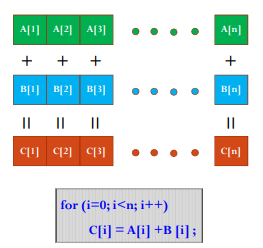

```C
#include <iostream>
#include <stdlib.h>
#include <sys/time.h>
#include <math.h>

using namespace std;

int main()
{
    struct timeval start, end;
    gettimeofday( &start, NULL );
    float*A, *B, *C;
    int n = 1024 * 1024;
    int size = n * sizeof(float);
    A = (float*)malloc(size);
    B = (float*)malloc(size);
    C = (float*)malloc(size);

    for(int i=0;i<n;i++)
    {
        A[i] = 90.0;
        B[i] = 10.0;
    }
    
    for(int i=0;i<n;i++)
    {
        C[i] = A[i] + B[i];
    }

    float max_error = 0.0;
    for(int i=0;i<n;i++)
    {
        max_error += fabs(100.0-C[i]);
    }
    cout << "max_error is " << max_error << endl;
    gettimeofday( &end, NULL );
    int timeuse = 1000000 * ( end.tv_sec - start.tv_sec ) + end.tv_usec - start.tv_usec;
    cout << "total time is " << timeuse/1000 << "ms" <<endl;
    return 0;
}
```
CPU方式输出结果
```shell
max_error is 0
total time is 22ms
```
如果我们使用GPU来做并行计算，速度将会如何呢？
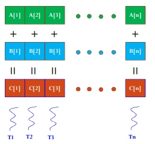
编程要点：

+ 每个Block中的Thread数最大不超过512；
+ 为了充分利用SM，Block数尽可能多，>100。
```C
#include "cuda_runtime.h"
#include <stdlib.h>
#include <iostream>
#include <sys/time.h>

using namespace std;

__global__ void Plus(float A[], float B[], float C[], int n)
{
    int i = blockDim.x * blockIdx.x + threadIdx.x;
    C[i] = A[i] + B[i];
}

int main()
{
    struct timeval start, end;
    gettimeofday( &start, NULL );
    float*A, *Ad, *B, *Bd, *C, *Cd;
    int n = 1024 * 1024;
    int size = n * sizeof(float);

    // CPU端分配内存
    A = (float*)malloc(size);
    B = (float*)malloc(size);
    C = (float*)malloc(size);

    // 初始化数组
    for(int i=0;i<n;i++)
    {
        A[i] = 90.0;
        B[i] = 10.0;
    }

    // GPU端分配内存
    cudaMalloc((void**)&Ad, size);
    cudaMalloc((void**)&Bd, size);
    cudaMalloc((void**)&Cd, size);

    // CPU的数据拷贝到GPU端
    cudaMemcpy(Ad, A, size, cudaMemcpyHostToDevice);
    cudaMemcpy(Bd, B, size, cudaMemcpyHostToDevice);
    cudaMemcpy(Bd, B, size, cudaMemcpyHostToDevice);

    // 定义kernel执行配置，（1024*1024/512）个block，每个block里面有512个线程
    dim3 dimBlock(512);
    dim3 dimGrid(n/512);

    // 执行kernel
    Plus<<<dimGrid, dimBlock>>>(Ad, Bd, Cd, n);

    // 将在GPU端计算好的结果拷贝回CPU端
    cudaMemcpy(C, Cd, size, cudaMemcpyDeviceToHost);

    // 校验误差
    float max_error = 0.0;
    for(int i=0;i<n;i++)
    {
        max_error += fabs(100.0 - C[i]);
    }

    cout << "max error is " << max_error << endl;

    // 释放CPU端、GPU端的内存
    free(A);
    free(B);
    free(C);
    cudaFree(Ad);
    cudaFree(Bd);
    cudaFree(Cd);
    gettimeofday( &end, NULL );
    int timeuse = 1000000 * ( end.tv_sec - start.tv_sec ) + end.tv_usec - start.tv_usec;
    cout << "total time is " << timeuse/1000 << "ms" <<endl;
    return 0;
}
```
GPU方式输出结果
```shell
max error is 0
total time is 1278ms
```
由上面的例子看出，使用CUDA编程时我们看不到for循环了，因为CPU编程的循环已经被分散到各个thread上做了，所以我们也就看到不到for一类的语句。从结果上看，CPU的循环计算的速度比GPU计算快多了，原因就在于CUDA中有大量的内存拷贝操作（数据传输花费了大量时间，而计算时间却非常少），如果计算量比较小的话，CPU计算会更合适一些。

下面计算一个稍微复杂的例子
### 矩阵加法
即对两个矩阵对应坐标的元素相加后的结果存储在第三个的对应位置的元素上。

值得注意的是，这个计算任务我采用了二维数组的计算方式，注意一下二维数组在CUDA编程中的写法。

#### CPU版本
```C
#include <stdlib.h>
#include <iostream>
#include <sys/time.h>
#include <math.h>

#define ROWS 1024
#define COLS 1024

using namespace std;

int main()
{
    struct timeval start, end;
    gettimeofday( &start, NULL );
    int *A, **A_ptr, *B, **B_ptr, *C, **C_ptr;
    int total_size = ROWS*COLS*sizeof(int);
    A = (int*)malloc(total_size);
    B = (int*)malloc(total_size);
    C = (int*)malloc(total_size);
    A_ptr = (int**)malloc(ROWS*sizeof(int*));
    B_ptr = (int**)malloc(ROWS*sizeof(int*));
    C_ptr = (int**)malloc(ROWS*sizeof(int*));
    
    //CPU一维数组初始化
    for(int i=0;i<ROWS*COLS;i++)
    {
        A[i] = 80;
        B[i] = 20;
    }
    
    for(int i=0;i<ROWS;i++)
    {
        A_ptr[i] = A + COLS*i;
        B_ptr[i] = B + COLS*i;
        C_ptr[i] = C + COLS*i;
    }
    
    for(int i=0;i<ROWS;i++)
        for(int j=0;j<COLS;j++)
        {
            C_ptr[i][j] = A_ptr[i][j] + B_ptr[i][j];
        }
        
    //检查结果
    int max_error = 0;
    for(int i=0;i<ROWS*COLS;i++)
    {
        //cout << C[i] << endl;
        max_error += abs(100-C[i]);
    }
    
    cout << "max_error is " << max_error <<endl;     
    gettimeofday( &end, NULL );
    int timeuse = 1000000 * ( end.tv_sec - start.tv_sec ) + end.tv_usec - start.tv_usec;
    cout << "total time is " << timeuse/1000 << "ms" <<endl;
    
    return 0;
}
```
CPU方式输出
```shell
max_error is 0
total time is 29ms
```
#### GPU版本
```C
#include "cuda_runtime.h"
#include "device_launch_parameters.h"
#include <sys/time.h> 
#include <stdio.h>
#include <math.h>
#define Row  1024
#define Col 1024
 
 
__global__ void addKernel(int **C,  int **A, int ** B)
{
    int idx = threadIdx.x + blockDim.x * blockIdx.x;
    int idy = threadIdx.y + blockDim.y * blockIdx.y;
    if (idx < Col && idy < Row) {
        C[idy][idx] = A[idy][idx] + B[idy][idx];
    }
}
 
int main()
{
    struct timeval start, end;
    gettimeofday( &start, NULL );

    int **A = (int **)malloc(sizeof(int*) * Row);
    int **B = (int **)malloc(sizeof(int*) * Row);
    int **C = (int **)malloc(sizeof(int*) * Row);
    int *dataA = (int *)malloc(sizeof(int) * Row * Col);
    int *dataB = (int *)malloc(sizeof(int) * Row * Col);
    int *dataC = (int *)malloc(sizeof(int) * Row * Col);
    int **d_A;
    int **d_B;
    int **d_C;
    int *d_dataA;
    int *d_dataB;
    int *d_dataC;
    //malloc device memory
    cudaMalloc((void**)&d_A, sizeof(int **) * Row);
    cudaMalloc((void**)&d_B, sizeof(int **) * Row);
    cudaMalloc((void**)&d_C, sizeof(int **) * Row);
    cudaMalloc((void**)&d_dataA, sizeof(int) *Row*Col);
    cudaMalloc((void**)&d_dataB, sizeof(int) *Row*Col);
    cudaMalloc((void**)&d_dataC, sizeof(int) *Row*Col);
    //set value
    for (int i = 0; i < Row*Col; i++) {
        dataA[i] = 90;
        dataB[i] = 10;
    }
    //将主机指针A指向设备数据位置，目的是让设备二级指针能够指向设备数据一级指针
    //A 和  dataA 都传到了设备上，但是二者还没有建立对应关系
    for (int i = 0; i < Row; i++) {
        A[i] = d_dataA + Col * i;
        B[i] = d_dataB + Col * i;
        C[i] = d_dataC + Col * i;
    }
                                                                
    cudaMemcpy(d_A, A, sizeof(int*) * Row, cudaMemcpyHostToDevice);
    cudaMemcpy(d_B, B, sizeof(int*) * Row, cudaMemcpyHostToDevice);
    cudaMemcpy(d_C, C, sizeof(int*) * Row, cudaMemcpyHostToDevice);
    cudaMemcpy(d_dataA, dataA, sizeof(int) * Row * Col, cudaMemcpyHostToDevice);
    cudaMemcpy(d_dataB, dataB, sizeof(int) * Row * Col, cudaMemcpyHostToDevice);
    dim3 threadPerBlock(16, 16);
    dim3 blockNumber( (Col + threadPerBlock.x - 1)/ threadPerBlock.x, (Row + threadPerBlock.y - 1) / threadPerBlock.y );
    printf("Block(%d,%d)   Grid(%d,%d).\n", threadPerBlock.x, threadPerBlock.y, blockNumber.x, blockNumber.y);
    addKernel << <blockNumber, threadPerBlock >> > (d_C, d_A, d_B);
    //拷贝计算数据-一级数据指针
    cudaMemcpy(dataC, d_dataC, sizeof(int) * Row * Col, cudaMemcpyDeviceToHost);
                                                                                             
    int max_error = 0;
    for(int i=0;i<Row*Col;i++)
    {
        //printf("%d\n", dataC[i]);
        max_error += abs(100-dataC[i]);
    }

    //释放内存
    free(A);
    free(B);
    free(C);
    free(dataA);
    free(dataB);
    free(dataC);
    cudaFree(d_A);
    cudaFree(d_B);
    cudaFree(d_C);
    cudaFree(d_dataA);
    cudaFree(d_dataB);
    cudaFree(d_dataC);

    printf("max_error is %d\n", max_error);
    gettimeofday( &end, NULL );
    int timeuse = 1000000 * ( end.tv_sec - start.tv_sec ) + end.tv_usec - start.tv_usec;
    printf("total time is %d ms\n", timeuse/1000);

    return 0;
}
```
GPU输出
```shell
Block(16,16)   Grid(64,64).
max_error is 0
total time is 442 ms
```
从结果看出，CPU计算时间还是比GPU的计算时间短。这里需要指出的是，这种二维数组的程序写法的效率并不高（虽然比较符合我们的思维方式），因为我们做了两次访存操作。所以一般而言，做高性能计算一般不会采取这种编程方式。

最后一个例子我们将计算一个更加复杂的任务
### 矩阵乘法

回顾一下矩阵乘法：两矩阵相乘，左矩阵第一行乘以右矩阵第一列（分别相乘，第一个数乘第一个数），乘完之后相加，即为结果的第一行第一列的数，依次往下算，直到计算完所有矩阵元素。
#### CPU版本

```C
#include <iostream>
#include <stdlib.h>
#include <sys/time.h>

#define ROWS 1024
#define COLS 1024

using namespace std;

void matrix_mul_cpu(float* M, float* N, float* P, int width)
{
    for(int i=0;i<width;i++)
        for(int j=0;j<width;j++)
        {
            float sum = 0.0;
            for(int k=0;k<width;k++)
            {
                float a = M[i*width+k];
                float b = N[k*width+j];
                sum += a*b;
            }
            P[i*width+j] = sum;
        }
}

int main()
{
    struct timeval start, end;
    gettimeofday( &start, NULL );
    float *A, *B, *C;
    int total_size = ROWS*COLS*sizeof(float);
    A = (float*)malloc(total_size);
    B = (float*)malloc(total_size);
    C = (float*)malloc(total_size);

    //CPU一维数组初始化
    for(int i=0;i<ROWS*COLS;i++)
    {
        A[i] = 80.0;
        B[i] = 20.0;
    }

    matrix_mul_cpu(A, B, C, COLS);

    gettimeofday( &end, NULL );
    int timeuse = 1000000 * ( end.tv_sec - start.tv_sec ) + end.tv_usec - start.tv_usec;
    cout << "total time is " << timeuse/1000 << "ms" <<endl;

    return 0;
}
```

CPU输出
```shell
total time is 7617ms
```
梳理一下CUDA求解矩阵乘法的思路：因为C=A×B，我们利用每个线程求解C矩阵每个(x, y)的元素，每个线程载入A的一行和B的一列，遍历各自行列元素，对A、B对应的元素做一次乘法和一次加法。
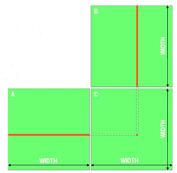

#### GPU版本
```C
#include "cuda_runtime.h"
#include "device_launch_parameters.h"
#include <sys/time.h> 
#include <stdio.h>
#include <math.h>
#define Row  1024
#define Col 1024

 
__global__ void matrix_mul_gpu(int *M, int* N, int* P, int width)
{
    int i = threadIdx.x + blockDim.x * blockIdx.x;
    int j = threadIdx.y + blockDim.y * blockIdx.y;
                
    int sum = 0;
    for(int k=0;k<width;k++)
    {
        int a = M[j*width+k];
        int b = N[k*width+i];
        sum += a*b;
    }
    P[j*width+i] = sum;
}
 
int main()
{
    struct timeval start, end;
    gettimeofday( &start, NULL );

    int *A = (int *)malloc(sizeof(int) * Row * Col);
    int *B = (int *)malloc(sizeof(int) * Row * Col);
    int *C = (int *)malloc(sizeof(int) * Row * Col);
    //malloc device memory
    int *d_dataA, *d_dataB, *d_dataC;
    cudaMalloc((void**)&d_dataA, sizeof(int) *Row*Col);
    cudaMalloc((void**)&d_dataB, sizeof(int) *Row*Col);
    cudaMalloc((void**)&d_dataC, sizeof(int) *Row*Col);
    //set value
    for (int i = 0; i < Row*Col; i++) {
        A[i] = 90;
        B[i] = 10;
    }
                                                                
    cudaMemcpy(d_dataA, A, sizeof(int) * Row * Col, cudaMemcpyHostToDevice);
    cudaMemcpy(d_dataB, B, sizeof(int) * Row * Col, cudaMemcpyHostToDevice);
    dim3 threadPerBlock(16, 16);
    dim3 blockNumber((Col+threadPerBlock.x-1)/ threadPerBlock.x, (Row+threadPerBlock.y-1)/ threadPerBlock.y );
    printf("Block(%d,%d)   Grid(%d,%d).\n", threadPerBlock.x, threadPerBlock.y, blockNumber.x, blockNumber.y);
    matrix_mul_gpu << <blockNumber, threadPerBlock >> > (d_dataA, d_dataB, d_dataC, Col);
    //拷贝计算数据-一级数据指针
    cudaMemcpy(C, d_dataC, sizeof(int) * Row * Col, cudaMemcpyDeviceToHost);
                                                                                             
    //释放内存
    free(A);
    free(B);
    free(C);
    cudaFree(d_dataA);
    cudaFree(d_dataB);
    cudaFree(d_dataC);

    gettimeofday( &end, NULL );
    int timeuse = 1000000 * ( end.tv_sec - start.tv_sec ) + end.tv_usec - start.tv_usec;
    printf("total time is %d ms\n", timeuse/1000);

    return 0;
}
```
GPU输出
```shell
Block(16,16)   Grid(64,64).
total time is 506 ms
```
从这个矩阵乘法任务可以看出，我们通过GPU进行并行计算的方式仅花费了0.5秒，但是CPU串行计算方式却花费了7.6秒，计算速度提升了十多倍，可见并行计算的威力！