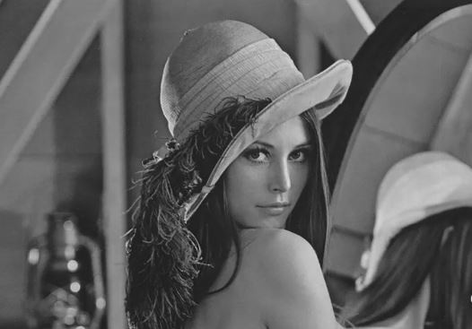
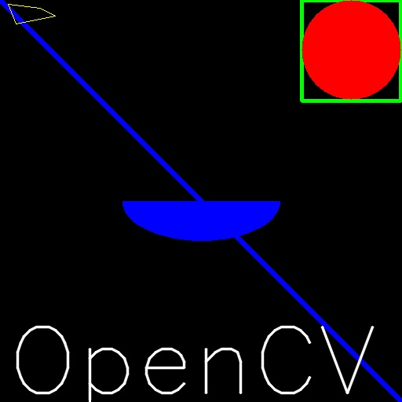
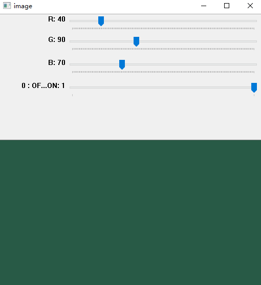

# 图像入门

## 目标

- 在这里，您将学习如何读取图像，如何显示图像以及如何将其保存回
- 您将学习以下功能：`cv.imread()`，`cv.imshow()`，`cv.imwrite()`
- （可选）您将学习如何使用Matplotlib显示图像

## 读取图像

使用函数`cv.imread()`读取图像

第二个参数是一个标志，用于指定应读取图像的方式。

- `cv.IMREAD_COLOR`：加载彩色图像。图像的任何透明度都将被忽略。这是默认标志。
- `cv.IMREAD_GRAYSCALE`：以灰度模式加载图像
- `cv.IMREAD_UNCHANGED`：加载图像，包括`alpha`通道

> 警告,即使图像路径错误，它也不会引发任何错误，但是`print img`会给您`None`

> 除了这三个标志，您可以分别简单地传递整数1、0或-1。

### 示例

```python
import cv2 as cv

img = cv.imread('images/lena.jpg',0)
```

## 显示图像

使用函数`cv.imshow()`在窗口中显示图像。窗口自动适合图像尺寸。

第一个参数是窗口名称，它是一个字符串。第二个参数是我们的图像。

### 示例

```python
import cv2 as cv

img = cv.imread('images/lena.jpg',0)
cv.imshow('lena',img)
cv.waitKey(0)
cv.destroyAllWindows()
```



`cv.waitKey()`是键盘绑定功能。它的参数是时间（以毫秒为单位）。该函数将为任何键盘事件等待指定的毫秒数。如果在此期间按任意键，程序将继续。如果传递 0，它将无限期地等待击键。还可以将其设置为检测特定的按键

> 除了绑定键盘事件之外，此功能还处理许多其他GUI事件，因此必须使用它来实际显示图像。

`cv.destroyAllWindows()`只会破坏我们创建的所有窗口。如果要销毁任何特定的窗口，请使用函数 `cv.destroyWindow()`在其中传递确切的窗口名称作为参数。

> 在一种特殊情况下，您已经可以创建一个窗口并稍后将图像加载到该窗口。在这种情况下，您可以指定窗口是否可调整大小。这是通过功能cv.namedWindow（）完成的。默认情况下，该标志为cv.WINDOW_AUTOSIZE。但是，如果将flag指定为cv.WINDOW_NORMAL，则可以调整窗口大小。当图像尺寸过大并将跟踪栏添加到窗口时，这将很有帮助。

```python
cv.namedWindow（'image'，cv.WINDOW_NORMAL）
cv.imshow（'image'，img）
cv.waitKey（0）
cv.destroyAllWindows（）
```

## 写图像

使用函数`cv.imwrite()`保存图像。

第一个参数是文件名，第二个参数是您要保存的图像。

```
cv.imwrite（'messigray.png'，img）
```

这会将图像以PNG格式保存在工作目录中。

## 总结一下

下面的程序以灰度加载图像，显示它，如果按“ s”保存该图像然后退出，或者如果按ESC键只是退出而不保存即可

```python
import cv2 as cv

img = cv.imread('images/lena.jpg',0)
cv.imshow('image',img)
k = cv.waitKey(0)

if k == ord('s'):
    cv.imwrite('test1.jpg',img)
elif k == 27:
    cv.destroyAllWindows()
```

> 如果使用的是64位计算机，则必须`k = cv.waitKey(0)`按如下所示修改行：`k = cv.waitKey(0) & 0xFF`

> OpenCV加载的彩色图像处于BGR模式。但是Matplotlib以RGB模式显示。

# 视频入门

## 目标

- 学习阅读视频，显示视频和保存视频。
- 学习从相机捕捉并显示它。
- 您将学习以下功能：`cv.VideoCapture()`，`cv.VideoWriter()`

## 从相机捕获视频

要捕获视频，您需要创建一个`VideoCapture`对象。它的参数可以是设备索引或视频文件的名称。设备索引只是指定哪个摄像机的编号。通常，将连接一台摄像机（以我的情况为例）。所以我只是传递0（或-1）。您可以通过传递1来选择第二台摄像机，依此类推。之后，您可以逐帧捕获。但是最后，不要忘记释放捕获。

```python
import cv2 as cv

cap = cv.VideoCapture(0)
if not cap.isOpened():
    print("Cannot open camera")
    exit()
while True:
    ret , frame = cap.read()
    
    if not ret:
        print("Can't receive frame (stream end?). Exiting ...")
        break
    gray = cv.cvtColor(frame,cv.COLOR_BGR2GRAY)
    cv.imshow('frame',gray)
    if cv.waitKey(1) == ord('q'):
        break
cap.release()
cv.destroyAllWindows()
```

`cap.read()`返回布尔值（True/ False）。如果正确读取了帧，它将为True。因此，您可以通过检查此返回值来检查视频的结尾。

有时，cap可能尚未初始化捕获。在这种情况下，此代码显示错误。您可以通过`cap.isOpened()`方法检查它是否已初始化。如果是True，那么确定。否则，使用`cap.open()`打开它。

您还可以使用`cap.get（propId）`方法访问此视频的某些功能，其中propId是0到18之间的一个数字。每个数字表示视频的属性（如果适用于该视频），并且可以显示完整的详细信息在这里看到：`cv :: VideoCapture :: get()`。其中一些值可以使用`cap.set（propId，value）`进行修改。价值是您想要的新价值。

例如，我可以通过和检查框架的宽度和高度。默认情况下，它的分辨率为640x480。但我想将其修改为320x240。只需使用和即可。

```python
cap.get(cv.CAP_PROP_FRAME_WIDTH)
cap.get(cv.CAP_PROP_FRAME_HEIGHT)
ret = cap.set(cv.CAP_PROP_FRAME_WIDTH,320)
ret = cap.set(cv.CAP_PROP_FRAME_HEIGHT,240)
```

## 从文件播放视频

它与从摄像机捕获相同，只是用视频文件名更改摄像机索引。另外，在显示框架时，请使用适当的时间`cv.waitKey()`。如果太少，则视频将非常快，而如果太高，则视频将变得很慢（嗯，这就是显示慢动作的方式）。正常情况下25毫秒就可以了。

```python
import numpy as np
import cv2 as cv
cap = cv.VideoCapture('vtest.avi')
while cap.isOpened():
    ret, frame = cap.read()
    # if frame is read correctly ret is True
    if not ret:
        print("Can't receive frame (stream end?). Exiting ...")
        break
    gray = cv.cvtColor(frame, cv.COLOR_BGR2GRAY)
    cv.imshow('frame', gray)
    if cv.waitKey(1) == ord('q'):
        break
cap.release()
cv.destroyAllWindows()
```

> 注意:
> 确保安装了正确版本的`ffmpeg`或`gstreamer`。有时，使用Video Capture令人头疼，主要是由于ffmpeg / gstreamer安装错误。

## 保存视频

因此，我们捕获了一个视频，对其进行逐帧处理，然后我们希望保存该视频。对于图像，这非常简单，只需使用即可`cv.imwrite()`。这里需要做更多的工作。

这次我们创建一个`VideoWriter`对象。我们应该指定输出文件名（例如：output.avi）。然后，我们应指定`FourCC`代码（下一段中的详细信息）。然后应传递每秒的帧数（fps）和帧大小。最后一个是`isColor`标志。如果为True，则编码器需要彩色框，否则将与灰度框一起使用。

`FourCC`是一个4字节的代码，用于指定视频编解码器。可用代码列表可在fourcc.org中找到。它取决于平台。遵循编解码器对我来说效果很好。

- 在Fedora中：DIVX，XVID，MJPG，X264，WMV1，WMV2。（最好使用XVID。MJPG可以生成大尺寸的视频。X264提供非常小的尺寸的视频）
- 在Windows中：DIVX（尚待测试和添加）
- 在OSX中：MJPG（.mp4），DIVX（.avi），X264（.mkv）。
  FourCC代码作为MJPG的`cv.VideoWriter_fourcc（'M'，'J'，'P'，'G'）`or `cv.VideoWriter_fourcc（*'MJPG'）`传递。

在从摄像机捕获的代码下面，沿垂直方向翻转每一帧并保存。

```python
import cv2 as cv

cap = cv.VideoCapture(0)

fourcc = cv.VideoWriter_fourcc(*'XVID')
out = cv.VideoWriter('output.avi',fourcc,20.0,(640,480))

while cap.isOpened():
    ret , frame = cap.read()
    if not ret:
        print("Can't receive frame (stream end?). Exiting ...")
        break
    frame = cv.flip(frame,0)
    
    out.write(frame)
    
    cv.imshow('frame',frame)
    if cv.waitKey(1) == ord('q'):
        break

cap.release()
out.release()
cv.destroyAllWindows()
```

`frame = cv.flip(frame,0)`是垂直翻转，改成1是水平翻转，例如默认情况下，我的电脑摄像头成像出来是左右相反的，这时候弄成水平翻转，有助于我们欣赏自己的容颜，尤其工作中用到的很多摄像头都需要这样处理一下

# OpenCV中的绘图功能

## 目标

- 学习使用OpenCV绘制不同的几何形状
- 您将学习以下功能：`cv.line()`，`cv.circle()`，`cv.rectangle()`，`cv.ellipse()`，`cv.putText()`等。

在上述所有功能中，您将看到一些常见的参数，如下所示：

- img：您要绘制形状的图像
- color：形状的颜色。对于BGR，将其作为元组传递，例如：（255,0,0）对于蓝色。对于灰度，只需传递标量值即可。
- thickness：线或圆等的粗细。如果对闭合图形（如圆）传递**-1 **，它将填充形状。默认厚度= 1
- lineType：线的类型，是否为8连接线，抗锯齿线等。默认情况下，为8连接线。 cv.LINE_AA给出了抗锯齿的线条，看起来非常适合曲线。

## 画线

要绘制一条线，您需要传递线的开始和结束坐标。我们将创建一个黑色图像，并从左上角到右下角在其上绘制一条蓝线。

```python
import cv2 as cv
import numpy as np

img = np.zeros((512,512,3),np.uint8)

cv.line(img,(0,0),(511,511),(255,0,0),5)
```

## 绘制矩形

要绘制矩形，您需要矩形的左上角和右下角。这次，我们将在图像的右上角绘制一个绿色矩形。

```python
cv.rectangle(img,(384,0),(510,128),(0,255,0),3)
```

## 绘制圆形

需要其中心坐标和半径

```python
cv.circle(img,(447,63), 63, (0,0,255), -1)
```

## 绘制椭圆

需要传递几个参数。一个参数是中心位置（x，y）。下一个参数是轴长度（长轴长度，短轴长度）。angle是椭圆沿逆时针方向旋转的角度。startAngle和endAngle表示从主轴沿顺时针方向测量的椭圆弧的开始和结束。即给出0和360给出完整的椭圆。

```python
cv.ellipse(img,(256,256),(100,50),0,0,180,255,-1)
```

## 绘图多边形

首先需要顶点的坐标。将这些点组成形状为ROWSx1x2的数组，其中ROWS是顶点数，并且其类型应为int32。在这里，我们绘制了一个带有四个顶点的黄色小多边形。

```python
pts = np.array([[10,5],[20,30],[70,20],[50,10]], np.int32)
pts = pts.reshape((-1,1,2))
cv.polylines(img,[pts],True,(0,255,255))
```

> 如果第三个参数为False，您将获得一条连接所有点的折线，而不是闭合形状。
> `cv.polylines()`可用于绘制多条线。只需创建要绘制的所有线条的列表，然后将其传递给函数即可。所有线条将单独绘制。与为每条线调用`cv.line()`相比，绘制一组线是一种更好，更快的方法。

## 向图像添加文本

要将文本放入图像中，需要指定以下内容。

- 您要写入的文字数据
- 您要放置它的位置坐标（即数据开始的左下角）。
- 字体类型（检查cv.putText()文档以获取受支持的字体）
- 字体比例（指定字体大小）
- 常规的内容，例如颜色等。为了更好看，建议使用lineType = cv.LINE_AA。

```ppython
font = cv.FONT_HERSHEY_SIMPLEX
cv.putText(img,'OpenCV',(10,500), font, 4,(255,255,255),2,cv.LINE_AA)
```

## 总结

结合之前的图像知识对绘图进行总结并保存结果图像

```python
import numpy as np
import cv2 as cv

img = np.zeros((512,512,3),np.uint8)

cv.line(img,(0,0),(511,511),(255,0,0),5)

cv.rectangle(img,(384,0),(510,128),(0,255,0),3)

cv.circle(img,(447,63),63,(0,0,255),-1)

cv.ellipse(img,(256,256),(100,50),0,0,180,255,-1)

pts = np.array([[10,5],[20,30],[70,20],[50,10]], np.int32)
pts = pts.reshape((-1,1,2))
cv.polylines(img,[pts],True,(0,255,255))

font = cv.FONT_HERSHEY_SIMPLEX
cv.putText(img,'OpenCV',(10,500), font, 4,(255,255,255),2,cv.LINE_AA)

cv.imshow('img',img)
cv.waitKey(0)
cv.destroyAllWindows()
cv.imwrite('drawing.jpg',img)
```

```
True
```

把上面保存的`drawing.jpg`显示出来：



# 用鼠标画东西

## 目标

- 了解如何在OpenCV中处理鼠标事件
- 您将学习以下功能：`cv.setMouseCallback()`

## 简单演示

在这里，我们创建一个简单的应用程序，无论我们在哪里双击它，都可以在图像上绘制一个圆。

首先，我们创建一个鼠标回调函数，该函数在发生鼠标事件时执行。鼠标事件可以是与鼠标相关的任何东西，例如左键按下，左键按下，左键双击等。它为我们提供了每个鼠标事件的坐标（x，y）。通过此活动和地点，我们可以做任何我们喜欢的事情。要列出所有可用的可用事件，请在Python终端中运行以下代码：

```python
import cv2 as cv
events = [i for i in dir(cv) if 'EVENT' in i]
print(events)
```

```
['EVENT_FLAG_ALTKEY', 'EVENT_FLAG_CTRLKEY', 'EVENT_FLAG_LBUTTON', 'EVENT_FLAG_MBUTTON', 'EVENT_FLAG_RBUTTON', 'EVENT_FLAG_SHIFTKEY', 'EVENT_LBUTTONDBLCLK', 'EVENT_LBUTTONDOWN', 'EVENT_LBUTTONUP', 'EVENT_MBUTTONDBLCLK', 'EVENT_MBUTTONDOWN', 'EVENT_MBUTTONUP', 'EVENT_MOUSEHWHEEL', 'EVENT_MOUSEMOVE', 'EVENT_MOUSEWHEEL', 'EVENT_RBUTTONDBLCLK', 'EVENT_RBUTTONDOWN', 'EVENT_RBUTTONUP']
```

在我们双击的地方绘制一个圆圈

```python
import numpy as np
import cv2 as cv
# mouse callback function
def draw_circle(event,x,y,flags,param):
    if event == cv.EVENT_LBUTTONDBLCLK:
        cv.circle(img,(x,y),100,(255,0,0),-1)
# Create a black image, a window and bind the function to window
img = np.zeros((512,512,3), np.uint8)
cv.namedWindow('image')
cv.setMouseCallback('image',draw_circle)
while(1):
    cv.imshow('image',img)
    if cv.waitKey(20) & 0xFF == 27:
        break
cv.destroyAllWindows()
```

## 更高级的演示

我们像在“画图”应用程序中一样，通过拖动鼠标来绘制矩形或圆形（取决于我们选择的模式）。因此，我们的鼠标回调函数有两个部分，一个用于绘制矩形，另一个用于绘制圆形。这个特定的示例对于创建和理解一些交互式应用程序（如对象跟踪，图像分割等）将非常有帮助。

```python
import numpy as np
import cv2 as cv
drawing = False # true if mouse is pressed
mode = True # if True, draw rectangle. Press 'm' to toggle to curve
ix,iy = -1,-1
# mouse callback function
def draw_circle(event,x,y,flags,param):
    global ix,iy,drawing,mode
    if event == cv.EVENT_LBUTTONDOWN:
        drawing = True
        ix,iy = x,y
    elif event == cv.EVENT_MOUSEMOVE:
        if drawing == True:
            if mode == True:
                cv.rectangle(img,(ix,iy),(x,y),(0,255,0),-1)
            else:
                cv.circle(img,(x,y),5,(0,0,255),-1)
    elif event == cv.EVENT_LBUTTONUP:
        drawing = False
        if mode == True:
            cv.rectangle(img,(ix,iy),(x,y),(0,255,0),-1)
        else:
            cv.circle(img,(x,y),5,(0,0,255),-1)

img = np.zeros((512,512,3), np.uint8)
cv.namedWindow('image')
cv.setMouseCallback('image',draw_circle)
while(1):
    cv.imshow('image',img)
    k = cv.waitKey(1) & 0xFF
    if k == ord('m'):
        mode = not mode
    elif k == 27:
        break
cv.destroyAllWindows()
```

# 轨迹栏作为调色板

## 目标

- 了解将轨迹栏绑定到OpenCV窗口
- 您将学习以下功能：`cv.getTrackbarPos()`，`cv.createTrackbar()`等。

## 代码演示

在这里，我们将创建一个简单的应用程序，以显示您指定的颜色。您有一个显示颜色的窗口，以及三个用于指定B，G，R颜色的跟踪栏。滑动轨迹栏，并相应地更改窗口颜色。默认情况下，初始颜色将设置为黑色。

对于`cv.getTrackbarPos()`函数，第一个参数是轨迹栏名称，第二个参数是它附加到的窗口名称，第三个参数是默认值，第四个参数是最大值，第五个是执行的回调函数每次跟踪栏值更改。回调函数始终具有默认参数，即轨迹栏位置。在我们的例子中，函数什么都不做，所以我们简单地通过。

轨迹栏的另一个重要应用是将其用作按钮或开关。默认情况下，OpenCV不具有按钮功能。因此，您可以使用跟踪栏来获得此类功能。在我们的应用程序中，我们创建了一个开关，只有在该开关为ON的情况下该应用程序才能运行，否则屏幕始终为黑色。

```python
import numpy as np
import cv2 as cv
def nothing(x):
    pass
# Create a black image, a window
img = np.zeros((300,512,3), np.uint8)
cv.namedWindow('image')
# create trackbars for color change
cv.createTrackbar('R','image',0,255,nothing)
cv.createTrackbar('G','image',0,255,nothing)
cv.createTrackbar('B','image',0,255,nothing)
# create switch for ON/OFF functionality
switch = '0 : OFF \n1 : ON'
cv.createTrackbar(switch, 'image',0,1,nothing)
while(1):
    cv.imshow('image',img)
    k = cv.waitKey(1) & 0xFF
    if k == 27:
        break
    # get current positions of four trackbars
    r = cv.getTrackbarPos('R','image')
    g = cv.getTrackbarPos('G','image')
    b = cv.getTrackbarPos('B','image')
    s = cv.getTrackbarPos(switch,'image')
    if s == 0:
        img[:] = 0
    else:
        img[:] = [b,g,r]
cv.destroyAllWindows()
```

效果如下：
