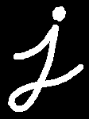
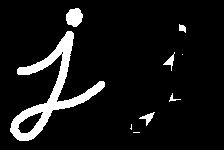
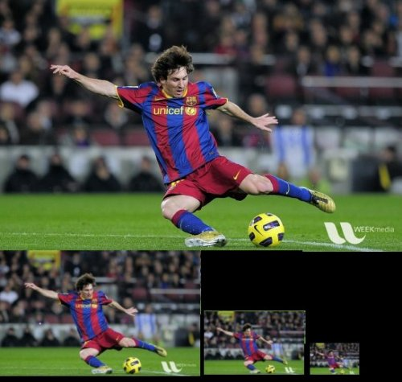
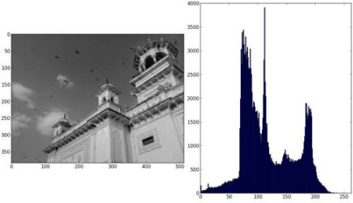
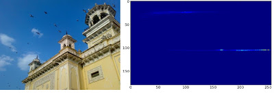
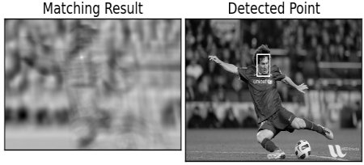

# 改变色彩空间

## 目标

- 在本教程中，您将学习如何将图像从一种颜色空间转换为另一种颜色空间，例如`BGR ↔ Gray`，`BGR ↔ HSV`等。
- 除此之外，我们还将创建一个应用程序，以提取视频中的彩色对象
- 您将学习以下功能：`cv.cvtColor()`，`cv.inRange()`等

## 改变色彩空间

OpenCV提供了150多种颜色空间转换方法。但是，我们将只研究两种使用最广泛的工具，即`BGR ↔ Gray`和`BGR ↔ HSV`。

对于颜色转换，我们使用函数`cv.cvtColor（input_image，flag）`，其中flag确定转换的类型。

对于`BGR → Gray`转换，我们使用标志`cv.COLOR_BGR2GRAY`。同样，对于`BGR → HSV`，我们使用标志`cv.COLOR_BGR2HSV`。要获取其他标志，只需在Python终端中运行以下命令：

```python
import cv2 as cv
flags = [i for i in dir(cv) if i.startswith('COLOR_')]
print(flags)
```

```
['COLOR_BAYER_BG2BGR', 'COLOR_BAYER_BG2BGRA', 'COLOR_BAYER_BG2BGR_EA', 'COLOR_BAYER_BG2BGR_VNG', 'COLOR_BAYER_BG2GRAY', 'COLOR_BAYER_BG2RGB', 'COLOR_BAYER_BG2RGBA', 'COLOR_BAYER_BG2RGB_EA', 'COLOR_BAYER_BG2RGB_VNG', 'COLOR_BAYER_GB2BGR', 'COLOR_BAYER_GB2BGRA', 'COLOR_BAYER_GB2BGR_EA', 'COLOR_BAYER_GB2BGR_VNG', 'COLOR_BAYER_GB2GRAY', 'COLOR_BAYER_GB2RGB', 'COLOR_BAYER_GB2RGBA', 'COLOR_BAYER_GB2RGB_EA', 'COLOR_BAYER_GB2RGB_VNG', 'COLOR_BAYER_GR2BGR', 'COLOR_BAYER_GR2BGRA', 'COLOR_BAYER_GR2BGR_EA', 'COLOR_BAYER_GR2BGR_VNG', 'COLOR_BAYER_GR2GRAY', 'COLOR_BAYER_GR2RGB', 'COLOR_BAYER_GR2RGBA', 'COLOR_BAYER_GR2RGB_EA', 'COLOR_BAYER_GR2RGB_VNG', 'COLOR_BAYER_RG2BGR', 'COLOR_BAYER_RG2BGRA', 'COLOR_BAYER_RG2BGR_EA', 'COLOR_BAYER_RG2BGR_VNG', 'COLOR_BAYER_RG2GRAY', 'COLOR_BAYER_RG2RGB', 'COLOR_BAYER_RG2RGBA', 'COLOR_BAYER_RG2RGB_EA', 'COLOR_BAYER_RG2RGB_VNG', 'COLOR_BGR2BGR555', 'COLOR_BGR2BGR565', 'COLOR_BGR2BGRA', 'COLOR_BGR2GRAY', 'COLOR_BGR2HLS', 'COLOR_BGR2HLS_FULL', 'COLOR_BGR2HSV', 'COLOR_BGR2HSV_FULL', 'COLOR_BGR2LAB', 'COLOR_BGR2LUV', 'COLOR_BGR2Lab', 'COLOR_BGR2Luv', 'COLOR_BGR2RGB', 'COLOR_BGR2RGBA', 'COLOR_BGR2XYZ', 'COLOR_BGR2YCR_CB', 'COLOR_BGR2YCrCb', 'COLOR_BGR2YUV', 'COLOR_BGR2YUV_I420', 'COLOR_BGR2YUV_IYUV', 'COLOR_BGR2YUV_YV12', 'COLOR_BGR5552BGR', 'COLOR_BGR5552BGRA', 'COLOR_BGR5552GRAY', 'COLOR_BGR5552RGB', 'COLOR_BGR5552RGBA', 'COLOR_BGR5652BGR', 'COLOR_BGR5652BGRA', 'COLOR_BGR5652GRAY', 'COLOR_BGR5652RGB', 'COLOR_BGR5652RGBA', 'COLOR_BGRA2BGR', 'COLOR_BGRA2BGR555', 'COLOR_BGRA2BGR565', 'COLOR_BGRA2GRAY', 'COLOR_BGRA2RGB', 'COLOR_BGRA2RGBA', 'COLOR_BGRA2YUV_I420', 'COLOR_BGRA2YUV_IYUV', 'COLOR_BGRA2YUV_YV12', 'COLOR_BayerBG2BGR', 'COLOR_BayerBG2BGRA', 'COLOR_BayerBG2BGR_EA', 'COLOR_BayerBG2BGR_VNG', 'COLOR_BayerBG2GRAY', 'COLOR_BayerBG2RGB', 'COLOR_BayerBG2RGBA', 'COLOR_BayerBG2RGB_EA', 'COLOR_BayerBG2RGB_VNG', 'COLOR_BayerGB2BGR', 'COLOR_BayerGB2BGRA', 'COLOR_BayerGB2BGR_EA', 'COLOR_BayerGB2BGR_VNG', 'COLOR_BayerGB2GRAY', 'COLOR_BayerGB2RGB', 'COLOR_BayerGB2RGBA', 'COLOR_BayerGB2RGB_EA', 'COLOR_BayerGB2RGB_VNG', 'COLOR_BayerGR2BGR', 'COLOR_BayerGR2BGRA', 'COLOR_BayerGR2BGR_EA', 'COLOR_BayerGR2BGR_VNG', 'COLOR_BayerGR2GRAY', 'COLOR_BayerGR2RGB', 'COLOR_BayerGR2RGBA', 'COLOR_BayerGR2RGB_EA', 'COLOR_BayerGR2RGB_VNG', 'COLOR_BayerRG2BGR', 'COLOR_BayerRG2BGRA', 'COLOR_BayerRG2BGR_EA', 'COLOR_BayerRG2BGR_VNG', 'COLOR_BayerRG2GRAY', 'COLOR_BayerRG2RGB', 'COLOR_BayerRG2RGBA', 'COLOR_BayerRG2RGB_EA', 'COLOR_BayerRG2RGB_VNG', 'COLOR_COLORCVT_MAX', 'COLOR_GRAY2BGR', 'COLOR_GRAY2BGR555', 'COLOR_GRAY2BGR565', 'COLOR_GRAY2BGRA', 'COLOR_GRAY2RGB', 'COLOR_GRAY2RGBA', 'COLOR_HLS2BGR', 'COLOR_HLS2BGR_FULL', 'COLOR_HLS2RGB', 'COLOR_HLS2RGB_FULL', 'COLOR_HSV2BGR', 'COLOR_HSV2BGR_FULL', 'COLOR_HSV2RGB', 'COLOR_HSV2RGB_FULL', 'COLOR_LAB2BGR', 'COLOR_LAB2LBGR', 'COLOR_LAB2LRGB', 'COLOR_LAB2RGB', 'COLOR_LBGR2LAB', 'COLOR_LBGR2LUV', 'COLOR_LBGR2Lab', 'COLOR_LBGR2Luv', 'COLOR_LRGB2LAB', 'COLOR_LRGB2LUV', 'COLOR_LRGB2Lab', 'COLOR_LRGB2Luv', 'COLOR_LUV2BGR', 'COLOR_LUV2LBGR', 'COLOR_LUV2LRGB', 'COLOR_LUV2RGB', 'COLOR_Lab2BGR', 'COLOR_Lab2LBGR', 'COLOR_Lab2LRGB', 'COLOR_Lab2RGB', 'COLOR_Luv2BGR', 'COLOR_Luv2LBGR', 'COLOR_Luv2LRGB', 'COLOR_Luv2RGB', 'COLOR_M_RGBA2RGBA', 'COLOR_RGB2BGR', 'COLOR_RGB2BGR555', 'COLOR_RGB2BGR565', 'COLOR_RGB2BGRA', 'COLOR_RGB2GRAY', 'COLOR_RGB2HLS', 'COLOR_RGB2HLS_FULL', 'COLOR_RGB2HSV', 'COLOR_RGB2HSV_FULL', 'COLOR_RGB2LAB', 'COLOR_RGB2LUV', 'COLOR_RGB2Lab', 'COLOR_RGB2Luv', 'COLOR_RGB2RGBA', 'COLOR_RGB2XYZ', 'COLOR_RGB2YCR_CB', 'COLOR_RGB2YCrCb', 'COLOR_RGB2YUV', 'COLOR_RGB2YUV_I420', 'COLOR_RGB2YUV_IYUV', 'COLOR_RGB2YUV_YV12', 'COLOR_RGBA2BGR', 'COLOR_RGBA2BGR555', 'COLOR_RGBA2BGR565', 'COLOR_RGBA2BGRA', 'COLOR_RGBA2GRAY', 'COLOR_RGBA2M_RGBA', 'COLOR_RGBA2RGB', 'COLOR_RGBA2YUV_I420', 'COLOR_RGBA2YUV_IYUV', 'COLOR_RGBA2YUV_YV12', 'COLOR_RGBA2mRGBA', 'COLOR_XYZ2BGR', 'COLOR_XYZ2RGB', 'COLOR_YCR_CB2BGR', 'COLOR_YCR_CB2RGB', 'COLOR_YCrCb2BGR', 'COLOR_YCrCb2RGB', 'COLOR_YUV2BGR', 'COLOR_YUV2BGRA_I420', 'COLOR_YUV2BGRA_IYUV', 'COLOR_YUV2BGRA_NV12', 'COLOR_YUV2BGRA_NV21', 'COLOR_YUV2BGRA_UYNV', 'COLOR_YUV2BGRA_UYVY', 'COLOR_YUV2BGRA_Y422', 'COLOR_YUV2BGRA_YUNV', 'COLOR_YUV2BGRA_YUY2', 'COLOR_YUV2BGRA_YUYV', 'COLOR_YUV2BGRA_YV12', 'COLOR_YUV2BGRA_YVYU', 'COLOR_YUV2BGR_I420', 'COLOR_YUV2BGR_IYUV', 'COLOR_YUV2BGR_NV12', 'COLOR_YUV2BGR_NV21', 'COLOR_YUV2BGR_UYNV', 'COLOR_YUV2BGR_UYVY', 'COLOR_YUV2BGR_Y422', 'COLOR_YUV2BGR_YUNV', 'COLOR_YUV2BGR_YUY2', 'COLOR_YUV2BGR_YUYV', 'COLOR_YUV2BGR_YV12', 'COLOR_YUV2BGR_YVYU', 'COLOR_YUV2GRAY_420', 'COLOR_YUV2GRAY_I420', 'COLOR_YUV2GRAY_IYUV', 'COLOR_YUV2GRAY_NV12', 'COLOR_YUV2GRAY_NV21', 'COLOR_YUV2GRAY_UYNV', 'COLOR_YUV2GRAY_UYVY', 'COLOR_YUV2GRAY_Y422', 'COLOR_YUV2GRAY_YUNV', 'COLOR_YUV2GRAY_YUY2', 'COLOR_YUV2GRAY_YUYV', 'COLOR_YUV2GRAY_YV12', 'COLOR_YUV2GRAY_YVYU', 'COLOR_YUV2RGB', 'COLOR_YUV2RGBA_I420', 'COLOR_YUV2RGBA_IYUV', 'COLOR_YUV2RGBA_NV12', 'COLOR_YUV2RGBA_NV21', 'COLOR_YUV2RGBA_UYNV', 'COLOR_YUV2RGBA_UYVY', 'COLOR_YUV2RGBA_Y422', 'COLOR_YUV2RGBA_YUNV', 'COLOR_YUV2RGBA_YUY2', 'COLOR_YUV2RGBA_YUYV', 'COLOR_YUV2RGBA_YV12', 'COLOR_YUV2RGBA_YVYU', 'COLOR_YUV2RGB_I420', 'COLOR_YUV2RGB_IYUV', 'COLOR_YUV2RGB_NV12', 'COLOR_YUV2RGB_NV21', 'COLOR_YUV2RGB_UYNV', 'COLOR_YUV2RGB_UYVY', 'COLOR_YUV2RGB_Y422', 'COLOR_YUV2RGB_YUNV', 'COLOR_YUV2RGB_YUY2', 'COLOR_YUV2RGB_YUYV', 'COLOR_YUV2RGB_YV12', 'COLOR_YUV2RGB_YVYU', 'COLOR_YUV420P2BGR', 'COLOR_YUV420P2BGRA', 'COLOR_YUV420P2GRAY', 'COLOR_YUV420P2RGB', 'COLOR_YUV420P2RGBA', 'COLOR_YUV420SP2BGR', 'COLOR_YUV420SP2BGRA', 'COLOR_YUV420SP2GRAY', 'COLOR_YUV420SP2RGB', 'COLOR_YUV420SP2RGBA', 'COLOR_YUV420p2BGR', 'COLOR_YUV420p2BGRA', 'COLOR_YUV420p2GRAY', 'COLOR_YUV420p2RGB', 'COLOR_YUV420p2RGBA', 'COLOR_YUV420sp2BGR', 'COLOR_YUV420sp2BGRA', 'COLOR_YUV420sp2GRAY', 'COLOR_YUV420sp2RGB', 'COLOR_YUV420sp2RGBA', 'COLOR_mRGBA2RGBA']
```

> 注意:对于HSV，色相范围为[0,179]，饱和度范围为[0,255]，值范围为[0,255]。不同的软件使用不同的比例。因此，如果将OpenCV值与它们进行比较，则需要将这些范围标准化。

## 对象追踪

现在我们知道了如何将BGR图像转换为HSV，我们可以使用它来提取彩色对象。在HSV中，表示颜色比在BGR颜色空间中更容易。在我们的应用程序中，我们将尝试提取一个蓝色的对象。所以这是方法：

- 拍摄视频的每一帧
- 从BGR转换为HSV颜色空间
- 我们将HSV图片的阈值范围设为蓝色
- 现在，仅提取蓝色对象，我们就可以在所需图像上执行任何操作。
  以下是详细注释的代码：

```python
import cv2 as cv
import numpy as np

cap = cv.VideoCapture(0)

while(1):
    _,frame = cap.read()
    
    # Convert BGR to HSV
    hsv = cv.cvtColor(frame,cv.COLOR_BGR2HSV)
    
    # define range of blue color in HSV
    lower_blue = np.array([110,50,50])
    upper_blue = np.array([130,255,255])
    
    # Threshold the HSV image to get only blue colors
    mask = cv.inRange(hsv,lower_blue,upper_blue)
    
    # Bitwise-AND mask and original image
    res = cv.bitwise_and(frame,frame,mask=mask)
    
    cv.imshow('frame',frame)
    cv.imshow('mask',mask)
    cv.imshow('res',res)
    
    k = cv.waitKey(5) & 0xFF
    if k == 27:
        break
cv.destroyAllWindows()
```

显示如下：


> 注意:图像中有一些噪点。我们将在后面的章节中看到如何删除它们。
> 这是对象跟踪中最简单的方法。一旦学习了轮廓功能，您就可以做很多事情，例如找到该对象的质心并使用它来跟踪该对象，仅通过将手移到相机前面以及其他许多有趣的东西就可以绘制图表。

## 如何找到要追踪的HSV值？

这是在`stackoverflow.com`中发现的常见问题。这非常简单，您可以使用相同的函数`cv.cvtColor()`。无需传递图像，只需传递所需的BGR值即可。例如，要查找Green的HSV值，请在Python终端中尝试以下命令：

```python
import cv2 as cv
import numpy as np

green = np.uint8([[[0,255,0]]])
hsv_green = cv.cvtColor(green,cv.COLOR_BGR2HSV)
print(hsv_green)
```

```
[[[ 60 255 255]]]
```

# 图像的几何变换

## 目标

- 学习将不同的几何变换应用于图像，例如平移，旋转，仿射变换等。

- 您将看到以下功能：`cv.getPerspectiveTransform`

## 转换

OpenCV提供了两个转换函数`cv.warpAffine`和`cv.warpPerspective`，您可以使用它们进行各种转换。`cv.warpAffine`采用2x3转换矩阵，而`cv.warpPerspective`采用3x3转换矩阵作为输入。

## 缩放

缩放只是调整图像的大小。为此，OpenCV带有一个函数`cv.resize()`。图像的大小可以手动指定，也可以指定缩放比例。使用了不同的插值方法。首选插值方法是`cv.INTER_AREA`用于缩小，`cv.INTER_CUBIC（slow）`和`cv.INTER_LINEAR`用于缩放。默认情况下，出于所有调整大小的目的，使用的插值方法为`cv.INTER_LINEAR`。您可以使用以下方法之一调整输入图像的大小：

```python
import numpy as np
import cv2 as cv
img = cv.imread('lena.jpg')
res = cv.resize(img,None,fx=2, fy=2, interpolation = cv.INTER_CUBIC)
#OR
height, width = img.shape[:2]
res = cv.resize(img,(2*width, 2*height), interpolation = cv.INTER_CUBIC)

cv.imshow('resize',res)
cv.waitKey(0)
cv.destroyAllWindows()
```

## 平移

平移是物体位置的移动
您可以将其放入np.float32类型的Numpy数组中，并将其传递给`cv.warpAffine`函数

```python
import numpy as np
import cv2 as cv
img = cv.imread('lena.jpg',0) # 改成1会报错
rows,cols = img.shape
M = np.float32([[1,0,100],[0,1,50]])
dst = cv.warpAffine(img,M,(cols,rows))
cv.imshow('img',dst)
cv.waitKey(0)
cv.destroyAllWindows()
```

## 旋转

OpenCV提供了可缩放的旋转以及可调整的旋转中心，因此您可以在自己喜欢的任何位置旋转。
为了找到此转换矩阵，OpenCV提供了一个函数`cv.getRotationMatrix2D`。请检查以下示例，该示例将图像相对于中心旋转90度而没有任何缩放比例。

```python
img = cv.imread('lena.jpg',0) # 还是不能改成1
rows,cols = img.shape
# cols-1 and rows-1 are the coordinate limits.
M = cv.getRotationMatrix2D(((cols-1)/2.0,(rows-1)/2.0),90,1)
dst = cv.warpAffine(img,M,(cols,rows))

cv.imshow('rotation',dst)
cv.waitKey(0)
cv.destroyAllWindows()
```

## 仿射变换

在仿射变换中，原始图像中的所有平行线在输出图像中仍将平行。为了找到变换矩阵，我们需要输入图像中的三个点及其在输出图像中的对应位置。然后`cv.getAffineTransform`将创建一个2x3矩阵，该矩阵将传递给`cv.warpAffine`

```python
import cv2 as cv
import matplotlib.pyplot as plt

img = cv.imread('lena.jpg')
rows,cols,ch = img.shape
pts1 = np.float32([[50,50],[200,50],[50,200]])
pts2 = np.float32([[10,100],[200,50],[100,250]])
M = cv.getAffineTransform(pts1,pts2)
dst = cv.warpAffine(img,M,(cols,rows))
plt.subplot(121),plt.imshow(img),plt.title('Input')
plt.subplot(122),plt.imshow(dst),plt.title('Output')
plt.show()
```


## 透视变换

对于透视变换，您需要3x3变换矩阵。即使在转换后，直线也将保持直线。要找到此变换矩阵，您需要在输入图像上有4个点，在输出图像上需要相应的点。在这四个点中，其中三个不应共线。然后可以通过函数`cv.getPerspectiveTransform`找到变换矩阵。然后将`cv.warpPerspective`应用于此3x3转换矩阵。

```python
img = cv.imread('lena.jpg')
rows,cols,ch = img.shape
pts1 = np.float32([[56,65],[368,52],[28,387],[389,390]])
pts2 = np.float32([[0,0],[300,0],[0,300],[300,300]])
M = cv.getPerspectiveTransform(pts1,pts2)
dst = cv.warpPerspective(img,M,(300,300))
plt.subplot(121),plt.imshow(img),plt.title('Input')
plt.subplot(122),plt.imshow(dst),plt.title('Output')
plt.show()
```


# 图像阈值

## 目标

- 在本教程中，您将学习简单阈值，自适应阈值和Otsu的阈值。
- 您将学习函数`cv.threshold`和`cv.adaptiveThreshold`。

## 简单阈值

在这里，问题直截了当。对于每个像素，应用相同的阈值。如果像素值小于阈值，则将其设置为0，否则将其设置为最大值。函数`cv.threshold`用于应用阈值。第一个参数是源图像，它应该是灰度图像。第二个参数是阈值，用于对像素值进行分类。第三个参数是分配给超过阈值的像素值的最大值。OpenCV提供了不同类型的阈值，这由函数的第四个参数给出。通过使用类型`cv.THRESH_BINARY`完成上述基本阈值处理。所有简单的阈值类型为：

- cv.THRESH_BINARY
- cv.THRESH_BINARY_INV
- cv.THRESH_TRUNC
- cv.THRESH_TOZERO
- cv.THRESH_TOZERO_INV
  有关差异，请参见类型的文档。

该方法返回两个输出。第一个是使用的阈值，第二个输出是阈值图像。

此代码比较了不同的简单阈值类型：

```python
import cv2 as cv
import numpy as np
from matplotlib import pyplot as plt
img = cv.imread('lena.jpg',0)
ret,thresh1 = cv.threshold(img,127,255,cv.THRESH_BINARY)
ret,thresh2 = cv.threshold(img,127,255,cv.THRESH_BINARY_INV)
ret,thresh3 = cv.threshold(img,127,255,cv.THRESH_TRUNC)
ret,thresh4 = cv.threshold(img,127,255,cv.THRESH_TOZERO)
ret,thresh5 = cv.threshold(img,127,255,cv.THRESH_TOZERO_INV)
titles = ['Original Image','BINARY','BINARY_INV','TRUNC','TOZERO','TOZERO_INV']
images = [img, thresh1, thresh2, thresh3, thresh4, thresh5]
for i in range(6):
    plt.subplot(2,3,i+1),plt.imshow(images[i],'gray')
    plt.title(titles[i])
    plt.xticks([]),plt.yticks([])
plt.show()
```


## 自适应阈值

在上一节中，我们使用一个全局值作为阈值。但这可能并非在所有情况下都很好，例如，如果图像在不同区域具有不同的照明条件。在这种情况下，自适应阈值阈值化可以提供帮助。在此，算法基于像素周围的小区域确定像素的阈值。因此，对于同一图像的不同区域，我们获得了不同的阈值，这为光照度变化的图像提供了更好的结果。

除上述参数外，方法`cv.adaptiveThreshold`还包含三个输入参数：

该`adaptiveMethod`决定阈值是如何计算的：

`cv.ADAPTIVE_THRESH_MEAN_C`：该阈值是该附近区域减去恒定的平均Ç。
`cv.ADAPTIVE_THRESH_GAUSSIAN_C`：阈值是邻域值减去常数C的高斯加权和。
该`BLOCKSIZE`确定附近区域的大小和Ç是从平均值或附近的像素的加权和中减去一个常数。

下面的代码比较了光照变化的图像的全局阈值和自适应阈值：

```python
import cv2 as cv
import numpy as np
from matplotlib import pyplot as plt
img = cv.imread('lena.jpg',0)
img = cv.medianBlur(img,5)
ret,th1 = cv.threshold(img,127,255,cv.THRESH_BINARY)
th2 = cv.adaptiveThreshold(img,255,cv.ADAPTIVE_THRESH_MEAN_C,\
            cv.THRESH_BINARY,11,2)
th3 = cv.adaptiveThreshold(img,255,cv.ADAPTIVE_THRESH_GAUSSIAN_C,\
            cv.THRESH_BINARY,11,2)
titles = ['Original Image', 'Global Thresholding (v = 127)',
            'Adaptive Mean Thresholding', 'Adaptive Gaussian Thresholding']
images = [img, th1, th2, th3]
for i in range(4):
    plt.subplot(2,2,i+1),plt.imshow(images[i],'gray')
    plt.title(titles[i])
    plt.xticks([]),plt.yticks([])
plt.show()
```


## Otsu's Binarization

在全局阈值化中，我们使用任意选择的值作为阈值。相反，Otsu的方法避免了必须选择一个值并自动确定它的情况。

考虑仅具有两个不同图像值的图像（双峰图像），其中直方图将仅包含两个峰。一个好的阈值应该在这两个值的中间。类似地，Otsu的方法从图像直方图中确定最佳全局阈值。

为此，使用了`cv.threshold()`函数，其中`cv.THRESH_OTSU`作为附加标志传递。阈值可以任意选择。然后，算法找到最佳阈值，该阈值作为第一输出返回。

查看以下示例。输入图像为噪点图像。在第一种情况下，将应用值127的全局阈值。在第二种情况下，将直接应用Otsu的阈值。在第三种情况下，首先使用5x5高斯核对图像进行滤波以去除噪声，然后应用Otsu阈值处理。了解噪声过滤如何改善结果。

```python
import cv2 as cv
import numpy as np
from matplotlib import pyplot as plt
img = cv.imread('noisy2.png',0)
# global thresholding
ret1,th1 = cv.threshold(img,127,255,cv.THRESH_BINARY)
# Otsu's thresholding
ret2,th2 = cv.threshold(img,0,255,cv.THRESH_BINARY+cv.THRESH_OTSU)
# Otsu's thresholding after Gaussian filtering
blur = cv.GaussianBlur(img,(5,5),0)
ret3,th3 = cv.threshold(blur,0,255,cv.THRESH_BINARY+cv.THRESH_OTSU)
# plot all the images and their histograms
images = [img, 0, th1,
          img, 0, th2,
          blur, 0, th3]
titles = ['Original Noisy Image','Histogram','Global Thresholding (v=127)',
          'Original Noisy Image','Histogram',"Otsu's Thresholding",
          'Gaussian filtered Image','Histogram',"Otsu's Thresholding"]
for i in range(3):
    plt.subplot(3,3,i*3+1),plt.imshow(images[i*3],'gray')
    plt.title(titles[i*3]), plt.xticks([]), plt.yticks([])
    plt.subplot(3,3,i*3+2),plt.hist(images[i*3].ravel(),256)
    plt.title(titles[i*3+1]), plt.xticks([]), plt.yticks([])
    plt.subplot(3,3,i*3+3),plt.imshow(images[i*3+2],'gray')
    plt.title(titles[i*3+2]), plt.xticks([]), plt.yticks([])
plt.show()
```


# 平滑图像

## 目标

- 使用各种低通滤镜模糊图像
- 将定制的滤镜应用于图像（2D卷积）

## 2D卷积（图像过滤）

与一维信号一样，还可以使用各种**低通滤波器（LPF）**，**高通滤波器（HPF）**等对图像进行滤波。LPF有助于消除噪声，使图像模糊等。HPF滤波器有助于在图像中找到边缘。图片。

OpenCV提供了一个函数`cv.filter2D()`来将内核与映像进行卷积。例如，我们将尝试对图像进行平均滤波。
操作如下：将内核保持在一个像素以上，将所有25个像素加到该内核以下，取其平均值，然后用新的平均值替换中心像素。对于图像中的所有像素，它将继续此操作。尝试以下代码并检查结果：

```python
import numpy as np
import cv2 as cv
# %matplotlib inline
from matplotlib import pyplot as plt
img = cv.imread('original.jpg')
kernel = np.ones((5,5),np.float32)/25
dst = cv.filter2D(img,-1,kernel)
plt.subplot(121),plt.imshow(img),plt.title('Original')
plt.xticks([]), plt.yticks([])
plt.subplot(122),plt.imshow(dst),plt.title('Averaging')
plt.xticks([]), plt.yticks([])
plt.show()
```


## 图像模糊（图像平滑）

通过将图像与低通滤波器内核进行卷积来实现图像模糊。这对于消除噪音很有用。它实际上从图像中删除了高频内容（例如，噪声，边缘）。因此，在此操作中边缘有些模糊。（嗯，有一些模糊技术也不会模糊边缘）。OpenCV主要提供四种类型的模糊技术。

### 1.平均

这是通过将图像与归一化框滤镜进行卷积来完成的。它仅获取内核区域下所有像素的平均值，并替换中心元素。这是通过功能`cv.blur()`或`cv.boxFilter()`完成的。检查文档以获取有关内核的更多详细信息。

> 注意:如果您不想使用标准化的框式过滤器，请使用cv.boxFilter（）。将参数normalize = False传递给函数。

```python
import cv2 as cv
import numpy as np
from matplotlib import pyplot as plt
img = cv.imread('original.jpg')
blur = cv.blur(img,(5,5))
plt.subplot(121),plt.imshow(img),plt.title('Original')
plt.xticks([]), plt.yticks([])
plt.subplot(122),plt.imshow(blur),plt.title('Blurred')
plt.xticks([]), plt.yticks([])
plt.show()
```


### 2.高斯模糊

在这种情况下，代替盒式滤波器，使用了高斯核。这是通过功能`cv.GaussianBlur()`完成的。我们应指定内核的宽度和高度，该宽度和高度应为正数和奇数。我们还应指定X和Y方向的标准偏差，分别为sigmaX和sigmaY。如果仅指定sigmaX，则将sigmaY与sigmaX相同。如果两个都为零，则根据内核大小进行计算。高斯模糊对于从图像中去除高斯噪声非常有效。

如果需要，可以使用函数`cv.getGaussianKernel()`创建高斯内核。

可以针对高斯模糊修改以上代码：

```python
blur = cv.GaussianBlur（img，（5,5），0）
```


### 3.中位模糊

在这里，函数`cv.medianBlur()`提取内核区域下所有像素的中值，并将中心元素替换为该中值。这对于消除图像中的椒盐噪声非常有效。有趣的是，在上述过滤器中，中心元素是新计算的值，该值可以是图像中的像素值或新值。但是在中值模糊中，中心元素总是被图像中的某些像素值代替。有效降低噪音。其内核大小应为正奇数整数。

```python
median = cv.medianBlur(img,5)
```


### 4.双边过滤

`cv.bilateralFilter()`在去除噪声的同时保持边缘清晰锐利非常有效。但是，与其他过滤器相比，该操作速度较慢。我们已经看到，高斯滤波器采用像素周围的邻域并找到其高斯加权平均值。高斯滤波器仅是空间的函数，也就是说，滤波时会考虑附近的像素。它不考虑像素是否具有几乎相同的强度。它不考虑像素是否是边缘像素。因此它也模糊了边缘，这是我们不想做的。

双边滤波器在空间中也采用高斯滤波器，但是又有一个高斯滤波器，它是像素差的函数。空间的高斯函数确保仅考虑附近像素的模糊，而强度差的高斯函数确保仅考虑强度与中心像素相似的像素的模糊。由于边缘的像素强度变化较大，因此可以保留边缘。

以下示例显示了使用双边过滤器

```python
blur = cv.bilateralFilter(img,9,75,75)
```


# 形态转换

## 目标

- 我们将学习不同的形态学操作，例如侵蚀，膨胀，打开，关闭等。
- 我们将看到不同的功能，例如：`cv.erode()`，`cv.dilate()`，`cv.morphologyEx()`等。

## 理论

形态变换是基于图像形状的一些简单操作。通常在二进制图像上执行。它需要两个输入，一个是我们的原始图像，第二个是决定操作性质的结构元素或内核。两种基本的形态学算子是侵蚀和膨胀。然后，它的变体形式（如“打开”，“关闭”，“渐变”等）也开始起作用。在下图的帮助下，我们将一一看到它们：



## 1.侵蚀

侵蚀的基本思想就像仅是土壤侵蚀一样，它侵蚀了前景物体的边界（始终尝试使前景保持白色）。那是什么呢？内核在图像中滑动（如2D卷积）。仅当内核下的所有像素均为1时，原始图像中的像素（1或0）才被视为1，否则它将被侵蚀（设为零）。

因此发生的是，将根据内核的大小丢弃边界附近的所有像素。因此，前景对象的厚度或大小会减小，或者图像中的白色区域只会减小。这对于消除小的白噪声（如我们在色彩空间一章中看到的），分离两个连接的对象等非常有用。

在这里，作为一个例子，我将使用一个全是5x5的内核。让我们看看它是如何工作的：

```python
import cv2 as cv
import numpy as np
img = cv.imread('j.png',0)
kernel = np.ones((5,5),np.uint8)
erosion = cv.erode(img,kernel,iterations = 1)

cv.imshow('k',erosion)
cv.waitKey(0)
cv.destroyAllWindows()
```

结果：


## 2.膨胀

它与侵蚀正好相反。如果内核下的至少一个像素为“ 1”，则像素元素为“ 1”。因此，它会增加图像中的白色区域或增加前景对象的大小。通常，在消除噪音的情况下，腐蚀后会膨胀。因为腐蚀会消除白噪声，但也会缩小物体。因此，我们对其进行了扩展。由于噪音消失了，它们不会回来，但是我们的目标区域增加了。在连接对象的损坏部分时也很有用。

```python
dilation = cv.dilate(img,kernel,iterations = 1)
```


## 3.开运算

开运算只是侵蚀然后膨胀的另一个名称。如上文所述，它对于消除噪音很有用。这里我们使用函数`cv.morphologyEx()`

```python
opening = cv.morphologyEx(img, cv.MORPH_OPEN, kernel)
```


## 4.闭运算

关闭与打开，膨胀接着是侵蚀相反。在闭运算前景对象内部的小孔或对象上的小黑点时很有用。

```python
closing = cv.morphologyEx(img, cv.MORPH_CLOSE, kernel)
```


## 5.形态梯度

这是图像的膨胀和腐蚀之间的区别。

结果将看起来像对象的轮廓。

```python
gradient = cv.morphologyEx(img, cv.MORPH_GRADIENT, kernel)
```


## 6.高帽
这是输入图像和图像打开之间的区别。下面的示例针对9x9内核完成。

```python
tophat = cv.morphologyEx(img, cv.MORPH_TOPHAT, kernel)
```


## 7.黑帽

这是输入图像和输入图像关闭之间的差异。

```python
blackhat = cv.morphologyEx(img, cv.MORPH_BLACKHAT, kernel)
```



## 结构元素

在Numpy的帮助下，我们在前面的示例中手动创建了一个结构元素。它是矩形。但是在某些情况下，您可能需要椭圆形/圆形的内核。因此，为此，OpenCV具有一个函数`cv.getStructuringElement()`。您只需传递内核的形状和大小，即可获得所需的内核。

```python
# Rectangular Kernel
>>> cv.getStructuringElement(cv.MORPH_RECT,(5,5))
array([[1, 1, 1, 1, 1],
       [1, 1, 1, 1, 1],
       [1, 1, 1, 1, 1],
       [1, 1, 1, 1, 1],
       [1, 1, 1, 1, 1]], dtype=uint8)
# Elliptical Kernel
>>> cv.getStructuringElement(cv.MORPH_ELLIPSE,(5,5))
array([[0, 0, 1, 0, 0],
       [1, 1, 1, 1, 1],
       [1, 1, 1, 1, 1],
       [1, 1, 1, 1, 1],
       [0, 0, 1, 0, 0]], dtype=uint8)
# Cross-shaped Kernel
>>> cv.getStructuringElement(cv.MORPH_CROSS,(5,5))
array([[0, 0, 1, 0, 0],
       [0, 0, 1, 0, 0],
       [1, 1, 1, 1, 1],
       [0, 0, 1, 0, 0],
       [0, 0, 1, 0, 0]], dtype=uint8)
```

# 图像渐变

## 目标

- 查找图像渐变，边缘等
- 我们将看到以下函数：`cv.Sobel()`，`cv.Scharr()`，`cv.Laplacian()`等

## 理论

OpenCV提供了三种类型的梯度滤波器或高通滤波器，即`Sobel`，`Scharr`和`Laplacian`。

Sobel算子是高斯平滑加微分运算的联合运算，因此它更抗噪声。您可以指定要采用的导数方向，垂直或水平（分别通过参数yorder和xorder）。您还可以通过参数ksize指定内核的大小。如果ksize = -1，则使用3x3 Scharr滤波器，其效果要比3x3 Sobel滤波器更好。请参阅文档以了解所使用的内核。

```python
import numpy as np
import cv2 as cv
from matplotlib import pyplot as plt
img = cv.imread('dave.jpg',0)
laplacian = cv.Laplacian(img,cv.CV_64F)
sobelx = cv.Sobel(img,cv.CV_64F,1,0,ksize=5)
sobely = cv.Sobel(img,cv.CV_64F,0,1,ksize=5)
plt.subplot(2,2,1),plt.imshow(img,cmap = 'gray')
plt.title('Original'), plt.xticks([]), plt.yticks([])
plt.subplot(2,2,2),plt.imshow(laplacian,cmap = 'gray')
plt.title('Laplacian'), plt.xticks([]), plt.yticks([])
plt.subplot(2,2,3),plt.imshow(sobelx,cmap = 'gray')
plt.title('Sobel X'), plt.xticks([]), plt.yticks([])
plt.subplot(2,2,4),plt.imshow(sobely,cmap = 'gray')
plt.title('Sobel Y'), plt.xticks([]), plt.yticks([])
plt.show()
```


## 一个重要的事情！

在我们的最后一个示例中，输出数据类型为cv.CV_8U或np.uint8。但这有一个小问题。黑色到白色的过渡被视为正斜率（具有正值），而白色到黑色的过渡被视为负斜率（具有负值）。因此，当您将数据转换为np.uint8时，所有负斜率均设为零。
如果要检测两个边缘，更好的选择是将输出数据类型保留为更高的形式，例如cv.CV_16S，cv.CV_64F等，取其绝对值，然后转换回cv.CV_8U。下面的代码演示了水平Sobel滤波器的处理过程以及结果的差异。

```python
import numpy as np
import cv2 as cv
from matplotlib import pyplot as plt
img = cv.imread('box.png',0)
# Output dtype = cv.CV_8U
sobelx8u = cv.Sobel(img,cv.CV_8U,1,0,ksize=5)
# Output dtype = cv.CV_64F. Then take its absolute and convert to cv.CV_8U
sobelx64f = cv.Sobel(img,cv.CV_64F,1,0,ksize=5)
abs_sobel64f = np.absolute(sobelx64f)
sobel_8u = np.uint8(abs_sobel64f)
plt.subplot(1,3,1),plt.imshow(img,cmap = 'gray')
plt.title('Original'), plt.xticks([]), plt.yticks([])
plt.subplot(1,3,2),plt.imshow(sobelx8u,cmap = 'gray')
plt.title('Sobel CV_8U'), plt.xticks([]), plt.yticks([])
plt.subplot(1,3,3),plt.imshow(sobel_8u,cmap = 'gray')
plt.title('Sobel abs(CV_64F)'), plt.xticks([]), plt.yticks([])
plt.show()
```


# Canny边缘检测

## 目标

- 边缘检测的概念
- OpenCV函数：`cv.Canny（）`

## 理论

Canny Edge Detection是一种流行的边缘检测算法。

1.这是一个多阶段算法，我们将经历每个阶段。
2.**降噪**由于边缘检测容易受到图像中噪声的影响，因此第一步是使用5x5高斯滤波器消除图像中的噪声。我们已经在前面的章节中看到了这一点。
3.**查找图像的强度梯度**然后使用Sobel核在水平和垂直方向上对平滑的图像进行滤波，以在水平方向()和垂直方向()上获得一阶导数。从这两个图像中，我们可以找到每个像素的边缘渐变和方向，渐变方向始终垂直于边缘。将其舍入为代表垂直，水平和两个对角线方向的四个角度之一
4.**非最大抑制**在获得梯度大小和方向后，将对图像进行全面扫描，以去除可能不构成边缘的所有不需要的像素。为此，在每个像素处，检查像素是否是其在梯度方向上附近的局部最大值。查看下面的图片：


点A在边缘（垂直方向）上。渐变方向垂直于边缘。点B和C在梯度方向上。因此，将A点与B点和C点进行检查，看是否形成局部最大值。如果是这样，则考虑将其用于下一阶段，否则将其抑制（置为零）。

简而言之，您得到的结果是带有“细边”的二进制图像。

**5.磁滞阈值**

该阶段确定哪些边缘全部是真正的边缘，哪些不是。为此，我们需要两个阈值minVal和maxVal。强度梯度大于maxVal的任何边缘必定是边缘，而小于minVal的那些强度必定是非边缘，因此将其丢弃。介于这两个阈值之间的对象根据其连通性被分类为边缘或非边缘。如果它们连接到“保证边缘”像素，则将它们视为边缘的一部分。否则，它们也将被丢弃。见下图：


边缘A在maxVal之上，因此被视为“确定边缘”。尽管边C低于maxVal，但它连接到边A，因此也被视为有效边，我们得到了完整的曲线。但是边缘B尽管在minVal之上并且与边缘C处于同一区域，但是它没有连接到任何“确保边缘”，因此被丢弃。因此，非常重要的一点是我们必须相应地选择minVal和maxVal以获得正确的结果。

在边缘为长线的假设下，该阶段还消除了小像素噪声。

因此，我们最终得到的是图像中的强边缘。

## OpenCV中的Canny Edge检测

OpenCV将以上所有内容放在单个函数`cv.Canny()`中。我们将看到如何使用它。第一个参数是我们的输入图像。第二个和第三个参数分别是我们的`minVal`和`maxVal`。第三个参数是`perture_size`。它是用于查找图像渐变的Sobel内核的大小。默认情况下为3。最后一个参数是`L2gradient`，它指定用于查找梯度幅度的方程式。如果为True，则使用上面提到的更精确的方程式,否则使用下面的方程式：Edge_Gradient(G)=|Gx|+|Gy|，默认是Flase

```python
import numpy as np
import cv2 as cv
%matplotlib inline
from matplotlib import pyplot as plt
img = cv.imread('lena.jpg',0)
edges = cv.Canny(img,100,200)
plt.subplot(121),plt.imshow(img,cmap = 'gray')
plt.title('Original Image'), plt.xticks([]), plt.yticks([])
plt.subplot(122),plt.imshow(edges,cmap = 'gray')
plt.title('Edge Image'), plt.xticks([]), plt.yticks([])
plt.show()
```


# 图像金字塔

## 目标

- 我们将学习图像金字塔
- 我们将使用图像金字塔创建一个新的水果“ Orapple”
- 我们将看到以下功能：`cv.pyrUp（）`，`cv.pyrDown（）`

## 理论

通常，我们过去使用的是恒定大小的图像。但是在某些情况下，我们需要使用不同分辨率的（相同）图像。例如，当在图像中搜索诸如面部之类的东西时，我们不确定对象将以何种大小出现在所述图像中。在这种情况下，我们将需要创建一组具有不同分辨率的相同图像，并在所有图像中搜索对象。这些具有不同分辨率的图像集称为“ 图像金字塔”（因为当它们堆叠在底部时，最高分辨率的图像位于顶部，最低分辨率的图像位于顶部时，看起来像金字塔）。

有两种图像金字塔。**1）高斯金字塔**和**2）拉普拉斯金字塔**

高斯金字塔中的较高级别（低分辨率）是通过删除较低级别（较高分辨率）图像中的连续行和列而形成的。然后，较高级别的每个像素由基础级别的5个像素的贡献与高斯权重形成。这样，图像变成图像。因此面积减少到原始面积的四分之一。它称为八度。当我们在金字塔中越靠上时（即分辨率降低），这种模式就会继续。同样，在扩展时，每个级别的面积变为4倍。我们可以使用`cv.pyrDown()`和`cv.pyrUp()`函数找到高斯金字塔。

```python
img = cv.imread（'messi5.jpg'）
lower_reso = cv.pyrDown（higher_reso）
```

以下是图像金字塔中的4个级别。



现在，您可以使用`cv.pyrUp()`函数查看图像金字塔。

upper_reso2 = cv.pyrUp（lower_reso）

请记住，`higher_reso2`不等于`higher_reso`，因为一旦降低分辨率，便会丢失信息。图像下方是在以前情况下从最小图像创建的金字塔下3级。将其与原始图像进行比较：


拉普拉斯金字塔由高斯金字塔形成。没有专用功能。拉普拉斯金字塔图像仅像边缘图像。它的大部分元素为零。它们用于图像压缩。拉普拉斯金字塔的层由高斯金字塔的层与高斯金字塔的上层的扩展版本之间的差形成。拉普拉斯水平的三个水平如下所示（调整了对比度以增强内容）：


## 使用金字塔进行图像融合

金字塔的一种应用是图像融合。例如，在图像拼接中，您需要将两个图像堆叠在一起，但是由于图像之间的不连续性，可能看起来不太好。在这种情况下，使用金字塔混合图像可以无缝混合，而不会在图像中保留大量数据。一个经典的例子是将两种水果，橙和苹果混合在一起。现在查看结果本身，以了解我在说什么：


请检查其他资源中的第一个参考，它具有图像混合，拉普拉斯金字塔等的完整图解详细信息。只需完成以下步骤即可：

- 加载苹果和橙子的两个图像
- 查找苹果和橙子的高斯金字塔（在此示例中，级别数为6）
- 从高斯金字塔中找到他们的拉普拉斯金字塔
- 现在在每个拉普拉斯金字塔中加入苹果的左半部分和橙的右半部分
- 最后，从此联合图像金字塔中重建原始图像。

```python
# 这里用的是xrange，注意更改
import cv2 as cv
import numpy as np,sys
A = cv.imread('apple.jpg')
B = cv.imread('orange.jpg')
# generate Gaussian pyramid for A
G = A.copy()
gpA = [G]
for i in xrange(6):
    G = cv.pyrDown(G)
    gpA.append(G)
# generate Gaussian pyramid for B
G = B.copy()
gpB = [G]
for i in xrange(6):
    G = cv.pyrDown(G)
    gpB.append(G)
# generate Laplacian Pyramid for A
lpA = [gpA[5]]
for i in xrange(5,0,-1):
    GE = cv.pyrUp(gpA[i])
    L = cv.subtract(gpA[i-1],GE)
    lpA.append(L)
# generate Laplacian Pyramid for B
lpB = [gpB[5]]
for i in xrange(5,0,-1):
    GE = cv.pyrUp(gpB[i])
    L = cv.subtract(gpB[i-1],GE)
    lpB.append(L)
# Now add left and right halves of images in each level
LS = []
for la,lb in zip(lpA,lpB):
    rows,cols,dpt = la.shape
    ls = np.hstack((la[:,0:cols/2], lb[:,cols/2:]))
    LS.append(ls)
# now reconstruct
ls_ = LS[0]
for i in xrange(1,6):
    ls_ = cv.pyrUp(ls_)
    ls_ = cv.add(ls_, LS[i])
# image with direct connecting each half
real = np.hstack((A[:,:cols/2],B[:,cols/2:]))
cv.imwrite('Pyramid_blending2.jpg',ls_)
cv.imwrite('Direct_blending.jpg',real)
```

# OpenCV中的轮廓

## 轮廓：入门

### 目标

- 了解轮廓是什么。
- 学习寻找轮廓，绘制轮廓等
- 您将看到以下功能：`cv.findContours()`，`cv.drawContours()`

### 什么是轮廓？

轮廓可以简单地解释为连接具有相同颜色或强度的所有连续点（沿边界）的曲线。轮廓是用于形状分析以及对象检测和识别的有用工具。

- 为了获得更高的准确性，请使用二进制图像。因此，在找到轮廓之前，请应用阈值或坎尼边缘检测。
- 从OpenCV 3.2开始，`findContours()`不再修改源图像。
- 在OpenCV中，找到轮廓就像从黑色背景中找到白色物体。因此请记住，要找到的对象应该是白色，背景应该是黑色。
  让我们看看如何找到二进制图像的轮廓：

```python
import numpy as np
import cv2 as cv
im = cv.imread('lena.jpg')
imgray = cv.cvtColor(im, cv.COLOR_BGR2GRAY)
ret, thresh = cv.threshold(imgray, 127, 255, 0)
contours, hierarchy = cv.findContours(thresh, cv.RETR_TREE, cv.CHAIN_APPROX_SIMPLE)
```

在`cv.findContours()`函数中有三个参数，第一个是源图像，第二个是轮廓检索模式，第三个是轮廓逼近方法。并输出轮廓和层次。轮廓是图像中所有轮廓的Python列表。每个单独的轮廓都是对象边界点的（x，y）坐标的Numpy数组。

### 如何绘制轮廓？

要绘制轮廓，请使用`cv.drawContours`函数。只要有边界点，它也可以用来绘制任何形状。它的第一个参数是源图像，第二个参数是应该作为Python列表传递的轮廓，第三个参数是轮廓的索引（在绘制单个轮廓时很有用。要绘制所有轮廓，请传递-1），其余参数是颜色，厚度等等

- 要在图像中绘制所有轮廓：
  `cv.drawContours(img, contours, -1, (0,255,0), 3)`
- 要绘制单个轮廓，请说第四个轮廓：
  `cv.drawContours(img, contours, 3, (0,255,0), 3)`
  但是在大多数情况下，以下方法会很有用：
  `cnt = contours[4]
  cv.drawContours(img, [cnt], 0, (0,255,0), 3)`

> 最后两种方法相同，但是前进时，您会发现最后一种更有用。

### 轮廓近似法

这是`cv.findContours`函数中的第三个参数。它实际上表示什么？

上面我们告诉我们轮廓是强度相同的形状的边界。它存储形状边界的（x，y）坐标。但是它存储所有坐标吗？这是通过这种轮廓近似方法指定的。

如果传递`cv.CHAIN_APPROX_NONE`，则会存储所有边界点。但是实际上我们需要所有这些要点吗？例如，您找到了一条直线的轮廓。您是否需要线上的所有点来代表该线？不，我们只需要该线的两个端点即可。这就是`cv.CHAIN_APPROX_SIMPLE`所做的。它删除所有冗余点并压缩轮廓，从而节省内存。

## 轮廓特征

### 目标

- 查找轮廓的不同特征，例如面积，周长，质心，边界框等
- 您将看到大量与轮廓有关的功能。

### 1.时刻

图像矩可帮助您计算某些特征，例如物体的重心，物体的面积等。请查看“ 图像矩”上的Wikipedia页面

函数`cv.moments()`提供了所有计算出的矩值的字典。见下文：

```python
import numpy as np
import cv2 as cv
img = cv.imread('star.jpg',0)
ret,thresh = cv.threshold(img,127,255,0)
contours,hierarchy = cv.findContours(thresh, 1, 2)
cnt = contours[0]
M = cv.moments(cnt)
print( M )
```

```python
cx = int(M['m10']/M['m00'])
cy = int(M['m01']/M['m00'])
```

### 2.轮廓面积

轮廓区域由函数`cv.contourArea()`或从力矩M ['m00']中给出。

```python
area = cv.contourArea(cnt)
```

### 3.轮廓周长

也称为弧长。可以使用`cv.arcLength()`函数找到它。第二个参数指定形状是闭合轮廓（如果通过True）还是曲线。

```python
perimeter = cv.arcLength(cnt,True)
```

### 4.轮廓近似

根据我们指定的精度，它可以将轮廓形状近似为顶点数量较少的其他形状。它是`Douglas-Peucker`算法的实现。

为了理解这一点，假设您试图在图像中找到一个正方形，但是由于图像中的某些问题，您没有得到一个完美的正方形，而是一个“坏形状”（如下图所示）。现在，您可以使用此功能来近似形状。在这种情况下，第二个参数称为`epsilon`，它是从轮廓到近似轮廓的最大距离。它是一个精度参数。需要正确选择`epsilon`才能获得正确的输出。

```python
epsilon = 0.1*cv.arcLength(cnt,True)
approx = cv.approxPolyDP(cnt,epsilon,True)
```

下面，在第二张图片中，绿线显示了ε=弧长的10％时的近似曲线。第三幅图显示了ε=电弧长度的1％时的情况。第三个参数指定曲线是否闭合。


### 5.凸包

凸包外观看起来与轮廓逼近相似，但并非如此（在某些情况下两者可能提供相同的结果）。在这里，`cv.convexHull()`函数检查曲线是否存在凸凹缺陷并对其进行校正。一般而言，凸曲线是始终凸出或至少平坦的曲线。如果在内部凸出，则称为凸度缺陷。例如，检查下面的手的图像。红线显示手的凸包。双向箭头标记显示凸度缺陷，这是船体与轮廓线之间的局部最大偏差。


关于它的语法，有一些事情需要讨论：

```python
hull = cv.convexHull(points[, hull[, clockwise[, returnPoints]]
```

参数详细信息：

- **points**就是我们传入的轮廓。
- **hull**是输出，通常我们避免它。
- **clockwise**方向标记。如果为True，则输出凸包为顺时针方向。否则，其方向为逆时针方向。
- **returnPoints**：默认情况下为True。然后返回船体点的坐标。如果为False，则返回与船体点相对应的轮廓点的索引。
  因此，要获得如上图所示的凸包，以下内容就足够了：

```python
hull = cv.convexHull(cnt)
```

但是，如果要查找凸度缺陷，则需要传递`returnPoints = False`。为了理解它，我们将拍摄上面的矩形图像。首先，我发现它的轮廓为cnt。现在，我发现它的带有`returnPoints = True`的凸包，得到以下值：[[[234 202]]，[[51 202]]，[[51 79]]，[[234 79]]]，它们是四个角矩形的点。现在，如果对`returnPoints = False`执行相同的操作，则会得到以下结果：[[129]，[67]，[0]，[142]]。这些是轮廓中相应点的索引。例如，检查第一个值：cnt [129] = [[234，202]]与第一个结果相同（对于其他结果依此类推）。

### 6.检查凸度

`cv.isContourConvex()`有一个函数可以检查曲线是否为凸形。它只是返回True还是False。没有大碍。

### 7.边界矩形
有两种类型的边界矩形。

#### 7.A. 直角矩形
它是一个直角矩形，不考虑对象的旋转。因此，边界矩形的面积将不会最小。它可以通过函数`cv.boundingRect()`找到。

令（x，y）为矩形的左上角坐标，而（w，h）为矩形的宽度和高度。

```python
x,y,w,h = cv.boundingRect(cnt)
cv.rectangle(img,(x,y),(x+w,y+h),(0,255,0),2)
```

#### 7.b. 旋转矩形

在这里，边界矩形是用最小面积绘制的，因此它也考虑了旋转。使用的函数是`cv.minAreaRect()`。它返回一个Box2D结构，其中包含以下细节-（中心（x，y），（宽度，高度），旋转角度）。但是要绘制此矩形，我们需要矩形的4个角。它是通过函数`cv.boxPoints()`获得的

```python
rect = cv.minAreaRect(cnt)
box = cv.boxPoints(rect)
box = np.int0(box)
cv.drawContours(img,[box],0,(0,0,255),2)
```


### 8.最小外接圆

接下来，我们使用函数`cv.minEnclosingCircle()`找到对象的外接圆。它是一个以最小面积完全覆盖对象的圆圈。

```python
(x,y),radius = cv.minEnclosingCircle(cnt)
center = (int(x),int(y))
radius = int(radius)
cv.circle(img,center,radius,(0,255,0),2)
```


### 9.拟合椭圆

下一步是使椭圆适合对象。它返回椭圆所在的旋转形状。

```python
ellipse = cv.fitEllipse(cnt)
cv.ellipse(img,ellipse,(0,255,0),2)

```


### 10.拟合线

同样，我们可以将一条直线拟合到一组点。下图包含一组白点。我们可以近似一条直线。

```python
rows,cols = img.shape[:2]
[vx,vy,x,y] = cv.fitLine(cnt, cv.DIST_L2,0,0.01,0.01)
lefty = int((-x*vy/vx) + y)
righty = int(((cols-x)*vy/vx)+y)
cv.line(img,(cols-1,righty),(0,lefty),(0,255,0),2)
```


## 轮廓属性

在这里，我们将学习提取对象的一些常用属性，例如实体，等效直径，蒙版图像，平均强度等

### 1.长宽比
它是对象边界矩形的宽度与高度的比率。

```python
x,y,w,h = cv.boundingRect(cnt)
aspect_ratio = float(w)/h
```

### 2.范围

范围是轮廓区域与边界矩形区域的比率。

```python
area = cv.contourArea(cnt)
x,y,w,h = cv.boundingRect(cnt)
rect_area = w*h
extent = float(area)/rect_area
```

### 3.坚固性
坚固度是轮廓面积与其凸包面积的比率。

```python
area = cv.contourArea(cnt)
hull = cv.convexHull(cnt)
hull_area = cv.contourArea(hull)
solidity = float(area)/hull_area
```

### 4.等效直径
当量直径是面积与轮廓面积相同的圆的直径。 

```python
area = cv.contourArea(cnt)
equi_diameter = np.sqrt(4*area/np.pi)
```

### 5.方向
方向是物体指向的角度。以下方法还给出了主轴和副轴的长度。

```python
(x,y),(MA,ma),angle = cv.fitEllipse(cnt)
```

### 6.遮罩和像素点
在某些情况下，我们可能需要构成该对象的所有点。可以按照以下步骤完成：

```python
mask = np.zeros(imgray.shape,np.uint8)
cv.drawContours(mask,[cnt],0,255,-1)
pixelpoints = np.transpose(np.nonzero(mask))
#pixelpoints = cv.findNonZero(mask)
```

### 7.最大值，最小值及其位置
我们可以使用遮罩图像找到这些参数。

```python
min_val, max_val, min_loc, max_loc = cv.minMaxLoc(imgray,mask = mask)
```

### 8.平均颜色或平均强度
在这里，我们可以找到对象的平均颜色。或者可以是灰度模式下物体的平均强度。我们再次使用相同的蒙版进行此操作。

```python
mean_val = cv.mean(im,mask = mask)
```

### 9.极端点
极点是指对象的最顶部，最底部，最右侧和最左侧的点。

```python
leftmost = tuple(cnt[cnt[:,:,0].argmin()][0])
rightmost = tuple(cnt[cnt[:,:,0].argmax()][0])
topmost = tuple(cnt[cnt[:,:,1].argmin()][0])
bottommost = tuple(cnt[cnt[:,:,1].argmax()][0])
```

## 轮廓：更多功能

### 目标

+ 凸性缺陷以及如何找到它们。
+ 查找点到多边形的最短距离
+ 匹配不同的形状

### 理论与规范

### 1.凸性缺陷

我们看到了关于轮廓的凸包。物体与该船体的任何偏离都可以视为凸度缺陷。

OpenCV带有一个现成的函数`cv.convexityDefects()`来查找该函数。基本的函数调用如下所示：

```python
hull = cv.convexHull(cnt,returnPoints = False)
defects = cv.convexityDefects(cnt,hull)
```

> 注意:请记住，在寻找凸包时，我们必须传递`returnPoints = False`，以便寻找凸缺陷。

它返回一个数组，其中每行包含这些值- [起点，终点，最远点，到最远点的近似距离]。我们可以使用图像对其进行可视化。我们画一条连接起点和终点的线，然后在最远的点画一个圆。请记住，返回的前三个值是cnt的索引。因此，我们必须从cnt带来这些价值。

```python
import cv2 as cv
import numpy as np
img = cv.imread('star.jpg')
img_gray = cv.cvtColor(img,cv.COLOR_BGR2GRAY)
ret,thresh = cv.threshold(img_gray, 127, 255,0)
contours,hierarchy = cv.findContours(thresh,2,1)
cnt = contours[0]
hull = cv.convexHull(cnt,returnPoints = False)
defects = cv.convexityDefects(cnt,hull)
for i in range(defects.shape[0]):
    s,e,f,d = defects[i,0]
    start = tuple(cnt[s][0])
    end = tuple(cnt[e][0])
    far = tuple(cnt[f][0])
    cv.line(img,start,end,[0,255,0],2)
    cv.circle(img,far,5,[0,0,255],-1)
cv.imshow('img',img)
cv.waitKey(0)
cv.destroyAllWindows()
```


### 2.点多边形测试

此功能查找图像中的点与轮廓之间的最短距离。它返回的距离为：当点在轮廓外时为负；当点在轮廓内时为正；如果点在轮廓上，则返回零。

例如，我们可以如下检查点（50,50）：

```python
dist = cv.pointPolygonTest（cnt，（50,50），True）
```

在函数中，第三个参数是`measureDist`。如果为True，则找到带符号的距离。如果为False，它将查找该点是在轮廓内部还是外部或轮廓上（它分别返回+ 1，-1、0）。

> 注意:如果您不想查找距离，请确保第三个参数为False，因为这是一个耗时的过程。因此，将其设置为False可使速度提高2-3倍。

### 3.比较形状

OpenCV带有函数`cv.matchShapes()`，使我们能够比较两个形状或两个轮廓，并返回显示相似性的度量。结果越低，匹配越好。它是基于`hu-moment`值计算的。文档中介绍了不同的测量方法。

```python
import cv2 as cv
import numpy as np
img1 = cv.imread('star.jpg',0)
img2 = cv.imread('star2.jpg',0)
ret, thresh = cv.threshold(img1, 127, 255,0)
ret, thresh2 = cv.threshold(img2, 127, 255,0)
contours,hierarchy = cv.findContours(thresh,2,1)
cnt1 = contours[0]
contours,hierarchy = cv.findContours(thresh2,2,1)
cnt2 = contours[0]
ret = cv.matchShapes(cnt1,cnt2,1,0.0)
print( ret )
```

我尝试匹配以下给出的不同形状的形状：


我得到以下结果：

- 匹配图像A本身= 0.0
- 将图像A与图像B匹配= 0.001946
- 将图像A与图像C匹配= 0.326911
  看，即使图像旋转也不会对该比较产生太大影响。

也可以看看
`Hu-Moments`是平移，旋转和缩放不变的七个时刻。第七个是偏斜不变的。这些值可以使用`cv.HuMoments()`函数找到。

## 轮廓层次

### 目标

这次，我们了解轮廓的层次结构，即`Contours`中的父子关系。

### 理论

在有关轮廓的最后几篇文章中，我们使用了与OpenCV提供的轮廓相关的一些功能。但是，当我们使用`cv.findContours()`函数在图像中找到轮廓时，我们传递了一个参数，即`Contour Retrieval Mode`。我们通常通过`cv.RETR_LIST`或`cv.RETR_TREE`，效果很好。但这实际上是什么意思？

另外，在输出中，我们得到了三个数组，第一个是图像，第二个是轮廓，另一个是我们命名为层次结构的输出（请检查上一篇文章中的代码）。但是，我们从未在任何地方使用此层次结构。那么，这个层次结构是什么呢？它与前面提到的函数参数有什么关系？

这就是本文要处理的内容。

### 什么是层次结构？

通常我们使用`cv.findContours()`函数来检测图像中的对象，对吗？有时对象位于不同的位置。但是在某些情况下，某些形状位于其他形状内。就像嵌套的数字一样。在这种情况下，我们将外部的一个称为父级，将内部的一个称为子级。这样，图像中的轮廓彼此之间就具有某种关系。并且我们可以指定一个轮廓如何相互连接，例如是其他轮廓的子轮廓，还是父轮廓等。这种关系的表示称为层次结构。

考虑下面的示例图像：


在此图像中，我从0-5编号了一些形状。2和2a表示最外面的盒子的外部和内部轮廓。

在此，轮廓0,1,2在外部或最外部。我们可以说，它们处于0层次结构中，或者只是处于相同的层次结构级别中。

接下来是轮廓2a。可以将其视为轮廓2的子级（或者相反，轮廓2是轮廓2a的父级）。因此，将其设置为hierarchy-1。同样，contour-3是contour-2的子级，位于下一个层次结构中。最后，轮廓4,5是轮廓3a的子级，它们位于最后的层次结构级别。从编号方式上来说，轮廓4是轮廓3a的第一个子元素（也可以是轮廓5）。

我提到这些东西是为了理解诸如相同的层次结构级别，外部轮廓，子轮廓，父轮廓，第一个孩子等术语。现在让我们进入OpenCV。

OpenCV中的层次结构表示
因此，每个轮廓都有关于其层次结构，其子级，其父级等的信息。OpenCV将其表示为四个值的数组：[Next，Previous，First_Child，Parent]

*“下一个表示相同等级的下一个轮廓。” *
例如，在我们的图片中选择轮廓0。谁是同一级别的下一个轮廓？它是轮廓1。因此，只需将Next = 1放进去。同样对于Contour-1，下一个就是轮廓线2。所以下一个= 2。

那轮廓2呢？在同一层中没有下一个轮廓。简而言之，将Next = -1。那轮廓4呢？与轮廓5处于同一水平。所以它的下一个轮廓是轮廓5，所以Next = 5。

*“上一个表示相同轮廓级别的上一个轮廓。” *
和上面一样。轮廓1的先前轮廓是同一级别的轮廓0。同样对于轮廓2，它是轮廓1。对于轮廓0，没有先前值，因此将其设为-1。

*“ First_Child表示其第一个子轮廓。” *
无需任何解释。对于轮廓2，子级是轮廓2a。这样就得到了轮廓2a的相应索引值。那轮廓3a呢？它有两个孩子。但是我们只带第一个孩子。它是轮廓4。因此，轮廓3a的First_Child = 4。

*“父代表示其父代轮廓的索引。” *
它与First_Child相反。轮廓4和轮廓5的父轮廓均为轮廓3a。对于轮廓3a，它是轮廓3，依此类推。

> 注意:如果没有孩子或父母，则该字段为-1

因此，现在我们知道了OpenCV中使用的层次结构样式，我们可以借助上面给出的相同图像来检查OpenCV中的轮廓检索模式。即，像`cv.RETR_LIST`，`cv.RETR_TREE`，`cv.RETR_CCOMP`，`cv.RETR_EXTERNAL`等标志是什么意思？

## 轮廓检索模式

### 1. RETR_LIST

这是四个标志中最简单的一个（从解释的角度来看）。它仅检索所有轮廓，但不创建任何父子关系。在这个规则下，父母和孩子是平等的，他们只是轮廓。即它们都属于同一层次结构级别。

因此，在这里，层次结构数组中的第3和第4项始终为-1。但是很明显，下一个和上一个术语将具有其相应的值。只需自己检查并验证即可。

以下是我得到的结果，每行是相应轮廓的层次结构详细信息。例如，第一行对应于轮廓0。下一个轮廓为轮廓1。因此Next =1。没有先前的轮廓，因此`Previous = -1`。如前所述，其余两个为-1。

```python
>>> hierarchy
array([[[ 1, -1, -1, -1],
        [ 2,  0, -1, -1],
        [ 3,  1, -1, -1],
        [ 4,  2, -1, -1],
        [ 5,  3, -1, -1],
        [ 6,  4, -1, -1],
        [ 7,  5, -1, -1],
        [-1,  6, -1, -1]]])
```

如果不使用任何层次结构功能，这是在代码中使用的不错选择。

### 2. RETR_EXTERNAL

如果使用此标志，则仅返回极端的外部标志。保留所有子轮廓。可以说，根据这项法律，只有每个家庭中的老大才能得到照顾。它不在乎家庭其他成员:

那么，在我们的图像中，有多少个极端的外部轮廓？即在等级0级别？只有3个，即轮廓0,1,2，对吗？现在尝试使用该标志查找轮廓。在此，赋予每个元素的值也与上述相同。与上面的结果进行比较。以下是我得到的：

```python
>>> hierarchy
array([[[ 1, -1, -1, -1],
        [ 2,  0, -1, -1],
        [-1,  1, -1, -1]]])
```

如果只想提取外部轮廓，则可以使用此标志。在某些情况下可能有用。

### 3. RETR_CCOMP

该标志检索所有轮廓并将它们排列为2级层次结构。即，对象的外部轮廓（即其边界）位于层次1中。然后，将对象（如果有）中的孔的轮廓放置在层次2中。如果其中有任何对象，则其轮廓将仅再次放置在等级1中。以及它在等级2中的漏洞等等。

只需考虑黑色背景上的“白色大零”图像即可。零外圈属于第一层级，零内圈属于第二层级。

我们可以用一个简单的图像来解释它。在这里，我用红色标记了轮廓的顺序，并用绿色（1或2）标记了它们所属的层次。该顺序与OpenCV检测轮廓的顺序相同。


因此考虑第一个轮廓，即轮廓0。它是等级1。它有两个孔，轮廓1和2，它们属于层次2。因此，对于轮廓0，相同层次结构级别中的下一个轮廓为轮廓3。而且没有以前的。它的第一个子对象是层次结构2中的轮廓1。它没有父级，因为它位于1层级中。因此其层次结构数组为[3，-1,1，-1]

现在取轮廓1。它在等级2中。在同一层次结构中（轮廓1的父项下）下一个是轮廓2。没有上一个。没有孩子，但父母的轮廓为0。因此数组为[2，-1，-1,0]。

同样的轮廓2：它位于层次2中。在轮廓-0下的相同层次结构中没有下一个轮廓。所以没有下一步。上一个是轮廓1。没有孩子，父母的轮廓为0。因此数组为[-1,1，-1,0]。

轮廓-3：等级1中的下一个是轮廓5。上一个是轮廓0。孩子是轮廓4，没有父母。因此数组为[5,0,4，-1]。

轮廓-4：位于轮廓3下的层次2中，并且没有同级。所以没有下一个，没有以前的，没有孩子，父母是轮廓3。因此数组为[-1，-1，-1,3]。

剩下的可以填满。这是我得到的最终答案：

```python
>>> hierarchy
array([[[ 3, -1,  1, -1],
        [ 2, -1, -1,  0],
        [-1,  1, -1,  0],
        [ 5,  0,  4, -1],
        [-1, -1, -1,  3],
        [ 7,  3,  6, -1],
        [-1, -1, -1,  5],
        [ 8,  5, -1, -1],
        [-1,  7, -1, -1]]])
```

### 4. RETR_TREE

这是最后一个家伙，Perfect先生。它检索所有轮廓并创建完整的族层次列表。它甚至告诉，谁是爷爷，父亲，儿子，孙子甚至更远... :)。

例如，我拍摄了上面的图片，重写了`cv.RETR_TREE`的代码，根据OpenCV给定的结果对轮廓进行重新排序并对其进行分析。同样，红色字母表示轮廓编号，绿色字母表示层次结构顺序。


取轮廓0：在层次0中。同一层次结构中的下一个轮廓是轮廓7。没有先前的轮廓。孩子是轮廓1。而且没有父母。因此数组为[7，-1,1，-1]。

取轮廓2：在等级1中。同一级别无轮廓。没有上一个。孩子是轮廓3。父级是轮廓1。因此数组为[-1，-1,3,1]。

还有，尝试一下。以下是完整答案：

```python
>>> hierarchy
array([[[ 7, -1,  1, -1],
        [-1, -1,  2,  0],
        [-1, -1,  3,  1],
        [-1, -1,  4,  2],
        [-1, -1,  5,  3],
        [ 6, -1, -1,  4],
        [-1,  5, -1,  4],
        [ 8,  0, -1, -1],
        [-1,  7, -1, -1]]])
```

# OpenCV中的直方图

## 直方图-1：查找，绘制，分析!!!

### 目标

- 使用OpenCV和Numpy函数查找直方图
- 使用OpenCV和Matplotlib函数绘制直方图
- 您将看到以下功能：cv.calcHist()，np.histogram()等。

### 理论

那么直方图是什么？您可以将直方图视为图形或曲线图，从而使您对图像的强度分布有一个整体的了解。它是在X轴上具有像素值（不总是从0到255的范围），在Y轴上具有图像中相应像素数的图。

这只是理解图像的另一种方式。通过查看图像的直方图，您可以直观地了解该图像的对比度，亮度，强度分布等。当今几乎所有图像处理工具都提供直方图功能。以下是剑桥彩色网站上的图片，建议您访问该网站以获取更多详细信息。


您可以看到图像及其直方图。（请记住，此直方图是针对灰度图像而非彩色图像绘制的）。直方图的左侧区域显示图像中较暗像素的数量，而右侧区域则显示较亮像素的数量。从直方图中，您可以看到暗区域多于亮区域，中间调的数量（中间值的像素值，例如127附近）非常少。

### 查找直方图

现在我们有了一个关于直方图的想法，我们可以研究如何找到它。OpenCV和Numpy都为此内置了功能。在使用这些功能之前，我们需要了解一些与直方图有关的术语。

**BINS**：上面的直方图显示每个像素值的像素数，即从0到255。即，您需要256个值来显示上面的直方图。但是考虑一下，如果您不需要分别找到所有像素值的像素数，而是找到像素值间隔中的像素数怎么办？例如，您需要找到介于0到15之间，然后16到31之间，...，240到255之间的像素数。您只需要16个值即可表示直方图。这就是在[OpenCV直方图教程](https://docs.opencv.org/4.1.1/d8/dbc/tutorial_histogram_calculation.html)中给出的示例中所显示的内容。

因此，您要做的就是将整个直方图分成16个子部分，每个子部分的值就是其中所有像素数的总和。每个子部分都称为“ BIN”。在第一种情况下，bin的数量为256个（每个像素一个），而在第二种情况下，bin的数量仅为16个。BINS由OpenCV文档中的histSize术语表示。

**DIMS**：这是我们为其收集数据的参数的数量。在这种情况下，我们仅收集关于强度值的一件事的数据。所以这里是1。

范围：这是您要测量的强度值的范围。通常，它是[0,256]，即所有强度值。

#### 1. OpenCV中的直方图计算

因此，现在我们使用`cv.calcHist()`函数查找直方图。让我们熟悉一下函数及其参数：

```
cv.calcHist(images, channels, mask, histSize, ranges[, hist[, accumulate]])
```

- images：它是uint8或float32类型的源图像。它应该放在方括号中，即“ [img]”。
- channels：也以方括号给出。它是我们计算直方图的通道的索引。例如，如果输入为灰度图像，则其值为[0]。对于彩色图像，您可以传递[0]，[1]或[2]分别计算蓝色，绿色或红色通道的直方图。
- mask：遮罩图像。为了找到完整图像的直方图，将其指定为“无”。但是，如果要查找图像特定区域的直方图，则必须为此创建一个遮罩图像并将其作为遮罩。（我将在后面显示一个示例。）
- histSize：这表示我们的BIN计数。需要放在方括号中。对于全尺寸，我们通过[256]。
- ranges：这是我们的RANGE。通常为[0,256]。
  因此，让我们从示例图像开始。只需在灰度模式下加载图像并找到其完整的直方图即可。

```
img = cv.imread('home.jpg',0)
hist = cv.calcHist([img],[0],None,[256],[0,256])
```

hist是256x1的数组，每个值对应于该图像中具有相应像素值的像素数。

#### 2. Numpy中的直方图计算

Numpy还为您提供了一个函数`np.histogram()`。因此，您可以在下面的行尝试代替`calcHist()`函数：

```python
hist,bins = np.histogram(img.ravel(),256,[0,256])
```

hist与我们之前计算的相同。但是bin将具有257个元素，因为Numpy计算出bin的范围为0-0.99、1-1.99、2-2.99等。因此最终范围为255-255.99。为了表示这一点，他们还在料箱末端添加了256。但是我们不需要256。最多255就足够了。

也可以看看

Numpy还有另一个函数`np.bincount()`，它比`np.histogram()`快10倍左右。因此，对于一维直方图，您可以更好地尝试一下。不要忘记在`np.bincount`中设置`minlength = 256`。例如，`hist = np.bincount(img.ravel()，minlength = 256)`

> 注意:OpenCV函数比np.histogram()快（大约40倍）。因此，请坚持使用OpenCV功能。
> 现在我们应该绘制直方图，但是如何绘制？

### 绘制直方图

有两种方法，

- 简单方法：使用Matplotlib绘图功能
- 复杂方法：使用OpenCV绘图功能

#### 1.使用Matplotlib

Matplotlib带有直方图绘图功能：`matplotlib.pyplot.hist()`

它直接找到直方图并将其绘制。您无需使用`calcHist()`或`np.histogram()`函数来查找直方图。请参见下面的代码：

```python
import numpy as np
import cv2 as cv
%matplotlib inline
from matplotlib import pyplot as plt
img = cv.imread('home.jpg',0)
plt.hist(img.ravel(),256,[0,256]); plt.show()
```



或者，您可以使用matplotlib的法线图，这对于BGR图是很好的。为此，您需要首先找到直方图数据。试试下面的代码：

```python
import numpy as np
import cv2 as cv
from matplotlib import pyplot as plt
img = cv.imread('home.jpg')
color = ('b','g','r')
for i,col in enumerate(color):
    histr = cv.calcHist([img],[i],None,[256],[0,256])
    plt.plot(histr,color = col)
    plt.xlim([0,256])
plt.show()
```

您可以从上图中得出，蓝色在图像中具有一些高价值区域（显然这应该是由于天空）

#### 2.使用OpenCV

好吧，在这里您可以调整直方图的值及其bin值，使其看起来像x，y坐标，以便可以使用`cv.line()`或`cv.polyline()`函数绘制它以生成与上述相同的图像。OpenCV-Python2官方示例已经提供了此功能。检查示例`/python/hist.py`中的代码。

### 掩膜的应用

我们使用`cv.calcHist()`查找完整图像的直方图。如果要查找图像某些区域的直方图怎么办？只需在要查找直方图的区域上创建白色的蒙版图像，否则创建黑色。然后通过这个作为面具。

```python
img = cv.imread('home.jpg',0)
# create a mask
mask = np.zeros(img.shape[:2], np.uint8)
mask[100:300, 100:400] = 255
masked_img = cv.bitwise_and(img,img,mask = mask)
# Calculate histogram with mask and without mask
# Check third argument for mask
hist_full = cv.calcHist([img],[0],None,[256],[0,256])
hist_mask = cv.calcHist([img],[0],mask,[256],[0,256])
plt.subplot(221), plt.imshow(img, 'gray')
plt.subplot(222), plt.imshow(mask,'gray')
plt.subplot(223), plt.imshow(masked_img, 'gray')
plt.subplot(224), plt.plot(hist_full), plt.plot(hist_mask)
plt.xlim([0,256])
plt.show()
```


查看结果。在直方图中，蓝线表示完整图像的直方图，绿线表示遮蔽区域的直方图。

## 直方图-2：直方图均衡

### 目标

- 我们将学习直方图均衡化的概念，并将其用于改善图像的对比度。

### 理论

考虑一个图像，其像素值仅限于特定的值范围。例如，较亮的图像会将所有像素限制在较高的值。但是，好的图像将具有来自图像所有区域的像素。因此，您需要将此直方图拉伸到两端（如下图所示，来自维基百科），这就是直方图均衡化的作用（简单来说）。通常，这可以提高图像的对比度。


在这里我们将看到其Numpy实现。之后，我们将看到OpenCV功能

您可以看到直方图位于较亮的区域。我们需要全方位的服务。为此，我们需要一个转换函数，该函数将较亮区域中的输入像素映射到整个区域中的输出像素。这就是直方图均衡化的作用。

现在，我们找到最小的直方图值（不包括0）并应用Wiki页面中给出的直方图均衡方程。但是我在这里使用了Numpy的masked array概念数组。对于掩码数组，所有操作都在非掩码元素上执行。您可以从有关屏蔽数组的Numpy文档中了解有关此内容的更多信息。

```python
cdf_m = np.ma.masked_equal(cdf,0)
cdf_m = (cdf_m - cdf_m.min())*255/(cdf_m.max()-cdf_m.min())
cdf = np.ma.filled(cdf_m,0).astype('uint8')
```

现在我们有了查找表，该表为我们提供了有关每个输入像素值的输出像素值是什么的信息。因此，我们仅应用变换。

```python
img2 = cdf[img]
```

现在我们像以前一样计算它的直方图和cdf（您这样做），结果如下所示：


另一个重要特征是，即使图像是较暗的图像（而不是我们使用的较亮的图像），在均衡后，我们将获得与获得的图像几乎相同的图像。结果，它被用作“参考工具”，以使所有图像具有相同的照明条件。在许多情况下这很有用。例如，在人脸识别中，在训练人脸数据之前，将人脸图像进行直方图均衡，以使它们全部具有相同的光照条件。

### OpenCV中的直方图均衡

OpenCV具有执行此操作的功能`cv.equalizeHist()`。它的输入只是灰度图像，输出是我们的直方图均衡图像。

下面是一个简单的代码片段，显示了它与我们使用的同一图像的用法：

```python
img = cv.imread('wiki.jpg',0)
equ = cv.equalizeHist(img)
res = np.hstack((img,equ)) #stacking images side-by-side
cv.imwrite('res.png',res)
```

因此，现在您可以在不同的光照条件下拍摄不同的图像，对其进行均衡并检查结果。

当图像的直方图限制在特定区域时，直方图均衡化效果很好。在直方图覆盖较大区域（即同时存在亮像素和暗像素）的强度变化较大的地方，效果不好。请检查其他资源中的SOF链接。

### CLAHE（对比度受限的自适应直方图均衡）

我们刚刚看到的第一个直方图均衡化考虑了图像的整体对比度。在许多情况下，这不是一个好主意。例如，下图显示了输入图像及其在全局直方图均衡后的结果。


直方图均衡后，背景对比度确实得到了改善。但是在两个图像中比较雕像的脸。由于亮度过高，我们在那里丢失了大多数信息。这是因为它的直方图不像我们在前面的案例中所看到的那样局限于特定区域（尝试绘制输入图像的直方图，您将获得更多的直觉）。

因此，为了解决这个问题，使用了自适应直方图均衡。在这种情况下，图像被分成称为“tiles”的小块（在OpenCV中，tileSize默认为8x8）。然后，像往常一样对这些块中的每一个进行直方图均衡。因此，在较小的区域中，直方图将局限于一个较小的区域（除非有噪声）。如果有噪音，它将被放大。为了避免这种情况，应用了对比度限制。如果任何直方图bin超过指定的对比度限制（在OpenCV中默认为40），则在应用直方图均衡之前，将这些像素裁剪并均匀地分布到其他bin。均衡后，要消除图块边界中的伪影，请应用双线性插值。

下面的代码片段显示了如何在OpenCV中应用CLAHE：

```python
import numpy as np
import cv2 as cv
img = cv.imread('tsukuba_l.png',0)
# create a CLAHE object (Arguments are optional).
clahe = cv.createCLAHE(clipLimit=2.0, tileGridSize=(8,8))
cl1 = clahe.apply(img)
cv.imwrite('clahe_2.jpg',cl1)
```

查看下面的结果，并将其与上面的结果进行比较，尤其是雕像区域：


## 直方图-3：2D直方图

### 目标

- 在本章中，我们将学习查找和绘制2D直方图。这将在以后的章节中有所帮助。

### 介绍

在第一篇文章中，我们计算并绘制了一维直方图。之所以称为一维，是因为我们仅考虑一个特征，即像素的灰度强度值。但是在二维直方图中，您要考虑两个特征。通常，它用于查找颜色直方图，其中两个特征是每个像素的色相和饱和度值。

已经有一个python样本`（samples/python/color_histogram.py）`用于查找颜色直方图。我们将尝试了解如何创建这种颜色直方图，这对于理解诸如直方图反投影之类的更多主题将很有用。

### OpenCV中的2D直方图

它非常简单，并且使用相同的函数`cv.calcHist()`进行计算。**对于颜色直方图，我们需要将图像从`BGR`转换为`HSV`**。（请记住，**对于一维直方图，我们从BGR转换为灰度**）。对于2D直方图，其参数将进行如下修改：

- channels = [0,1]， 因为我们需要同时处理H和S平面。
- bins = [180,256] 对于H平面为180，对于S平面为256。
- ranges = [0,180,0,256] 色相值介于0和180之间，饱和度介于0和256之间。

现在检查以下代码：

```python
import numpy as np
import cv2 as cv
img = cv.imread('home.jpg')
hsv = cv.cvtColor(img,cv.COLOR_BGR2HSV)
hist = cv.calcHist([hsv], [0, 1], None, [180, 256], [0, 180, 0, 256])
```

### numpy中的2D直方图

Numpy还为此提供了一个特定功能：`np.histogram2d()`。（请记住，对于一维直方图，我们使用了`np.histogram()`）。

```python
import numpy as np
import cv2 as cv
from matplotlib import pyplot as plt
img = cv.imread('home.jpg')
hsv = cv.cvtColor(img,cv.COLOR_BGR2HSV)
hist, xbins, ybins = np.histogram2d(h.ravel(),s.ravel(),[180,256],[[0,180],[0,256]])
```

### 绘制2D直方图

#### 方法-1：使用`cv.imshow()`

我们得到的结果是尺寸为180x256的二维数组。因此，可以使用`cv.imshow()`函数像平常一样显示它们。它将是一幅灰度图像，除非您知道不同颜色的色相值，否则不会对其中的颜色有太多了解。

#### 方法-2：使用`Matplotlib`

我们可以使用`matplotlib.pyplot.imshow()`函数绘制具有不同颜色图的2D直方图。它使我们对不同的像素密度有了更好的了解。但是，这也并不能使我们一眼就能知道是什么颜色，除非您知道不同颜色的色相值。我还是更喜欢这种方法。它简单而更好。

> 注意:使用此功能时，请记住，插值标记应最接近以获得更好的结果。

代码：

```python
import numpy as np
import cv2 as cv
from matplotlib import pyplot as plt
img = cv.imread('home.jpg')
hsv = cv.cvtColor(img,cv.COLOR_BGR2HSV)
hist = cv.calcHist( [hsv], [0, 1], None, [180, 256], [0, 180, 0, 256] )
plt.imshow(hist,interpolation = 'nearest')
plt.show()
```



在直方图中，您可以在H = 100和S = 200附近看到一些较高的值。它对应于天空的蓝色。同样，在H = 25和S = 100附近可以看到另一个峰值。它对应于宫殿的黄色。您可以使用GIMP等任何图像编辑工具进行验证。

#### 方法3：OpenCV示例样式！

OpenCV-Python2示例中有一个颜色直方图的示例代码`（samples/python/color_histogram.py）`。如果运行代码，则可以看到直方图也显示了相应的颜色。或者简单地，它输出颜色编码的直方图。其结果非常好（尽管您需要添加额外的线束）。

在该代码中，作者在HSV中创建了一个颜色图。然后将其转换为BGR。将所得的直方图图像与此颜色图相乘。他还使用一些预处理步骤来删除小的孤立像素，从而获得良好的直方图。

我将它留给读者来运行代码，对其进行分析并拥有自己的解决方法。下面是与上面相同的图像的代码输出：


您可以在直方图中清楚地看到存在什么颜色，那里是蓝色，那里是黄色，并且由于棋盘而有些白色。不错！

## 直方图-4：直方图反投影

### 目标

- 在本章中，我们将学习直方图反投影。

### 理论

它是由Michael J.Swain和Dana H.Ballard在他们的论文“ 通过颜色直方图索引”中提出的。

简单来说到底是什么？它用于图像分割或在图像中查找感兴趣的对象。简而言之，它创建的图像大小与输入图像相同（但只有一个通道），其中每个像素对应于该像素属于我们物体的概率。用更简单的话来说，与其余部分相比，输出图像将使我们感兴趣的对象具有更多的白色。好吧，这是一个直观的解释。（我无法使其更简单）。直方图反投影与`camshift`算法等配合使用。

我们该怎么做呢 ？我们创建一个图像的直方图，其中包含我们感兴趣的对象（在我们的示例中是地面，离开播放器等）。对象应尽可能填充图像以获得更好的效果。而且颜色直方图比灰度直方图更可取，因为对象的颜色比其灰度强度是定义对象的更好方法。然后，我们将该直方图“反向投影”到需要找到对象的测试图像上，换句话说，我们计算出属于地面的每个像素的概率并将其显示出来。在适当的阈值下产生的输出仅使我们有基础。

### Numpy中的算法

1.首先，我们需要计算我们要查找的对象（使其为“ M”）和要搜索的图像（使其为“ I”）的颜色直方图。

```python
import numpy as np
import cv2 as cvfrom matplotlib import pyplot as plt
#roi is the object or region of object we need to find
roi = cv.imread('rose_red.png')
hsv = cv.cvtColor(roi,cv.COLOR_BGR2HSV)
#target is the image we search in
target = cv.imread('rose.png')
hsvt = cv.cvtColor(target,cv.COLOR_BGR2HSV)
# Find the histograms using calcHist. Can be done with np.histogram2d also
M = cv.calcHist([hsv],[0, 1], None, [180, 256], [0, 180, 0, 256] )
I = cv.calcHist([hsvt],[0, 1], None, [180, 256], [0, 180, 0, 256] )
```

2.求出比率

```python
h,s,v = cv.split(hsvt)
B = R[h.ravel(),s.ravel()]
B = np.minimum(B,1)
B = B.reshape(hsvt.shape[:2])
```

3.在对圆盘应用卷积

```python
disc = cv.getStructuringElement(cv.MORPH_ELLIPSE,(5,5))
cv.filter2D(B,-1,disc,B)
B = np.uint8(B)
cv.normalize(B,B,0,255,cv.NORM_MINMAX)
```

现在最大强度的位置给了我们物体的位置。如果我们期望图像中有一个区域，则对合适的值进行阈值处理会得到不错的结果。

```python
ret,thresh = cv.threshold(B,50,255,0)
```

### OpenCV中的反投影

OpenCV提供了一个内置函数`cv.calcBackProject()`。它的参数与`cv.calcHist()`函数几乎相同。它的参数之一是直方图，它是对象的直方图，我们必须找到它。另外，在传递给`backproject`函数之前，应对对象直方图进行标准化。它返回概率图像。然后，我们将图像与磁盘内核卷积并应用阈值。下面是我的代码和输出：

```python
import numpy as np
import cv2 as cv
roi = cv.imread('rose_red.png')
hsv = cv.cvtColor(roi,cv.COLOR_BGR2HSV)
target = cv.imread('rose.png')
hsvt = cv.cvtColor(target,cv.COLOR_BGR2HSV)
# calculating object histogram
roihist = cv.calcHist([hsv],[0, 1], None, [180, 256], [0, 180, 0, 256] )
# normalize histogram and apply backprojection
cv.normalize(roihist,roihist,0,255,cv.NORM_MINMAX)
dst = cv.calcBackProject([hsvt],[0,1],roihist,[0,180,0,256],1)
# Now convolute with circular disc
disc = cv.getStructuringElement(cv.MORPH_ELLIPSE,(5,5))
cv.filter2D(dst,-1,disc,dst)
# threshold and binary AND
ret,thresh = cv.threshold(dst,50,255,0)
thresh = cv.merge((thresh,thresh,thresh))
res = cv.bitwise_and(target,thresh)
res = np.vstack((target,thresh,res))
cv.imwrite('res.jpg',res)
```

以下是我处理过的一个示例。我将蓝色矩形内的区域用作示例对象，我想提取整个地面。


# OpenCV中的图像转换

## 傅立叶变换

### 目标

- 使用OpenCV查找图像的傅立叶变换
- 利用Numpy中可用的FFT功能
- 傅立叶变换的一些应用
- 我们将看到以下函数：`cv.dft()`，`cv.idft()`等

### 理论

傅立叶变换用于分析各种滤波器的频率特性。对于图像，使用2D离散傅里叶变换（DFT）查找频域。快速算法称为快速傅立叶变换（FFT）用于计算DFT。关于这些的详细信息可以在任何图像处理或信号处理教科书中找到。请参阅其他资源_部分。

对于正弦信号$x(t) = Asin(2{\pi}ft)$，我们可以说F是信号的频率，如果采用其频域，则可以看到的尖峰F。如果对信号进行采样以形成离散信号，我们将获得相同的频域，但在$[-{\pi},{\pi}]$或$[0,2{\pi}]$（或对于N点DFT为是周期性的$[0,N]$）。您可以将图像视为在两个方向上采样的信号。因此，在X和Y方向都进行傅立叶变换，可以得到图像的频率表示。

更直观地说，对于正弦信号，如果振幅在短时间内变化如此之快，则可以说它是高频信号。如果变化缓慢，则为低频信号。您可以将相同的想法扩展到图像。图像中的振幅在哪里急剧变化？在边缘点或噪音。因此，可以说边缘和噪声是图像中的高频内容。如果幅度没有太大变化，则它是低频分量。（一些链接已添加到“其他资源”，其中通过示例直观地说明了频率变换）。

现在，我们将看到如何找到傅立叶变换。

### numpy中的傅立叶变换

首先，我们将看到如何使用Numpy查找傅立叶变换。Numpy具有FFT软件包来执行此操作。`np.fft.fft2()`为我们提供了频率转换，它将是一个复杂的数组。它的第一个参数是输入图像，即灰度图像。第二个参数是可选的，它决定输出数组的大小。如果它大于输入图像的大小，则在计算FFT之前用零填充输入图像。如果小于输入图像，将裁切输入图像。如果未传递任何参数，则输出数组的大小将与输入的大小相同。

现在，一旦获得结果，零频率分量（DC分量）将位于左上角。如果要将其居中，则需要在两个方向结果移动。只需通过函数`np.fft.fftshift()`即可完成。（它更容易分析）。找到频率变换后，就可以找到幅度谱。
结果如下：


看，您可以在中心看到更多白色区域，这表明低频内容更多。

因此，您找到了频率变换现在，您可以在频域中执行一些操作，例如高通滤波和重建图像，即找到逆DFT。为此，您只需用尺寸为60x60的矩形窗口遮罩即可消除低频。然后，使用np.fft.ifftshift（）应用反向移位，以使DC分量再次出现在左上角。然后使用np.ifft2（）函数找到逆FFT 。同样，结果将是一个复数。您可以采用其绝对值。

```python
rows, cols = img.shape
crow,ccol = rows//2 , cols//2
fshift[crow-30:crow+31, ccol-30:ccol+31] = 0
f_ishift = np.fft.ifftshift(fshift)
img_back = np.fft.ifft2(f_ishift)
img_back = np.real(img_back)
plt.subplot(131),plt.imshow(img, cmap = 'gray')
plt.title('Input Image'), plt.xticks([]), plt.yticks([])
plt.subplot(132),plt.imshow(img_back, cmap = 'gray')
plt.title('Image after HPF'), plt.xticks([]), plt.yticks([])
plt.subplot(133),plt.imshow(img_back)
plt.title('Result in JET'), plt.xticks([]), plt.yticks([])
plt.show()
```

Result look like below:


结果表明高通滤波是边缘检测操作。这就是我们在“图像渐变”一章中看到的。这也表明大多数图像数据都存在于频谱的低频区域。无论如何，我们已经看到了如何在Numpy中找到DFT，IDFT等。现在，让我们看看如何在OpenCV中进行操作。

如果您仔细观察结果，尤其是最后一张JET颜色的图像，您会看到一些伪像（我用红色箭头标记的一个实例）。它在那里显示出一些波纹状结构，称为振铃效应。这是由我们用于遮罩的矩形窗口引起的。此蒙版转换为正弦形状，从而导致此问题。因此，矩形窗口不用于过滤。更好的选择是高斯Windows。

### OpenCV中的傅立叶变换

OpenCV 为此提供了功能`cv.dft()`和`cv.idft()`。它返回与以前相同的结果，但是有两个通道。第一个通道将具有结果的实部，第二个通道将具有结果的虚部。输入的图像应首先转换为np.float32。我们将看到如何做。

```python
import numpy as np
import cv2 as cv
from matplotlib import pyplot as plt
img = cv.imread('messi5.jpg',0)
dft = cv.dft(np.float32(img),flags = cv.DFT_COMPLEX_OUTPUT)
dft_shift = np.fft.fftshift(dft)
magnitude_spectrum = 20*np.log(cv.magnitude(dft_shift[:,:,0],dft_shift[:,:,1]))
plt.subplot(121),plt.imshow(img, cmap = 'gray')
plt.title('Input Image'), plt.xticks([]), plt.yticks([])
plt.subplot(122),plt.imshow(magnitude_spectrum, cmap = 'gray')
plt.title('Magnitude Spectrum'), plt.xticks([]), plt.yticks([])
plt.show()
```

> 注意:您还可以使用cv.cartToPolar（）一次返回大小和相位

因此，现在我们必须进行逆DFT。在上面，我们创建了一个`HPF`，这次我们将看到如何去除图像中的高频内容，即我们将`LPF`应用于图像。实际上会使图像模糊。为此，我们首先创建一个在低频时具有高值（1）的蒙版，即，我们传递LF含量，并在HF区域传递0。

```python
rows, cols = img.shape
crow,ccol = rows/2 , cols/2
# create a mask first, center square is 1, remaining all zeros
mask = np.zeros((rows,cols,2),np.uint8)
mask[crow-30:crow+30, ccol-30:ccol+30] = 1
# apply mask and inverse DFT
fshift = dft_shift*mask
f_ishift = np.fft.ifftshift(fshift)
img_back = cv.idft(f_ishift)
img_back = cv.magnitude(img_back[:,:,0],img_back[:,:,1])
plt.subplot(121),plt.imshow(img, cmap = 'gray')
plt.title('Input Image'), plt.xticks([]), plt.yticks([])
plt.subplot(122),plt.imshow(img_back, cmap = 'gray')
plt.title('Magnitude Spectrum'), plt.xticks([]), plt.yticks([])
plt.show()
```


> 注意:像往常一样，OpenCV函数`cv.dft()`和`cv.idft()`比Numpy对应函数要快。但是Numpy功能更加人性化。有关性能问题的更多详细信息，请参阅以下部分。

### DFT的性能优化

对于某些阵列大小，DFT计算的性能更好。当阵列大小为2的幂时，它是最快的。大小为2、3和5的乘积的数组也得到了有效处理。因此，如果您担心代码的性能，可以在找到DFT之前将数组的大小修改为任何最佳大小（通过填充零）。对于OpenCV，您必须手动填充零。但是对于Numpy，您可以指定FFT计算的新大小，它将自动为您填充零。

那么我们如何找到这个最佳尺寸呢？OpenCV 为此提供了一个函数`cv.getOptimalDFTSize()`。它适用于`cv.dft()`和`np.fft.fft2()`。让我们使用`IPython magic`命令`timeit`检查它们的性能。

```python
In [16]: img = cv.imread('messi5.jpg',0)
In [17]: rows,cols = img.shape
In [18]: print("{} {}".format(rows,cols))
342 548
In [19]: nrows = cv.getOptimalDFTSize(rows)
In [20]: ncols = cv.getOptimalDFTSize(cols)
In [21]: print("{} {}".format(nrows,ncols))
360 576
```

参见，将大小（342,548）修改为（360，576）。现在让我们用零填充（对于OpenCV），并找到其DFT计算性能。您可以通过创建一个新的大零数组并将数据复制到其中来完成此操作，或者使用`cv.copyMakeBorder()`。

```python
nimg = np.zeros((nrows,ncols))
nimg[:rows,:cols] = img
```

或者：

```python
right = ncols - cols
bottom = nrows - rows
bordertype = cv.BORDER_CONSTANT #just to avoid line breakup in PDF file
nimg = cv.copyMakeBorder(img,0,bottom,0,right,bordertype, value = 0)
```

现在，我们计算Numpy函数的DFT性能比较：

```python
In [22]: %timeit fft1 = np.fft.fft2(img)
10 loops, best of 3: 40.9 ms per loop
In [23]: %timeit fft2 = np.fft.fft2(img,[nrows,ncols])
100 loops, best of 3: 10.4 ms per loop
```

它显示了4倍的加速。现在，我们将尝试使用OpenCV函数。

```python
In [24]: %timeit dft1= cv.dft(np.float32(img),flags=cv.DFT_COMPLEX_OUTPUT)
100 loops, best of 3: 13.5 ms per loop
In [27]: %timeit dft2= cv.dft(np.float32(nimg),flags=cv.DFT_COMPLEX_OUTPUT)
100 loops, best of 3: 3.11 ms per loop

```

它还显示了4倍的加速。您还可以看到OpenCV函数比Numpy函数快3倍左右。也可以对逆FFT进行测试，这留给您练习。

## 为什么拉普拉斯算子是高通滤波器？

在论坛上提出了类似的问题。问题是，为什么拉普拉斯算子是高通滤波器？为什么Sobel是HPF？等等。第一个得到的答案是傅里叶变换。只需对Laplacian进行傅立叶变换，以获得更大的FFT大小。分析一下：

```python
import cv2 as cv
import numpy as np
from matplotlib import pyplot as plt
# simple averaging filter without scaling parameter
mean_filter = np.ones((3,3))
# creating a gaussian filter
x = cv.getGaussianKernel(5,10)
gaussian = x*x.T
# different edge detecting filters
# scharr in x-direction
scharr = np.array([[-3, 0, 3],
                   [-10,0,10],
                   [-3, 0, 3]])
# sobel in x direction
sobel_x= np.array([[-1, 0, 1],
                   [-2, 0, 2],
                   [-1, 0, 1]])
# sobel in y direction
sobel_y= np.array([[-1,-2,-1],
                   [0, 0, 0],
                   [1, 2, 1]])
# laplacian
laplacian=np.array([[0, 1, 0],
                    [1,-4, 1],
                    [0, 1, 0]])
filters = [mean_filter, gaussian, laplacian, sobel_x, sobel_y, scharr]
filter_name = ['mean_filter', 'gaussian','laplacian', 'sobel_x', \
                'sobel_y', 'scharr_x']
fft_filters = [np.fft.fft2(x) for x in filters]
fft_shift = [np.fft.fftshift(y) for y in fft_filters]
mag_spectrum = [np.log(np.abs(z)+1) for z in fft_shift]
for i in xrange(6):
    plt.subplot(2,3,i+1),plt.imshow(mag_spectrum[i],cmap = 'gray')
    plt.title(filter_name[i]), plt.xticks([]), plt.yticks([])
plt.show()
```


从图像中，您可以看到每个内核阻止的频率区域以及它经过的区域。从这些信息中，我们可以说出为什么每个内核都是HPF或LPF

# 模板匹配

## 目标

- 使用模板匹配在图像中查找对象
- 您将看到以下功能：`cv.matchTemplate()`，`cv.minMaxLoc()`

## 理论

模板匹配是一种用于在较大图像中搜索和查找模板图像位置的方法。为此，OpenCV带有一个函数`cv.matchTemplate()`。它只是在输入图像上滑动模板图像（如2D卷积），然后在模板图像下比较模板和输入图像的补丁。OpenCV中实现了几种比较方法。（您可以检查文档以了解更多详细信息）。它返回一个灰度图像，其中每个像素表示该像素的邻域与模板匹配多少。

如果输入图像的尺寸为（WxH），模板图像的尺寸为（wxh），则输出图像的尺寸将为（W-w + 1，H-h + 1）。获得结果后，可以使用`cv.minMaxLoc()`函数查找最大/最小值在哪里。将其作为矩形的左上角，并以（w，h）作为矩形的宽度和高度。该矩形是您模板的区域。

> 注意:如果使用`cv.TM_SQDIFF`作为比较方法，则最小值提供最佳匹配。

## OpenCV中的模板匹配

作为示例，我们将在梅西的照片中搜索他的脸。所以我创建了一个模板，如下所示：

我们将尝试所有比较方法，以便我们可以看到它们的结果如何：

```python
import cv2 as cv
import numpy as np
from matplotlib import pyplot as plt
img = cv.imread('messi5.jpg',0)
img2 = img.copy()
template = cv.imread('template.jpg',0)
w, h = template.shape[::-1]
# All the 6 methods for comparison in a list
methods = ['cv.TM_CCOEFF', 'cv.TM_CCOEFF_NORMED', 'cv.TM_CCORR',
            'cv.TM_CCORR_NORMED', 'cv.TM_SQDIFF', 'cv.TM_SQDIFF_NORMED']
for meth in methods:
    img = img2.copy()
    method = eval(meth)
    # Apply template Matching
    res = cv.matchTemplate(img,template,method)
    min_val, max_val, min_loc, max_loc = cv.minMaxLoc(res)
    # If the method is TM_SQDIFF or TM_SQDIFF_NORMED, take minimum
    if method in [cv.TM_SQDIFF, cv.TM_SQDIFF_NORMED]:
        top_left = min_loc
    else:
        top_left = max_loc
    bottom_right = (top_left[0] + w, top_left[1] + h)
    cv.rectangle(img,top_left, bottom_right, 255, 2)
    plt.subplot(121),plt.imshow(res,cmap = 'gray')
    plt.title('Matching Result'), plt.xticks([]), plt.yticks([])
    plt.subplot(122),plt.imshow(img,cmap = 'gray')
    plt.title('Detected Point'), plt.xticks([]), plt.yticks([])
    plt.suptitle(meth)
    plt.show()
```

结果如下：

- **cv.TM_CCOEFF**


- **cv.TM_CCOEFF_NORMED**


- **cv.TM_CCORR**


- **cv.TM_CCORR_NORMED**



- **cv.TM_SQDIFF**


- **cv.TM_SQDIFF_NORMED**
  

## 模板与多个对象匹配

在上一节中，我们在图像中搜索了梅西的脸，该脸在图像中仅出现一次。假设您正在搜索具有多次出现的对象，则`cv.minMaxLoc()`不会为您提供所有位置。在这种情况下，我们将使用阈值。因此，在此示例中，我们将使用著名游戏Mario的屏幕截图，并在其中找到硬币。

```python
import cv2 as cv
import numpy as np
from matplotlib import pyplot as plt
img_rgb = cv.imread('mario.png')
img_gray = cv.cvtColor(img_rgb, cv.COLOR_BGR2GRAY)
template = cv.imread('mario_coin.png',0)
w, h = template.shape[::-1]
res = cv.matchTemplate(img_gray,template,cv.TM_CCOEFF_NORMED)
threshold = 0.8
loc = np.where( res >= threshold)
for pt in zip(*loc[::-1]):
    cv.rectangle(img_rgb, pt, (pt[0] + w, pt[1] + h), (0,0,255), 2)
cv.imwrite('res.png',img_rgb)
```


# 霍夫线变换

## 目标

- 我们将了解霍夫变换的概念。
- 我们将看到如何使用它来检测图像中的线条。
- 我们将看到以下函数：`cv.HoughLines()`，`cv.HoughLinesP()`

## 理论

如果可以用数学形式表示形状，则霍夫变换是一种检测任何形状的流行技术。即使形状有些破损或变形，也可以检测出形状。

## OpenCV中的霍夫变换

上面解释的所有内容都封装在OpenCV函数`cv.HoughLines()`中。第一个参数，输入图像应该是二进制图像，因此在应用霍夫变换之前，请应用阈值或使用Canny边缘检测。第二和第三参数是ρ和θ准确度。第四个参数是阈值，这意味着应该将其视为行的最低投票。请记住，票数取决于线上的点数。因此，它表示应检测到的最小线长。

```python
import cv2 as cv
import numpy as np
img = cv.imread(cv.samples.findFile('sudoku.png'))
gray = cv.cvtColor(img,cv.COLOR_BGR2GRAY)
edges = cv.Canny(gray,50,150,apertureSize = 3)
lines = cv.HoughLines(edges,1,np.pi/180,200)
for line in lines:
    rho,theta = line[0]
    a = np.cos(theta)
    b = np.sin(theta)
    x0 = a*rho
    y0 = b*rho
    x1 = int(x0 + 1000*(-b))
    y1 = int(y0 + 1000*(a))
    x2 = int(x0 - 1000*(-b))
    y2 = int(y0 - 1000*(a))
    cv.line(img,(x1,y1),(x2,y2),(0,0,255),2)
cv.imwrite('houghlines3.jpg',img)
```


## 概率霍夫变换

在霍夫变换中，您可以看到即使对于带有两个参数的行，也需要大量的计算。概率霍夫变换是我们看到的霍夫变换的优化。它没有考虑所有要点。取而代之的是，它仅采用随机的点子集，足以进行线检测。只是我们必须降低阈值。参见下图，比较了霍夫空间中的霍夫变换和概率霍夫变换。（图片提供：Franck Bettinger的主页）

OpenCV的实现基于Matas，J.和Galambos，C.和Kittler，JV使用渐进式概率霍夫变换对行进行的稳健检测。使用的函数是`cv.HoughLinesP()`。它有两个新的论点。

- minLineLength-最小长度。小于此长度的线段将被拒绝。
- maxLineGap-线段之间允许将它们视为一条线的最大间隙。
  最好的是，它直接返回行的两个端点。在以前的情况下，您仅获得线的参数，并且必须找到所有点。在这里，一切都是直接而简单的。


# 霍夫圆变换

## 目标

在这一章当中，

- 我们将学习使用霍夫变换在图像中查找圆。
- 我们将看到以下函数：`cv.HoughCircles（）`

## 示例代码

```python
import numpy as np
import cv2 as cv
img = cv.imread('opencv-logo-white.png',0)
img = cv.medianBlur(img,5)
cimg = cv.cvtColor(img,cv.COLOR_GRAY2BGR)
circles = cv.HoughCircles(img,cv.HOUGH_GRADIENT,1,20,
                            param1=50,param2=30,minRadius=0,maxRadius=0)
circles = np.uint16(np.around(circles))
for i in circles[0,:]:
    # draw the outer circle
    cv.circle(cimg,(i[0],i[1]),i[2],(0,255,0),2)
    # draw the center of the circle
    cv.circle(cimg,(i[0],i[1]),2,(0,0,255),3)
cv.imshow('detected circles',cimg)
cv.waitKey(0)
cv.destroyAllWindows()
```


# 分水岭算法的图像分割

## 目标

- 我们将学习使用分水岭算法使用基于标记的图像分割
- 我们将看到：`cv.watershed()`

## 理论

任何灰度图像都可以视为地形图表面，其中高强度表示山峰和丘陵，而低强度表示山谷。您开始用不同颜色的水（标签）填充每个孤立的山谷（局部最小值）。随着水的上升，取决于附近的峰（梯度），来自不同山谷（显然具有不同颜色）的水将开始合并。为了避免这种情况，您可以在水汇合的位置建造障碍。您将继续填充水和建造障碍物的工作，直到所有山峰都在水下。然后，您创建的障碍将为您提供细分结果。这就是分水岭背后的“哲学”。您可以访问[分水岭](http://www.cmm.mines-paristech.fr/~beucher/wtshed.html)上的[CMM网页](http://www.cmm.mines-paristech.fr/~beucher/wtshed.html)，借助一些动画来了解它。

但是，这种方法会由于噪声或图像中的任何其他不规则性而给您造成过分分割的结果。因此，OpenCV实施了基于标记的分水岭算法，您可以在其中指定要合并的所有山谷点，哪些不是。这是一个交互式图像分割。我们要做的是为我们知道的对象提供不同的标签。用一种颜色（或强度）标记我们确定为前景或对象的区域，用另一种颜色标记我们确定为背景或非对象的区域，最后标记为我们不确定的区域，将其标记为0。这就是我们的标记。然后应用分水岭算法。然后，我们的标记将使用给定的标签进行更新，并且对象的边界的值为-1。

## 代码示例：

下面我们将看到一个有关如何使用距离变换和分水岭分割相互接触的对象的示例。

考虑下面的硬币图像，硬币彼此接触。即使您设置阈值，它也会彼此接触。


我们从找到硬币的近似估计开始。为此，我们可以使用Otsu的二值化。

```python
import numpy as np
import cv2 as cv
from matplotlib import pyplot as plt
img = cv.imread('coins.png')
gray = cv.cvtColor(img,cv.COLOR_BGR2GRAY)
ret, thresh = cv.threshold(gray,0,255,cv.THRESH_BINARY_INV+cv.THRESH_OTSU)
```


现在我们需要去除图像中的任何小白噪声。为此，我们可以使用形态学开放。要去除对象中的任何小孔，我们可以使用形态学封闭。因此，现在我们可以确定，靠近对象中心的区域是前景，而离对象中心很远的区域是背景。我们不确定的唯一区域是硬币的边界区域。

因此，我们需要提取我们确定它们是硬币的区域。侵蚀会去除边界像素。因此，无论剩余多少，我们都可以肯定它是硬币。如果物体彼此不接触，那将起作用。但是，由于它们彼此接触，因此另一个好选择是找到距离变换并应用适当的阈值。接下来，我们需要找到我们确定它们不是硬币的区域。为此，我们扩大了结果。膨胀将对象边界增加到背景。这样，由于边界区域已删除，因此我们可以确保结果中背景中的任何区域实际上都是背景。参见下图。


其余的区域是我们不知道的区域，无论是硬币还是背景。分水岭算法应该找到它。这些区域通常位于前景和背景相遇（甚至两个不同的硬币相遇）的硬币边界附近。我们称之为边界。可以通过从`sure_bg`区域中减去`sure_fg`区域来获得。

```python
# noise removal
kernel = np.ones((3,3),np.uint8)
opening = cv.morphologyEx(thresh,cv.MORPH_OPEN,kernel, iterations = 2)
# sure background area
sure_bg = cv.dilate(opening,kernel,iterations=3)
# Finding sure foreground area
dist_transform = cv.distanceTransform(opening,cv.DIST_L2,5)
ret, sure_fg = cv.threshold(dist_transform,0.7*dist_transform.max(),255,0)
# Finding unknown region
sure_fg = np.uint8(sure_fg)
unknown = cv.subtract(sure_bg,sure_fg)
```

查看结果。在阈值图像中，我们得到了一些硬币区域，我们确定这些区域是硬币，现在已经分离了。（在某些情况下，您可能只对前景分割感兴趣，而不对分离相互接触的对象感兴趣。在那种情况下，您无需使用距离变换，只需腐蚀就足够了。腐蚀只是另一种提取确定前景区域的方法，那就是所有。）


现在我们可以确定哪些是硬币区域，哪些是背景硬币以及所有硬币。因此，我们创建标记（它的大小与原始图像的大小相同，但具有int32数据类型），并标记其中的区域。我们肯定知道的区域（无论是前景还是背景）都标有任何正整数，但标记为不同的整数，而我们不确定的区域则保留为零。为此，我们使用`cv.connectedComponents()`。它用0标记图像的背景，然后其他对象用从1开始的整数标记。

但是我们知道，如果背景标记为0，则分水岭会将其视为未知区域。所以我们想用不同的整数来标记它。相反，我们将未知定义的未知区域标记为0。

```python
# Marker labelling
ret, markers = cv.connectedComponents(sure_fg)
# Add one to all labels so that sure background is not 0, but 1
markers = markers+1
# Now, mark the region of unknown with zero
markers[unknown==255] = 0
```

请参见JET颜色图中显示的结果。深蓝色区域显示未知区域。当然，硬币的颜色会不同。与未知区域相比，可以确定背景的其余区域以浅蓝色显示。


现在我们的标记器已准备就绪。现在是最后一步的时候了，申请分水岭。然后标记图像将被修改。边界区域将标记为-1。

```python
markers = cv.watershed(img,markers)
img[markers == -1] = [255,0,0]
```

请参阅下面的结果。对于某些硬币，它们接触的区域被正确地分割，而对于某些硬币，则不是。


# 使用GrabCut算法进行交互式前景提取

## 目标

- 我们将看到GrabCut算法提取图像中的前景
- 我们将为此创建一个交互式应用程序。

## 理论

GrabCut算法由英国微软研究院的Carsten Rother，Vladimir Kolmogorov和Andrew Blake设计。在他们的论文“GrabCut”中：使用迭代图割的交互式前景提取。需要用最少的用户交互进行前景提取的算法，结果是GrabCut。

从用户角度来看，它是如何工作的？最初，用户在前景区域周围绘制一个矩形（前景区域应完全位于矩形内部）。然后，算法会对其进行迭代分割，以获得最佳结果。完成。但在某些情况下，分割可能不会很好，例如，可能已将某些前景区域标记为背景，反之亦然。在这种情况下，用户需要进行精细修饰。只需在图像上画些笔画，那里就会有一些错误的结果。笔画基本上说*“嘿，该区域应该是前景，您将其标记为背景，在下一次迭代中对其进行校正” *或与背景相反。然后在下一次迭代中，您将获得更好的结果。

参见下图。第一名球员和球被封闭在一个蓝色矩形中。然后用白色笔划（表示前景）和黑色笔划（表示背景）进行最后的修饰。而且我们得到了不错的结果。


那么背景发生了什么呢？

- 用户输入矩形。此矩形之外的所有内容都将用作背景（这是在矩形应包含所有对象之前提到的原因）。矩形内的所有内容都是未知的。同样，任何指定前景和背景的用户输入都被视为硬标签，这意味着它们在此过程中不会更改。
- 计算机根据我们提供的数据进行初始标记。它标记前景和背景像素（或对其进行硬标记）
- 现在，使用高斯混合模型（GMM）对前景和背景进行建模。
- 根据我们提供的数据，GMM可以学习并创建新的像素分布。也就是说，未知像素根据颜色统计上与其他硬标记像素的关系而被标记为可能的前景或可能的背景（就像聚类一样）。
- 根据此像素分布构建图形。图中的节点为像素。添加了另外两个节点，即Source节点和Sink节点。每个前景像素都连接到源节点，每个背景像素都连接到接收器节点。
- 将像素连接到源节点/末端节点的边缘的权重由像素是前景/背景的概率定义。像素之间的权重由边缘信息或像素相似度定义。如果像素颜色差异很大，则它们之间的边缘将变低。
- 然后使用mincut算法对图进行分段。它将图切成具有最小成本函数的两个分离的源节点和宿节点。成本函数是被切割边缘的所有权重的总和。剪切后，连接到“源”节点的所有像素都变为前景，而连接到“接收器”节点的像素都变为背景。
- 继续该过程，直到分类收敛为止。
  下图对此进行了说明（图片提供：http : //www.cs.ru.ac.za/research/g02m1682/）


## 演示版

现在我们使用OpenCV进行抓取算法。OpenCV 为此具有功能`cv.grabCut()`。我们将首先看到其参数：

- img-输入图片
- mask-这是一个蒙版图像，其中我们指定哪些区域是背景，前景或可能的背景/前景等。它是通过以下标志cv.GC_BGD，cv.GC_FGD，cv.GC_PR_BGD，cv.GC_PR_FGD来完成的，或者只是通过0,1,2,3到图像。
- rect-它是矩形的坐标，其中包括格式为（x，y，w，h）的前景对象
- bdgModel，fgdModel-这些是算法内部使用的数组。您只需创建两个大小为（1,65）的np.float64类型零数组。
- iterCount-算法应运行的迭代次数。
- mode-应该为cv.GC_INIT_WITH_RECT或cv.GC_INIT_WITH_MASK或两者结合，决定我们要绘制矩形还是最终的修饰笔触。
  首先让我们看看矩形模式。我们加载图像，创建类似的蒙版图像。我们创建fgdModel和bgdModel。我们给出矩形参数。一切都是直截了当的。让算法运行5次迭代。模式应为`cv.GC_INIT_WITH_RECT`，因为我们使用的是矩形。然后运行抓取。修改蒙版图像。在新的蒙版图像中，像素将被标记有四个标记，分别表示上面指定的背景/前景。因此，我们修改蒙版，使所有0像素和2像素都置为0（即背景），而所有1像素和3像素均置为1（即前景像素）。现在，我们的最终蒙版已经准备就绪。只需将其与输入图像相乘即可得到分割的图像。

```python
import numpy as np
import cv2 as cv
from matplotlib import pyplot as plt
img = cv.imread('messi5.jpg')
mask = np.zeros(img.shape[:2],np.uint8)
bgdModel = np.zeros((1,65),np.float64)
fgdModel = np.zeros((1,65),np.float64)
rect = (50,50,450,290)
cv.grabCut(img,mask,rect,bgdModel,fgdModel,5,cv.GC_INIT_WITH_RECT)
mask2 = np.where((mask==2)|(mask==0),0,1).astype('uint8')
img = img*mask2[:,:,np.newaxis]
plt.imshow(img),plt.colorbar(),plt.show()
```


糟糕，梅西的头发不见了。谁会喜欢没有头发的梅西？我们需要把它带回来。因此，我们将使用1像素（确保前景）进行精细修饰。同时，一些我们不需要的地面图片和一些徽标也出现了。我们需要删除它们。在那里，我们给出了一些0像素的修饰（确保背景）。因此，如现在所说，我们在以前的情况下修改了生成的蒙版。

我实际上所做的是，我在paint应用程序中打开了输入图像，并在图像中添加了另一层。使用画笔中的画笔工具，我在新图层上用白色标记了错过的前景（头发，鞋子，球等），而用白色标记了不需要的背景（例如徽标，地面等）。然后用灰色填充剩余的背景。然后将该蒙版图像加载到OpenCV中，编辑我们在新添加的蒙版图像中具有相应值的原始蒙版图像。检查以下代码：

```python
# newmask is the mask image I manually labelled
newmask = cv.imread('newmask.png',0)
# wherever it is marked white (sure foreground), change mask=1
# wherever it is marked black (sure background), change mask=0
mask[newmask == 0] = 0
mask[newmask == 255] = 1
mask, bgdModel, fgdModel = cv.grabCut(img,mask,None,bgdModel,fgdModel,5,cv.GC_INIT_WITH_MASK)
mask = np.where((mask==2)|(mask==0),0,1).astype('uint8')
img = img*mask[:,:,np.newaxis]
plt.imshow(img),plt.colorbar(),plt.show()
```


就是这样了。在这里，您无需直接在rect模式下初始化，而可以直接进入mask模式。只需用2像素或3像素（可能的背景/前景）标记蒙版图像中的矩形区域。然后像在第二个示例中一样，将我们的`sure_foreground`标记为1像素。然后直接在遮罩模式下应用grabCut功能。

