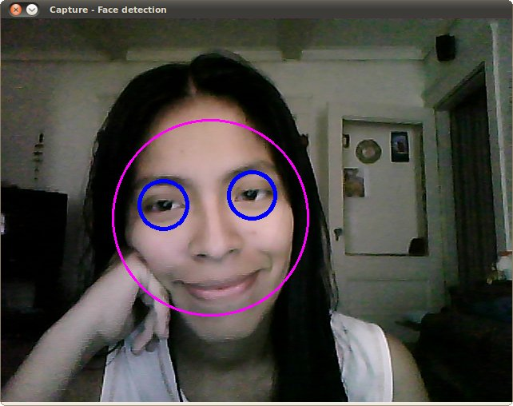
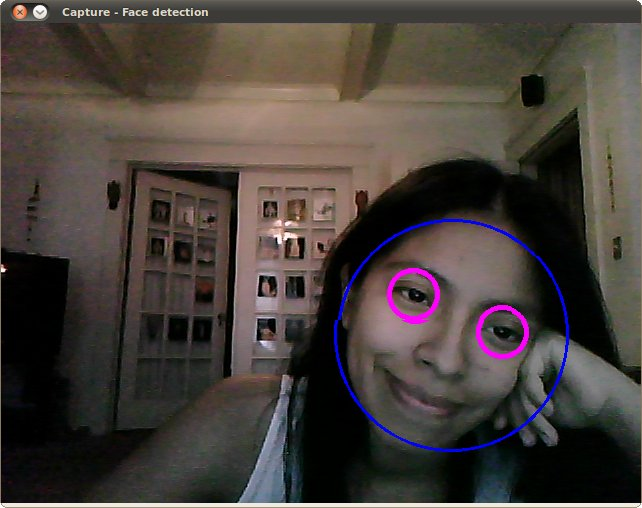
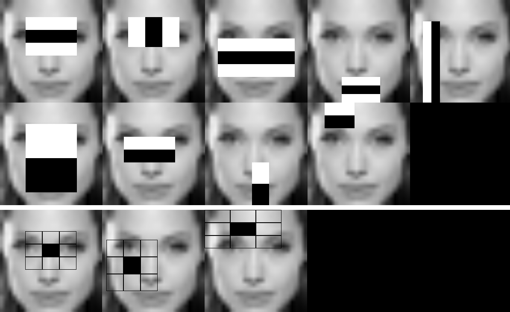

# 级联分类器

## 目标

- 我们将学习Haar级联对象检测的工作原理。
- 我们将使用基于`Haar Feature`的`Cascade`分类器了解人脸检测和眼睛检测的基础知识
  我们将使用`cv :: CascadeClassifier`类来检测视频流中的对象。特别是，我们将使用以下功能：
  `cv :: CascadeClassifier :: load`来加载`.xml`分类器文件。它可以是`Haar`或`LBP`分类器
  `cv :: CascadeClassifier :: detectMultiScale`执行检测。

## 理论

使用基于Haar特征的级联分类器进行对象检测是Paul Viola和Michael Jones在其论文“使用简单特征的增强级联进行快速对象检测”中于2001年提出的一种有效的对象检测方法。这是一种基于机器学习的方法，其中从许多正负图像中训练级联函数。然后用于检测其他图像中的对象。

在这里，我们将进行人脸检测。最初，该算法需要大量正图像（面部图像）和负图像（无面部图像）来训练分类器。然后，我们需要从中提取特征。为此，使用下图所示的Haar功能。它们就像我们的卷积核。每个特征都是通过从黑色矩形下的像素总和中减去白色矩形下的像素总和而获得的单个值。


现在，每个内核的所有可能大小和位置都用于计算许多功能。（试想一下它需要多少计算？即使是一个24x24的窗口也会产生超过160000个特征）。对于每个特征计算，我们需要找到白色和黑色矩形下的像素总和。为了解决这个问题，他们引入了整体形象。无论您的图像有多大，它都会将给定像素的计算减少到仅涉及四个像素的操作。很好，不是吗？它使事情变得超快。

但是在我们计算的所有这些功能中，大多数都不相关。例如，考虑下图。第一行显示了两个良好的功能。选择的第一个特征似乎着眼于眼睛区域通常比鼻子和脸颊区域更暗的性质。选择的第二个功能依赖于眼睛比鼻梁更黑的属性。但是，将相同的窗口应用于脸颊或其他任何地方都是无关紧要的。那么，我们如何从16万多个功能中选择最佳功能？它是由Adaboost实现的。


为此，我们将所有功能应用于所有训练图像。对于每个功能，它会找到最佳的阈值，该阈值会将人脸分为正面和负面。显然，会出现错误或分类错误。我们选择错误率最低的特征，这意味着它们是对人脸和非人脸图像进行最准确分类的特征。（此过程并非如此简单。在开始时，每个图像的权重均相等。在每次分类后，错误分类的图像的权重都会增加。然后执行相同的过程。将计算新的错误率。还要计算新的权重。继续进行此过程，直到达到所需的精度或错误率或找到所需的功能数量为止。

最终分类器是这些弱分类器的加权和。之所以称为弱分类，是因为仅凭它不能对图像进行分类，而是与其他分类一起形成强分类器。该论文说，甚至200个功能都可以提供95％的准确度检测。他们的最终设置具有大约6000个功能。（想象一下，从160000多个功能减少到6000个功能。这是很大的收获）。

因此，现在您拍摄一张照片。取每个24x24窗口。向其应用6000个功能。检查是否有脸。哇..这不是效率低下又费时吗？是的。作者对此有一个很好的解决方案。

在图像中，大多数图像是非面部区域。因此，最好有一种简单的方法来检查窗口是否不是面部区域。如果不是，请一次性丢弃它，不要再次对其进行处理。相反，应将重点放在可能有脸的区域。这样，我们将花费更多时间检查可能的面部区域。

为此，他们引入了级联分类器的概念。不是将所有6000个功能部件应用到一个窗口中，而是将这些功能部件分组到不同阶段的分类器中，并一一应用。（通常前几个阶段将包含很少的功能）。如果窗口在第一阶段失败，则将其丢弃。我们不考虑它的其余功能。如果通过，则应用功能的第二阶段并继续该过程。经过所有阶段的窗口是一个面部区域。那计划怎么样？

作者的检测器具有6000多个特征，具有38个阶段，在前五个阶段具有1、10、25、25和50个特征。（上图中的两个功能实际上是从Adaboost获得的最佳两个功能）。根据作者的说法，每个子窗口平均评估了6000多个特征中的10个特征。

因此，这是Viola-Jones人脸检测工作原理的简单直观说明。阅读本文以获取更多详细信息，或查看其他资源部分中的参考资料。

## OpenCV中的Haar级联检测

OpenCV提供了一种训练方法（请参阅Cascade Classifier Training）或预先训练的模型，可以使用`cv::CascadeClassifier::load`方法读取它。预训练的模型位于OpenCV安装的data文件夹中，或在[此处](https://github.com/opencv/opencv/tree/master/data)找到。

以下代码示例将使用预训练的Haar级联模型来检测图像中的面部和眼睛。首先，创建一个`cv::CascadeClassifier`并使用`cv::CascadeClassifier::load`方法加载必要的`XML`文件。然后，使用`cv::CascadeClassifier::detectMultiScale`方法完成检测，该方法返回检测到的脸部或眼睛的边界矩形。

本教程的代码如下所示。

```python
from __future__ import print_function
import cv2 as cv
import argparse
def detectAndDisplay(frame):
    frame_gray = cv.cvtColor(frame, cv.COLOR_BGR2GRAY)
    frame_gray = cv.equalizeHist(frame_gray)
    #-- Detect faces
    faces = face_cascade.detectMultiScale(frame_gray)
    for (x,y,w,h) in faces:
        center = (x + w//2, y + h//2)
        frame = cv.ellipse(frame, center, (w//2, h//2), 0, 0, 360, (255, 0, 255), 4)
        faceROI = frame_gray[y:y+h,x:x+w]
        #-- In each face, detect eyes
        eyes = eyes_cascade.detectMultiScale(faceROI)
        for (x2,y2,w2,h2) in eyes:
            eye_center = (x + x2 + w2//2, y + y2 + h2//2)
            radius = int(round((w2 + h2)*0.25))
            frame = cv.circle(frame, eye_center, radius, (255, 0, 0 ), 4)
    cv.imshow('Capture - Face detection', frame)
parser = argparse.ArgumentParser(description='Code for Cascade Classifier tutorial.')
parser.add_argument('--face_cascade', help='Path to face cascade.', default='data/haarcascades/haarcascade_frontalface_alt.xml')
parser.add_argument('--eyes_cascade', help='Path to eyes cascade.', default='data/haarcascades/haarcascade_eye_tree_eyeglasses.xml')
parser.add_argument('--camera', help='Camera devide number.', type=int, default=0)
args = parser.parse_args()
face_cascade_name = args.face_cascade
eyes_cascade_name = args.eyes_cascade
face_cascade = cv.CascadeClassifier()
eyes_cascade = cv.CascadeClassifier()
#-- 1. Load the cascades
if not face_cascade.load(cv.samples.findFile(face_cascade_name)):
    print('--(!)Error loading face cascade')
    exit(0)
if not eyes_cascade.load(cv.samples.findFile(eyes_cascade_name)):
    print('--(!)Error loading eyes cascade')
    exit(0)
camera_device = args.camera
#-- 2. Read the video stream
cap = cv.VideoCapture(camera_device)
if not cap.isOpened:
    print('--(!)Error opening video capture')
    exit(0)
while True:
    ret, frame = cap.read()
    if frame is None:
        print('--(!) No captured frame -- Break!')
        break
    detectAndDisplay(frame)
    if cv.waitKey(10) == 27:
        break
```

## 结果

这是运行上面的代码并将内置摄像头的视频流用作输入的结果：



确保程序会找到文件`haarcascade_frontalface_alt.xml`和`haarcascade_eye_tree_eyeglasses.xml`的路径。它们位于`opencv/data/haarcascades`中

这是使用文件`lbpcascade_frontalface.xml`（经过LBP训练）进行人脸检测的结果。对于眼睛，我们继续使用本教程中使用的文件。



# 级联分类器训练

## 介绍

使用弱分类器的增强级联包括两个主要阶段：训练和检测阶段。对象检测教程中介绍了使用基于HAAR或LBP模型的检测阶段。本文档概述了训练自己的弱分类器的级联所需的功能。当前指南将分各个阶段进行：收集训练数据，准备训练数据并执行实际模型训练。

为了支持本教程，将使用几个官方的OpenCV应用程序：[opencv_createsamples](https://github.com/opencv/opencv/tree/master/apps/createsamples)，[opencv_annotation](https://github.com/opencv/opencv/tree/master/apps/annotation)，[opencv_traincascade](https://github.com/opencv/opencv/tree/master/apps/traincascade)和[opencv_visualisation](https://github.com/opencv/opencv/tree/master/apps/visualisation)。

### 重要笔记

- 如果您遇到任何提及旧的opencv_haartraining工具（不推荐使用，仍在使用OpenCV1.x接口）的教程，请忽略该教程并坚持使用opencv_traincascade工具。此工具是较新的版本，根据OpenCV 2.x和OpenCV 3.x API用C ++编写。opencv_traincascade同时支持类似HAAR的小波特征和LBP（局部二进制模式）特征。与HAAR特征相比，LBP特征产生整数精度，从而产生浮点精度，因此LBP的训练和检测速度都比HAAR特征快几倍。关于LBP和HAAR的检测质量，主要取决于所使用的训练数据和选择的训练参数。可以训练基于LBP的分类器，该分类器将在训练时间的一定百分比内提供与基于HAAR的分类器几乎相同的质量。
- 来自OpenCV 2.x和OpenCV 3.x（cv :: CascadeClassifier）的较新的级联分类器检测接口支持使用新旧模型格式。如果由于某些原因而使用旧界面，则opencv_traincascade甚至可以旧格式保存（导出）经过训练的级联。然后至少可以在最稳定的界面中训练模型。
- opencv_traincascade应用程序可以使用TBB进行多线程处理。要在多核模式下使用它，必须在启用TBB支持的情况下构建OpenCV。

## 准备训练数据

为了训练弱分类器的增强级联，我们需要一组正样本（包含您要检测的实际对象）和一组负图像（包含您不想检测的所有内容）。负样本集必须手动准备，而正样本集是使用`opencv_createsamples`应用程序创建的。

### 负样本

负样本取自任意图像，其中不包含要检测的对象。这些负图像（从中生成样本）应在特殊的负图像文件中列出，该文件每行包含一个图像路径（可以是绝对路径，也可以是相对路径）。注意，负样本和样本图像也称为背景样本或背景图像，在本文档中可以互换使用。

所描述的图像可能具有不同的尺寸。但是，每个图像都应等于或大于所需的训练窗口大小（与模型尺寸相对应，大多数情况下是对象的平均大小），因为这些图像用于将给定的负像子采样为几个图像具有此训练窗口大小的样本。

否定描述文件的示例：

目录结构：

```
/ IMG
  img1.jpg
  img2.jpg
bg.txt
```

您的一组否定窗口样本将用于告诉机器学习步骤，在这种情况下，当尝试查找您感兴趣的对象时，可以增强不需要查找的内容。

### 正样本

正样本由`opencv_createsamples`应用程序创建。增强过程使用它们来定义在尝试找到感兴趣的对象时模型应实际寻找的内容。该应用程序支持两种生成正样本数据集的方式。

1.您可以从单个正对象图像生成一堆正值。
2.您可以自己提供所有肯定的内容，仅使用该工具将其切出，调整大小并以opencv所需的二进制格式放置。

虽然第一种方法对固定对象（例如非常刚性的徽标）效果不错，但对于刚性较差的对象，它往往很快就会失效。在这种情况下，我们建议使用第二种方法。网络上的许多教程甚至都指出，使用`opencv_createsamples`应用程序，与1000个人工生成的正片相比，可以生成100个真实的对象图像更好的模型。但是，如果您决定采用第一种方法，请记住以下几点：

- 请注意，在将其提供给上述应用程序之前，您需要多个正样本，因为它仅应用透视变换。
- 如果您需要一个健壮的模型，请获取涵盖对象类中可能出现的多种变化的样本。例如，对于面孔，您应该考虑不同的种族和年龄段，情绪以及胡须风格。当使用第二种方法时，这也适用。

第一种方法采用带有公司徽标的单个对象图像，并通过随机旋转对象，更改图像强度以及将图像放置在任意背景上，从给定的对象图像中创建大量正样本。随机性的数量和范围可以由`opencv_createsamples`应用程序的命令行参数控制。

命令行参数：

- `-vec <vec_file_name>` ：包含用于训练的正样本的输出文件的名称。
- `-img <image_file_name>` ：源对象图像（例如公司徽标）。
- `-bg <background_file_name>`：背景描述文件；包含图像列表，这些图像用作对象的随机变形版本的背景。
- `-num <number_of_samples>` ：要生成的阳性样本数。
- `-bgcolor <background_color>`：背景色（目前假设为灰度图像）；背景色表示透明色。由于可能存在压缩伪影，因此可以通过-bgthresh指定颜色容忍度。bgcolor-bgthresh和bgcolor + bgthresh范围内的所有像素均被解释为透明的。
- `-bgthresh <background_color_threshold>`
- `-inv` ：如果指定，颜色将被反转。
- `-randinv` ：如果指定，颜色将随机反转。
- `-maxidev <max_intensity_deviation>` ：前景样本中像素的最大强度偏差。
- `-maxxangle <max_x_rotation_angle>` ：相对于x轴的最大旋转角度，必须以弧度为单位。
- `-maxyangle <max_y_rotation_angle>` ：朝向y轴的最大旋转角必须以弧度为单位。
- `-maxzangle <max_z_rotation_angle>` ：朝向z轴的最大旋转角必须以弧度为单位。
- `-show`：有用的调试选项。如果指定，将显示每个样本。按Esc将继续示例创建过程，而不会显示每个示例。
- `-w <sample_width>` ：输出样本的宽度（以像素为单位）。
- `-h <sample_height>` ：输出样本的高度（以像素为单位）。
  当以这种方式运行opencv_createsamples时，将使用以下过程来创建样本对象实例：给定的源图像围绕所有三个轴随机旋转。所选择的角由限制`-maxxangle`，`-maxyangle`和`-maxzangle`。然后，像素具有`[bg_color-bg_color_threshold; bg_color + bg_c​​olor_threshold]`范围被解释为透明。白噪声被添加到前景的强度。如果`-inv`指定了键，则前景像素强度会反转。如果`-randinv`指定了key，则算法将随机选择是否应将反演应用于此样本。最后，将获得的图像放置在背景描述文件中的任意背景上，并调整为由`-w`和指定的所需大小`-h`并存储到由`-vec`命令行选项指定的vec文件中。

也可以从以前标记的图像的集合中获取正样本，这是构建鲁棒对象模型时的理想方式。该集合由类似于背景描述文件的文本文件描述。该文件的每一行都对应一个图像。该行的第一个元素是文件名，后跟对象注释的数量，后跟描述包围矩形（x，y，宽度，高度）的对象坐标的数字。

描述文件的示例：

目录结构：

```
/ IMG
  img1.jpg
  img2.jpg
info.dat
```

文件info.dat：

```
img / img1.jpg 1140100 45 45
img / img2.jpg 210020050 50 50 30 25 25
```

图像img1.jpg包含具有以下边界矩形坐标的单个对象实例：（140，100，45，45）。图像img2.jpg包含两个对象实例。

为了从此类集合中创建正样本，`-info`应指定参数而不是`-img`：

- `-info <collection_file_name>` ：标记的图像集合的描述文件。
  请注意，在这种情况下，像这样`-bg, -bgcolor, -bgthreshold, -inv, -randinv, -maxxangle, -maxyangle, -maxzangle`的参数将被简单地忽略并且不再使用。在这种情况下，样本创建的方案如下。通过从原始图像中切出提供的边界框，从给定图像中获取对象实例。然后将它们调整为目标样本大小（由`-w`和定义`-h`），并存储在由`-vec`参数定义的输出vec文件中。无失真应用，所以只能影响参数是`-w，-h，-show和-num`。

`-info`也可以使用opencv_annotation工具完成手动创建文件的过程。这是一个开放源代码工具，用于在任何给定图像中直观地选择对象实例的关注区域。以下小节将详细讨论如何使用此应用程序。

**额外备注**

- opencv_createsamples实用程序可用于检查存储在任何给定正样本文件中的样本。为了做到这一点只-vec，-w并-h应指定的参数。
- 此处提供了vec-file的示例`opencv/data/vec_files/trainingfaces_24-24.vec`。它可用于训练具有以下窗口大小的面部检测器：`-w 24 -h 24`。

## 使用OpenCV的集成注释工具

从OpenCV 3.x开始，社区一直在提供和维护用于生成`-info`
文件的开源注释工具。如果构建了OpenCV应用程序，则可以通过命令opencv_annotation访问该工具。

使用该工具非常简单。该工具接受几个必需参数和一些可选参数：

- `--annotations` （必需）：注释txt文件的路径，您要在其中存储注释，然后将其传递到`-info`参数[example-/data/annotations.txt]
- `--images` （必填）：包含带有您的对象的图像的文件夹的路径[示例-/ data / testimages /]
- `--maxWindowHeight` （可选）：如果输入图像的高度大于此处的给定分辨率，请使用调整图像的大小以便于注释`--resizeFactor`。
- `--resizeFactor` （可选）：使用`-maxWindowHeight`参数时用于调整输入图像大小的因子。
  请注意，可选参数只能一起使用。可以使用的命令示例如下所示

```
opencv_annotation --annotations = /path/to/annotations/file.txt --images=/path/to/image/folder/
```

此命令将启动一个窗口，其中包含第一张图像和您的鼠标光标，这些窗口将用于注释。有关如何使用注释工具的视频，请参见此处。基本上，有几个按键可以触发一个动作。鼠标左键用于选择对象的第一个角，然后一直进行绘图直到您感觉很好为止，并在记录第二次鼠标左键单击时停止。每次选择后，您有以下选择：

- 按c：确认注释，将注释变为绿色并确认已存储
- 按下d：从注释列表中删除最后一个注释（易于删除错误的注释）
- 按下n：继续下一张图像
- 按下ESC：这将退出注释软件
  最后，您将获得一个可用的注释文件，该文件可以传递给`-infoopencv_createsamples`的参数。

## 级联训练

下一步是基于预先准备的正数和负数数据集对弱分类器的增强级联进行实际训练。

opencv_traincascade应用程序的命令行参数按用途分组：

- 常用参数：
- `-data <cascade_dir_name>`：应将经过训练的分类器存储在哪里。此文件夹应事先手动创建。
- `-vec <vec_file_name>` ：带有正样本的vec文件（由opencv_createsamples实用程序创建）。
- `-bg <background_file_name>`：背景描述文件。这是包含阴性样本图像的文件。
- `-numPos <number_of_positive_samples>` ：每个分类器阶段用于训练的阳性样本数。
- `-numNeg <number_of_negative_samples>` ：每个分类器阶段用于训练的阴性样本数。
- `-numStages <number_of_stages>` ：要训练的级联级数。
- `-precalcValBufSize <precalculated_vals_buffer_size_in_Mb>`：用于预先计算的特征值的缓冲区大小（以Mb为单位）。您分配的内存越多，培训过程就越快，但是请记住，`-precalcValBufSize`和的`-precalcIdxBufSize`总和不应超过您的可用系统内存。
- `-precalcIdxBufSize <precalculated_idxs_buffer_size_in_Mb>`：用于预先计算的特征索引的缓冲区大小（以Mb为单位）。您分配的内存越多，培训过程就越快，但是请记住，`-precalcValBufSize`和的`-precalcIdxBufSize`总和不应超过您的可用系统内存。
- `-baseFormatSave`：对于类似Haar的功能，此参数是实际的。如果指定，级联将以旧格式保存。仅出于向后兼容的原因，并且允许用户停留在旧的不赞成使用的界面上，至少可以使用较新的界面训练模型，才可以使用此功能。
- `-numThreads <max_number_of_threads>`：训练期间要使用的最大线程数。请注意，实际使用的线程数可能会更少，具体取决于您的计算机和编译选项。默认情况下，如果您使用TBB支持构建了OpenCV，则将选择最大可用线程，这是此优化所必需的。
- `-acceptanceRatioBreakValue <break_value>`：此参数用于确定模型应保持学习的精确度以及何时停止。良好的指导原则是进行不超过10e-5的训练，以确保模型不会对您的训练数据过度训练。默认情况下，此值设置为-1以禁用此功能。
- 级联参数：
- `-stageType <BOOST(default)>`：阶段类型。目前仅支持提升分类器作为阶段类型。
- `-featureType<{HAAR(default), LBP}>` ：功能类型：HAAR-类似Haar的功能，LBP-本地二进制模式。
- `-w <sampleWidth>`：训练样本的宽度（以像素为单位）。必须具有与训练样本创建期间使用的值完全相同的值（opencv_createsamples实用程序）。
- `-h <sampleHeight>`：训练样本的高度（以像素为单位）。必须具有与训练样本创建期间使用的值完全相同的值（opencv_createsamples实用程序）。
- 提升分类器参数：
- `-bt <{DAB, RAB, LB, GAB(default)}>` ：增强分类器的类型：DAB-离散AdaBoost，RAB-真实AdaBoost，LB-LogitBoost，GAB-温和AdaBoost。
- `-minHitRate <min_hit_rate>`：分类器每个阶段的最低期望命中率。总命中率可以估计为（min_hit_rate ^ number_of_stages），[228] §4.1。
- `-maxFalseAlarmRate <max_false_alarm_rate>`：分类器每个阶段的最大期望误报率。总体误报率可以估计为（max_false_alarm_rate ^ number_of_stages）。
- `-weightTrimRate <weight_trim_rate>`：指定是否应使用修剪及其重量。不错的选择是0.95。
- `-maxDepth <max_depth_of_weak_tree>`：一棵弱树的最大深度。一个不错的选择是1，这是树桩的情况。
- `-maxWeakCount <max_weak_tree_count>`：每个级联阶段的弱树的最大数量。提升分类器（阶段）将具有太多弱树（<= maxWeakCount），这是实现给定所需的-`maxFalseAlarmRate`。
- 类似Haar的特征参数：
- `-mode <BASIC (default) | CORE | ALL>`：选择训练中使用的Haar功能集的类型。BASIC仅使用直立功能，而ALL使用整套直立和45度旋转功能集。
- 本地二进制模式参数：本地二进制模式没有参数。
  opencv_traincascade应用程序完成工作后，经过训练的级联将保存`cascade.xml`在该`-data`文件夹中的文件中。此文件夹中的其他文件是为中断培训而创建的，因此您可以在培训完成后将其删除。

训练已完成，您可以测试级联分类器！

## 可视化级联分类器

有时，可视化受过训练的级联，查看其选择的功能以及其阶段的复杂性可能会很有用。为此，OpenCV提供了一个`opencv_visualisation`应用程序。该应用程序具有以下命令：

- `--image` （必需）：对象模型的参考图像的路径。这应该是带有标注`[ -w，-h]`的注释，同时传递给`opencv_createsamples`和`opencv_traincascade`应用程序。
- `--model` （必需）：训练模型的路径，该路径应该在`-dataopencv_traincascade`应用程序的参数提供的文件夹中。
- `--data` （可选）：如果提供了数据文件夹（必须事先手动创建），则将存储舞台输出和功能视频。
  下面是一个示例命令

```
opencv_visualisation --image = /data/object.png --model = /data/model.xml --data = /data/result/
```

当前可视化工具的一些限制

- 仅处理由opencv_traincascade工具训练的级联分类器模型，其中包含**stumps**作为决策树[默认设置]。
- 提供的图像必须是带有原始模型尺寸的样本窗口，并传递给`--image`参数。
  `HAAR/LBP`人脸模型的示例在Angelina Jolie的给定窗口上运行，该窗口具有与级联分类器文件相同的预处理-> 24x24像素图像，灰度转换和直方图均衡化：

每个阶段都会制作一个视频，以显示每个功能：

每个阶段都作为图像存储，以供将来对功能进行验证：


