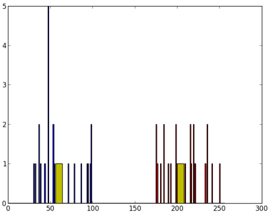
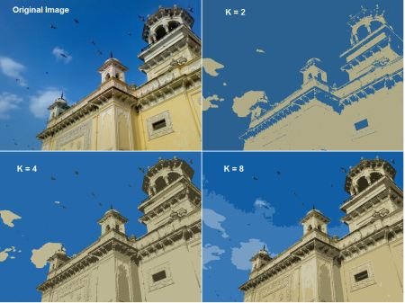

# K最近邻

## 了解k最近邻居

### 目标

- 在本章中，我们将了解k最近邻（kNN）算法的概念。

### 理论

kNN是可用于监督学习的最简单的分类算法之一。这个想法是在特征空间中搜索测试数据的最匹配。我们将用下面的图片来研究它。


在图像中，有两个家族，蓝色正方形和红色三角形。我们称每个家庭为`Class`。他们的房屋显示在他们的城镇地图中，我们称之为要素空间。*（您可以将要素空间视为投影所有数据的空间。例如，考虑一个2D坐标空间。每个数据都有两个要素x和y坐标。您可以在2D坐标空间中表示此数据，对吧？现在假设如果有三个要素，则需要3D空间，现在考虑N个要素，需要N维空间，对吗？这个N维空间就是其要素空间，在我们的图像中，您可以将其视为2D情况有两个功能）*。

现在有一个新成员进入城镇并创建了一个新房屋，显示为绿色圆圈。他应该被添加到这些蓝色/红色家族之一中。我们称该过程为分类。我们所做的？由于我们正在处理kNN，因此让我们应用此算法。

一种方法是检查谁是他的最近邻居。从图像中可以明显看出它是红色三角形家族。因此，他也被添加到了`Red Triangle`中。此方法简称为`Nearest Neighbor`，因为分类仅取决于最近的邻居。

但这是有问题的。红色三角可能是最近的。但是，如果附近有很多蓝色广场怎么办？然后，蓝色方块在该地区的实力比红色三角更大。因此，仅检查最接近的一个是不够的。相反，我们检查一些k最近的家庭。那么，无论谁占多数，新人都属于那个家庭。在我们的图像中，让我们取k = 3，即3个最近的家庭。他有两个红色和一个蓝色（有两个等距的蓝色，但是由于k = 3，我们只取其中一个），所以他又应该加入红色家族。但是，如果我们取k = 7怎么办？然后，他有5个蓝色家庭和2个红色家庭。大！！现在，他应该被加入Blue家族。因此，所有这些都随k的值而变化。更有趣的是，如果k = 4怎么办？他有2个红色邻居和2个蓝色邻居。这是一条领带！因此最好将k作为奇数。k最近邻，因为分类取决于k最近邻。

同样，在kNN中，我们确实在考虑k个邻居，但我们对所有人都给予同等的重视，对吗？是正义吗？例如，以k ＝ 4的情况为例。我们说这是平局。但是请注意，这两个红色家庭比其他两个蓝色家庭离他更近。因此，他更有资格被添加到Red。那么我们如何用数学解释呢？我们根据每个家庭到新来者的距离来给他们一些权重。对于那些靠近他的人，权重增加，而那些远离他的人，权重减轻。然后，我们分别添加每个家庭的总权重。谁得到的总权重最高，新人就去那个家庭。这称为修改的kNN。

那么您在这里看到的一些重要内容是什么？

您需要了解镇上所有房屋的信息，对吗？因为，我们必须检查从新移民到所有现有房屋的距离，以找到最近的邻居。如果有很多房屋和家庭，则需要大量的内存，并且需要更多的时间进行计算。
几乎没有时间进行任何形式的培训或准备。
现在让我们在OpenCV中看到它。

### OpenCV中的kNN

就像上面一样，我们将在这里做一个简单的例子，有两个家庭（类）。然后在下一章中，我们将做一个更好的例子。

因此，在这里，我们将红色系列标记为`Class-0`（因此用0表示），将蓝色系列标记为`Class-1`（用1表示）。我们创建25个家庭或25个训练数据，并将它们标记为0类或1类。我们借助Numpy中的`Random Number Generator`来完成所有这些工作。

然后我们在`Matplotlib`的帮助下对其进行绘制。红色系列显示为红色三角形，蓝色系列显示为蓝色正方形。

```python
import cv2 as cv
import numpy as np
import matplotlib.pyplot as plt
# Feature set containing (x,y) values of 25 known/training data
trainData = np.random.randint(0,100,(25,2)).astype(np.float32)
# Labels each one either Red or Blue with numbers 0 and 1
responses = np.random.randint(0,2,(25,1)).astype(np.float32)
# Take Red families and plot them
red = trainData[responses.ravel()==0]
plt.scatter(red[:,0],red[:,1],80,'r','^')
# Take Blue families and plot them
blue = trainData[responses.ravel()==1]
plt.scatter(blue[:,0],blue[:,1],80,'b','s')
plt.show()
```

您会得到与我们的第一张图片相似的东西。由于您使用的是随机数生成器，因此每次运行代码都将获得不同的数据。

接下来启动kNN算法，并传递`trainData`和响应以训练kNN（它会构建搜索树）。

然后，我们将在OpenCV中的kNN的帮助下将一个新人带入一个家庭并将其分类。在进入kNN之前，我们需要了解测试数据（新手的数据）上的知识。我们的数据应该是大小为$number of testdata×number of features$,然后我们找到新来者的最近邻居。我们可以指定我们想要多少个邻居。它返回：

- 给新人的标签取决于我们之前看到的kNN理论。如果要使用“最近邻居”算法，只需指定k = 1即可，其中k是邻居数。
- k最近邻居的标签。
- 从新来者到每个最近邻居的相应距离。
  因此，让我们看看它是如何工作的。新角标记为绿色。

```python
newcomer = np.random.randint(0,100,(1,2)).astype(np.float32)
plt.scatter(newcomer[:,0],newcomer[:,1],80,'g','o')
knn = cv.ml.KNearest_create()
knn.train(trainData, cv.ml.ROW_SAMPLE, responses)
ret, results, neighbours ,dist = knn.findNearest(newcomer, 3)
print( "result:  {}\n".format(results) )
print( "neighbours:  {}\n".format(neighbours) )
print( "distance:  {}\n".format(dist) )
plt.show()
```

我得到的结果如下：

```python
result:  [[ 1.]]
neighbours:  [[ 1.  1.  1.]]
distance:  [[ 53.  58.  61.]]
```

它说我们的新来者有3个邻居，全部来自Blue家族。因此，他被标记为蓝色家庭。从下面的图可以明显看出：


如果您有大量数据，则可以将其作为数组传递。还获得了相应的结果作为数组。

```python
# 10 new comers
newcomers = np.random.randint(0,100,(10,2)).astype(np.float32)
ret, results,neighbours,dist = knn.findNearest(newcomer, 3)
# The results also will contain 10 labels.
```

## 使用kNN的OCR手写数据

### 目标

在这一章当中

- 我们将使用有关kNN的知识来构建基本的OCR应用程序。
- 我们将尝试使用OpenCV随附的数字和字母数据。

### 手写数字的OCR

我们的目标是构建一个可以读取手写数字的应用程序。为此，我们需要一些`train_data`和`test_data`。OpenCV带有一个图片`digits.png`（在文件夹`opencv/samples/data/`中），其中包含5000个手写数字（每个数字500个）。每个数字都是20x20的图像。因此，我们的第一步是将图像分割成5000个不同的数字。对于每个数字，我们将其展平为400像素的一行。那就是我们的功能集，即所有像素的强度值。这是我们可以创建的最简单的功能集。我们将每个数字的前250个样本用作`train_data`，然后将250个样本用作`test_data`。因此，让我们先准备它们。

```python
import numpy as np
import cv2 as cv
img = cv.imread('digits.png')
gray = cv.cvtColor(img,cv.COLOR_BGR2GRAY)
# Now we split the image to 5000 cells, each 20x20 size
cells = [np.hsplit(row,100) for row in np.vsplit(gray,50)]
# Make it into a Numpy array. It size will be (50,100,20,20)
x = np.array(cells)
# Now we prepare train_data and test_data.
train = x[:,:50].reshape(-1,400).astype(np.float32) # Size = (2500,400)
test = x[:,50:100].reshape(-1,400).astype(np.float32) # Size = (2500,400)
# Create labels for train and test data
k = np.arange(10)
train_labels = np.repeat(k,250)[:,np.newaxis]
test_labels = train_labels.copy()
# Initiate kNN, train the data, then test it with test data for k=1
knn = cv.ml.KNearest_create()
knn.train(train, cv.ml.ROW_SAMPLE, train_labels)
ret,result,neighbours,dist = knn.findNearest(test,k=5)
# Now we check the accuracy of classification
# For that, compare the result with test_labels and check which are wrong
matches = result==test_labels
correct = np.count_nonzero(matches)
accuracy = correct*100.0/result.size
print( accuracy )
```

因此，我们的基本OCR应用程序已准备就绪。这个特定的例子给我的准确性是91％。一种提高准确性的选择是添加更多数据进行训练，尤其是错误的数据。因此，与其每次启动应用程序时都找不到该培训数据，不如将其保存，以便下次我直接从文件中读取此数据并开始分类。您可以借助一些Numpy函数（例如`np.savetxt`，`np.savez`，`np.load`等）来完成此操作。请查看其文档以获取更多详细信息。

```python
# save the data
np.savez('knn_data.npz',train=train, train_labels=train_labels)
# Now load the data
with np.load('knn_data.npz') as data:
    print( data.files )
    train = data['train']
    train_labels = data['train_labels']
```

在我的系统中，它需要大约4.4 MB的内存。由于我们使用强度值（`uint8`数据）作为特征，因此最好先将数据转换为`np.uint8`，然后保存。在这种情况下，仅占用1.1 MB。然后在加载时，您可以转换回float32。

### 英文字母的OCR

接下来，我们将对英语字母执行相同的操作，但是数据和功能集会稍有变化。在这里，OpenCV除了图像以外，还带有一个数据文件，即`opencv/samples/cpp/`文件夹中的`letter-recognitiontion.data`。如果打开它，您将看到20000行，乍一看可能看起来像垃圾。实际上，在每一行中，第一列是一个字母，这是我们的标签。接下来的16个数字是它的不同功能。这些功能可从[UCI机器学习存储库获得](http://archive.ics.uci.edu/ml/index.php)。您可以[在此页面](http://archive.ics.uci.edu/ml/datasets/Letter+Recognition)中找到这些功能的详细信息。

现有20000个样本，因此我们将前10000个数据作为训练样本，其余10000个作为测试样本。我们应该将字母更改为ASCII字符，因为我们不能直接使用字母。

```python
import cv2 as cv
import numpy as np
# Load the data, converters convert the letter to a number
data= np.loadtxt('letter-recognition.data', dtype= 'float32', delimiter = ',',
                    converters= {0: lambda ch: ord(ch)-ord('A')})
# split the data to two, 10000 each for train and test
train, test = np.vsplit(data,2)
# split trainData and testData to features and responses
responses, trainData = np.hsplit(train,[1])
labels, testData = np.hsplit(test,[1])
# Initiate the kNN, classify, measure accuracy.
knn = cv.ml.KNearest_create()
knn.train(trainData, cv.ml.ROW_SAMPLE, responses)
ret, result, neighbours, dist = knn.findNearest(testData, k=5)
correct = np.count_nonzero(result == labels)
accuracy = correct*100.0/10000
print( accuracy )
```

它给我的准确性为93.22％。同样，如果要提高准确性，则可以迭代地在每个级别中添加错误数据。

# 支持向量机（SVM）

## 了解SVM

### 目标

在这一章当中

- 我们将看到对SVM的直观了解

### 理论

### 线性可分离数据

考虑下面的图像，它具有两种数据类型，红色和蓝色。在kNN中，对于测试数据，我们用来测量其与所有训练样本的距离，并以最小的距离作为样本。测量所有距离都需要花费大量时间，并且需要大量内存来存储所有训练样本。但是考虑到图像中给出的数据，我们是否需要那么多？


您可以看到很多这样的行都是可能的。我们会选哪一个？非常直观地，我们可以说直线应该从所有点尽可能远地经过。为什么？因为传入的数据中可能会有噪音。此数据不应影响分类准确性。因此，走最远的线将提供更大的抗干扰能力。因此，SVM要做的是找到到训练样本的最小距离最大的直线（或超平面）。请参阅下面图像中穿过中心的粗线。


因此，要找到此决策边界，您需要训练数据。需要全部吗？没有。仅接近相反组的那些就足够了。在我们的图像中，它们是一个蓝色填充的圆圈和两个红色填充的正方形。我们可以称它们为支持向量，而通过它们的线称为支持平面。它们足以找到我们的决策边界。我们不必担心所有数据。它有助于减少数据量。

### 非线性可分离数据

可以使用二维空间中的平方点积来实现三维空间中的点积。这可以应用于更高维度的空间。因此，我们可以从较低尺寸本身计算较高尺寸的特征。一旦将它们映射，我们将获得更高的空间。

除了所有这些概念之外，还存在分类错误的问题。因此，仅找到具有最大余量的决策边界是不够的。我们还需要考虑分类错误的问题。有时，可能会找到裕度较小但分类错误减少的决策边界。无论如何，我们需要修改我们的模型，以便它应该找到具有最大裕度但分类错误较少的决策边界。

如何选择参数C？显然，这个问题的答案取决于训练数据的分布方式。尽管没有一般性的答案，但考虑以下规则会很有用：

- C的值越大，解决方案的分类错误越少，但裕度也越小。考虑到在这种情况下，进行错误分类错误是昂贵的。由于优化的目的是使参数最小化，因此几乎没有错误分类错误。
- C的值越小，解决方案的裕度就越大，分类误差也越大。在这种情况下，最小化对总和项的考虑不多，因此它更多地关注于找到具有大余量的超平面。

## 使用SVM的手写数据的OCR

### 目标

在这一章当中

- 我们将重新访问手写数据OCR，但是使用SVM而不是kNN。
- 手写数字的OCR
- 在kNN中，我们直接使用像素强度作为特征向量。这次我们将使用定向梯度直方图（HOG）作为特征向量。

在这里，在找到HOG之前，我们使用其二阶矩对图像进行去偏斜。因此，我们首先定义一个函数`deskew()`，该函数获取一个数字图像并将其校正。下面是`deskew()`函数：

```python
def deskew(img):
    m = cv.moments(img)
    if abs(m['mu02']) < 1e-2:
        return img.copy()
    skew = m['mu11']/m['mu02']
    M = np.float32([[1, skew, -0.5*SZ*skew], [0, 1, 0]])
    img = cv.warpAffine(img,M,(SZ, SZ),flags=affine_flags)
    return img
```

下图显示了应用于零图像的上偏移校正功能。左图像是原始图像，右图像是去歪斜图像。


接下来，我们必须找到每个单元格的HOG描述符。为此，我们找到了每个单元在X和Y方向上的Sobel导数。然后在每个像素处找到它们的大小和梯度方向。该梯度被量化为16个整数值。将此图像划分为四个子正方形。对于每个子正方形，计算权重大小方向的直方图（16个bin）。因此，每个子正方形为您提供了一个包含16个值的向量。（四个子正方形的）四个这样的向量共同为我们提供了一个包含64个值的特征向量。这是我们用于训练数据的特征向量。

```python
def hog(img):
    gx = cv.Sobel(img, cv.CV_32F, 1, 0)
    gy = cv.Sobel(img, cv.CV_32F, 0, 1)
    mag, ang = cv.cartToPolar(gx, gy)
    bins = np.int32(bin_n*ang/(2*np.pi))    # quantizing binvalues in (0...16)
    bin_cells = bins[:10,:10], bins[10:,:10], bins[:10,10:], bins[10:,10:]
    mag_cells = mag[:10,:10], mag[10:,:10], mag[:10,10:], mag[10:,10:]
    hists = [np.bincount(b.ravel(), m.ravel(), bin_n) for b, m in zip(bin_cells, mag_cells)]
    hist = np.hstack(hists)     # hist is a 64 bit vector
    return hist
```

最后，与前面的情况一样，我们首先将大数据集拆分为单个单元格。对于每个数字，保留250个单元用于训练数据，其余250个数据保留用于测试。

```python
#!/usr/bin/env python
import cv2 as cv
import numpy as np
SZ=20
bin_n = 16 # Number of bins
affine_flags = cv.WARP_INVERSE_MAP|cv.INTER_LINEAR
def deskew(img):
    m = cv.moments(img)
    if abs(m['mu02']) < 1e-2:
        return img.copy()
    skew = m['mu11']/m['mu02']
    M = np.float32([[1, skew, -0.5*SZ*skew], [0, 1, 0]])
    img = cv.warpAffine(img,M,(SZ, SZ),flags=affine_flags)
    return img
def hog(img):
    gx = cv.Sobel(img, cv.CV_32F, 1, 0)
    gy = cv.Sobel(img, cv.CV_32F, 0, 1)
    mag, ang = cv.cartToPolar(gx, gy)
    bins = np.int32(bin_n*ang/(2*np.pi))    # quantizing binvalues in (0...16)
    bin_cells = bins[:10,:10], bins[10:,:10], bins[:10,10:], bins[10:,10:]
    mag_cells = mag[:10,:10], mag[10:,:10], mag[:10,10:], mag[10:,10:]
    hists = [np.bincount(b.ravel(), m.ravel(), bin_n) for b, m in zip(bin_cells, mag_cells)]
    hist = np.hstack(hists)     # hist is a 64 bit vector
    return hist
img = cv.imread('digits.png',0)
if img is None:
    raise Exception("we need the digits.png image from samples/data here !")
cells = [np.hsplit(row,100) for row in np.vsplit(img,50)]
# First half is trainData, remaining is testData
train_cells = [ i[:50] for i in cells ]
test_cells = [ i[50:] for i in cells]
deskewed = [list(map(deskew,row)) for row in train_cells]
hogdata = [list(map(hog,row)) for row in deskewed]
trainData = np.float32(hogdata).reshape(-1,64)
responses = np.repeat(np.arange(10),250)[:,np.newaxis]
svm = cv.ml.SVM_create()
svm.setKernel(cv.ml.SVM_LINEAR)
svm.setType(cv.ml.SVM_C_SVC)
svm.setC(2.67)
svm.setGamma(5.383)
svm.train(trainData, cv.ml.ROW_SAMPLE, responses)
svm.save('svm_data.dat')
deskewed = [list(map(deskew,row)) for row in test_cells]
hogdata = [list(map(hog,row)) for row in deskewed]
testData = np.float32(hogdata).reshape(-1,bin_n*4)
result = svm.predict(testData)[1]
mask = result==responses
correct = np.count_nonzero(mask)
print(correct*100.0/result.size)
```

这种特殊的技术给了我近94％的准确性。您可以为SVM的各种参数尝试不同的值，以检查是否可以实现更高的精度。或者，您可以阅读有关此领域的技术论文并尝试实施它们。

# K均值聚类

## 了解K均值聚类

### 目标

- 在本章中，我们将了解K-Means聚类的概念，其工作原理等。

### 理论

我们将用一个常用的例子来处理这个问题。

### T恤尺寸问题

考虑一家公司，该公司将向市场发布新型号的T恤。显然，他们将不得不制造不同尺寸的模型，以满足各种规模的人们的需求。因此，该公司会记录人们的身高和体重数据，并将其绘制到图形上，如下所示：


公司无法制作所有尺寸的T恤。取而代之的是，他们将人划分为小，中和大，并仅制造这三种适合所有人的模型。可以通过k均值聚类将人员分为三组，并且算法可以为我们提供最佳的3种尺寸，这将满足所有人员的需求。如果不是这样，公司可以将人员分为更多的组，可能是五个，依此类推。查看下面的图片：


#### 它是如何工作的 ？

该算法是一个迭代过程。我们将在图像的帮助下逐步解释它。

考虑如下数据（您可以将其视为T恤问题）。我们需要将此数据分为两类。


**步骤1**-算法随机选择两个质心$C1$个和$C2$ （有时，将任何两个数据作为质心）。

**步骤2**-计算每个点到两个质心的距离。如果测试数据更接近$C1$个，然后将该数据标记为“ 0”。如果更接近$C2$，然后标记为“ 1”（如果存在更多质心，则标记为“ 2”，“ 3”等）。

在我们的示例中，我们将为所有标记为红色的“ 0”和标记为蓝色的所有“ 1”着色。因此，经过以上操作，我们得到以下图像。

**步骤3**-接下来，我们分别计算所有蓝点和红点的平均值，这将成为我们的新质心。那是$C1$个和$C2$转移到新计算的质心。（请记住，显示的图像不是真实值，也不是真实比例，仅用于演示）。

再次，使用新的质心执行步骤2，并将标签数据设置为'0'和'1'。

因此我们得到如下结果：

现在，迭代步骤2和步骤3，直到两个质心都收敛到固定点

最终结果几乎如下所示：


## OpenCV中的K-均值聚类

### 目标

- 了解如何在OpenCV中使用`cv.kmeans()`函数进行数据聚类

### 了解参数

#### 输入参数

- `sample`：它应该是np.float32数据类型，并且每个功能都应该放在单个列中。
- `nclusters(K)`：结束时所需的集群数
- `criteria`：这是迭代终止准则。满足此条件后，算法迭代将停止。实际上，它应该是3个参数的元组。它们是`（type，max_iter，epsilon）`：
  a.终止条件的类型。它具有3个标志，如下所示：
  1.`cv.TERM_CRITERIA_EPS`-如果达到指定的精度epsilon，则停止算法迭代。
  2.`cv.TERM_CRITERIA_MAX_ITER`-在指定的迭代次数max_iter之后停止算法。
  3.`cv.TERM_CRITERIA_EPS + cv.TERM_CRITERIA_MAX_ITER`-满足以上任何条件时，停止迭代。
  b.`max_iter`-一个整数，指定最大迭代次数。
  c.`epsilon`-要求的精度
- `attempts`：标志来指定的算法是使用不同的初始labellings执行次数。该算法返回产生最佳紧密度的标签。该紧凑性作为输出返回。
- `flags`：此标志用于指定初始中心的获取方式。通常，为此使用两个标志：`cv.KMEANS_PP_CENTERS`和`cv.KMEANS_RANDOM_CENTERS`。

#### 输出参数

- `compactness`：是每个点到其对应中心的平方距离的总和。
- `labels`：这是标签数组（与上一篇文章中的“代码”相同），其中每个元素标记为“ 0”，“ 1” .....
- `centers`：这是群集中心的阵列。
  现在，我们将通过三个示例了解如何应用K-Means算法。

## 1.仅具有一维的数据

考虑一下，您有一组仅具有一个特征（即一维）的数据。例如，我们可以解决我们的T恤问题，您只用身高来决定T恤的尺寸。

因此，我们首先创建数据并将其绘制在Matplotlib

```python
import numpy as np
import cv2 as cv
from matplotlib import pyplot as plt
x = np.random.randint(25,100,25)
y = np.random.randint(175,255,25)
z = np.hstack((x,y))
z = z.reshape((50,1))
z = np.float32(z)
plt.hist(z,256,[0,256]),plt.show()
```

因此，我们有一个“ z”，它是一个大小为50的数组，值的范围是0到255。我已经将“ z”重塑为列向量。如果存在多个功能，它将更加有用。然后我制作了np.float32类型的数据。

我们得到以下图像：

现在我们应用KMeans函数。在此之前，我们需要指定标准。我的标准是，每当运行10次算法迭代或达到epsilon = 1.0的精度时，就停止算法并返回答案。

```python
# Define criteria = ( type, max_iter = 10 , epsilon = 1.0 )
criteria = (cv.TERM_CRITERIA_EPS + cv.TERM_CRITERIA_MAX_ITER, 10, 1.0)
# Set flags (Just to avoid line break in the code)
flags = cv.KMEANS_RANDOM_CENTERS
# Apply KMeans
compactness,labels,centers = cv.kmeans(z,2,None,criteria,10,flags)
```

这为我们提供了紧凑性，标签和中心。在这种情况下，我得到的中心分别为60和207。标签的大小将与测试数据的大小相同，其中每个数据的质心都将标记为“ 0”，“ 1”，“ 2”等。现在，我们根据标签将数据分为不同的群集。

```python
A = z[labels==0]
B = z[labels==1]
```

现在我们以红色绘制A，以蓝色绘制B，以黄色绘制其质心。

```python
# Now plot 'A' in red, 'B' in blue, 'centers' in yellow
plt.hist(A,256,[0,256],color = 'r')
plt.hist(B,256,[0,256],color = 'b')
plt.hist(centers,32,[0,256],color = 'y')
plt.show()
```

以下是我们得到的输出：


## 2.具有多种功能的数据

在前面的示例中，我们仅考虑了T恤问题的身高。在这里，我们将同时考虑身高和体重，即两个特征。

请记住，在以前的情况下，我们将数据制作为单个列向量。每个特征排列在一列中，而每一行对应于一个输入测试样本。

例如，在这种情况下，我们设置了一个大小为50x2的测试数据，即50人的身高和体重。第一列对应于全部50个人的身高，第二列对应于他们的体重。第一行包含两个元素，其中第一个是第一人称的身高，第二个是他的体重。类似地，剩余的行对应于其他人的身高和体重。查看下面的图片：

现在，我直接转到代码：

```python
import numpy as np
import cv2 as cv
from matplotlib import pyplot as plt
X = np.random.randint(25,50,(25,2))
Y = np.random.randint(60,85,(25,2))
Z = np.vstack((X,Y))
# convert to np.float32
Z = np.float32(Z)
# define criteria and apply kmeans()
criteria = (cv.TERM_CRITERIA_EPS + cv.TERM_CRITERIA_MAX_ITER, 10, 1.0)
ret,label,center=cv.kmeans(Z,2,None,criteria,10,cv.KMEANS_RANDOM_CENTERS)
# Now separate the data, Note the flatten()
A = Z[label.ravel()==0]
B = Z[label.ravel()==1]
# Plot the data
plt.scatter(A[:,0],A[:,1])
plt.scatter(B[:,0],B[:,1],c = 'r')
plt.scatter(center[:,0],center[:,1],s = 80,c = 'y', marker = 's')
plt.xlabel('Height'),plt.ylabel('Weight')
plt.show()
```

下面是我们得到的输出：


## 3.颜色量化

颜色量化是减少图像中颜色数量的过程。这样做的原因之一是减少内存。有时，某些设备可能会受到限制，因此只能产生有限数量的颜色。同样在那些情况下，执行颜色量化。在这里，我们使用k均值聚类进行颜色量化。

这里没有新内容要解释。有3个功能，例如R，G，B。因此，我们需要将图像重塑为Mx3大小的数组（M是图像中的像素数）。在聚类之后，我们将质心值（也是R，G，B）应用于所有像素，这样生成的图像将具有指定的颜色数。再一次，我们需要将其重塑为原始图像的形状。下面是代码：

```python
import numpy as np
import cv2 as cv
img = cv.imread('home.jpg')
Z = img.reshape((-1,3))
# convert to np.float32
Z = np.float32(Z)
# define criteria, number of clusters(K) and apply kmeans()
criteria = (cv.TERM_CRITERIA_EPS + cv.TERM_CRITERIA_MAX_ITER, 10, 1.0)
K = 8
ret,label,center=cv.kmeans(Z,K,None,criteria,10,cv.KMEANS_RANDOM_CENTERS)
# Now convert back into uint8, and make original image
center = np.uint8(center)
res = center[label.flatten()]
res2 = res.reshape((img.shape))
cv.imshow('res2',res2)
cv.waitKey(0)
cv.destroyAllWindows()
```

K = 8，请参见以下结果：
