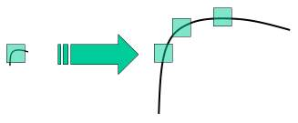
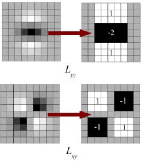
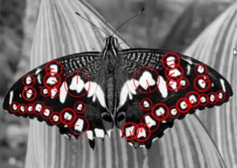
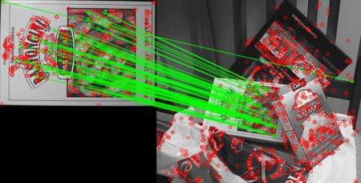

# 了解功能

## 目标

- 在本章中，我们将尝试理解什么是特征，为什么重要，拐角重要等。

## 说明

你们大多数人都会玩拼图游戏。您会得到很多小图像，需要正确组装它们以形成大的真实图像。问题是，你怎么做？将相同的理论投影到计算机程序上，以便计算机可以玩拼图游戏呢？如果计算机可以玩拼图游戏，为什么我们不能给计算机提供很多自然风光的真实图像，并告诉计算机将所有这些图像拼接成一个大的单个图像呢？如果计算机可以将多个自然图像缝合在一起，那么如何给建筑物或任何结构提供大量图片并告诉计算机从中创建3D模型呢？

好了，问题和想象力还在继续。但这全都取决于最基本的问题：您如何玩拼图游戏？您如何将许多加扰的图像片段排列成一个大的单个图像？您如何将许多自然图像拼接到一张图像上？

答案是，我们正在寻找独特的，可以轻松跟踪和比较的独特模式或特定功能。如果我们对这种功能进行定义，我们可能会发现很难用语言来表达它，但是我们知道它们是什么。如果有人要求您指出一项可以在多张图像中进行比较的良好功能，则可以指出其中一项。这就是为什么即使是小孩也可以玩这些游戏的原因。我们在图像中搜索这些特征，找到它们，在其他图像中寻找相同的特征并将它们对齐。而已。（在拼图游戏中，我们更多地研究了不同图像的连续性）。所有这些能力都是我们固有的。

因此，我们的一个基本问题扩展到更多，但变得更加具体。这些功能是什么？。（答案对于计算机也应该是可以理解的。）

很难说人类如何发现这些特征。这已经在我们的大脑中进行了编程。但是，如果我们深入研究某些图片并搜索不同的样式，我们会发现一些有趣的东西。例如，拍摄下图：

图像非常简单。在图像的顶部，给出了六个小图像块。您的问题是在原始图像中找到这些补丁的确切位置。您可以找到多少正确的结果？

A和B是平坦的表面，它们散布在很多区域上。很难找到这些补丁的确切位置。

C和D更简单。它们是建筑物的边缘。您可以找到一个大概的位置，但是准确的位置仍然很困难。这是因为沿着边缘的每个地方的图案都是相同的。但是，在边缘，情况有所不同。因此，与平坦区域相比，边缘是更好的功能，但不够好（在拼图游戏中比较边缘的连续性很好）。

最后，E和F是建筑物的某些角落。而且很容易找到它们。因为在拐角处，无论将此修补程序移动到何处，它的外观都将有所不同。因此，它们可以被视为很好的功能。因此，现在我们进入更简单（且被广泛使用的图像）以更好地理解。


就像上面一样，蓝色补丁是平坦区域，很难找到和跟踪。无论您将蓝色补丁移到何处，它看起来都一样。黑色补丁有一个边缘。如果沿垂直方向（即沿渐变）移动它，则它会改变。沿着边缘（平行于边缘）移动，看起来相同。对于红色补丁，这是一个角落。无论您将补丁移动到何处，它看起来都不同，这意味着它是唯一的。因此，基本上，角点被认为是图像中的良好特征。（不仅是角落，在某些情况下，斑点也被认为是不错的功能）。

因此，现在我们回答了我们的问题，“这些功能是什么？”。但是出现了下一个问题。我们如何找到它们？还是我们如何找到角落？我们以一种直观的方式回答了这一问题，即寻找图像中在其周围所有区域中移动（少量）变化最大的区域。在接下来的章节中，这将被投影到计算机语言中。因此，找到这些图像特征称为特征检测。

我们在图像中找到了功能。找到它之后，您应该能够在其他图像中找到相同的图像。怎么做？我们围绕该特征采取一个区域，用自己的语言解释它，例如“上部是蓝天，下部是建筑物的区域，在建筑物上有玻璃等”，而您在另一个建筑物中搜索相同的区域图片。基本上，您是在描述功能。同样，计算机还应该描述特征周围的区域，以便可以在其他图像中找到它。所谓的描述称为功能描述。获得功能及其描述后，您可以在所有图像中找到相同的功能并将它们对齐，缝合在一起或进行所需的操作。

因此，在此模块中，我们正在寻找OpenCV中的不同算法来查找功能，对其进行描述，对它们进行匹配等。

# Harris特征

## 目标

在这一章当中，

- 我们将了解Harris拐角检测背后的概念。
- 我们将看到以下函数：`cv.cornerHarris()`，`cv.cornerSubPix()`

## 理论

在上一章中，我们看到角是图像中各个方向上强度变化很大的区域。克里斯·哈里斯（Chris Harris）和迈克·史蒂芬斯（Mike Stephens）在1988年的论文《组合式拐角和边缘检测器》中做了一次尝试找到这些拐角的尝试，所以现在将其称为Harris拐角检测器。

## OpenCV中的Harris角落探测器

为此， OpenCV具有功能`cv.cornerHarris()`。它的参数是：

- `img`-输入图像，它应该是灰度和float32类型。
- `blockSize`-它是考虑进行角点检测的邻域的大小
- `ksize`-使用的Sobel导数的光圈参数。
- `k`-等式中的哈里斯检测器自由参数。
  请参阅以下示例：

```python
import numpy as np
import cv2 as cv
filename = 'chessboard.png'
img = cv.imread(filename)
gray = cv.cvtColor(img,cv.COLOR_BGR2GRAY)
gray = np.float32(gray)
dst = cv.cornerHarris(gray,2,3,0.04)
#result is dilated for marking the corners, not important
dst = cv.dilate(dst,None)
# Threshold for an optimal value, it may vary depending on the image.
img[dst>0.01*dst.max()]=[0,0,255]
cv.imshow('dst',img)
if cv.waitKey(0) & 0xff == 27:
    cv.destroyAllWindows()
```

以下是三个结果：


在这一章当中，

- 我们将了解Harris拐角检测背后的概念。
- 我们将看到以下函数：`cv.cornerHarris()`，`cv.cornerSubPix()`

## 理论

在上一章中，我们看到角是图像中各个方向上强度变化很大的区域。克里斯·哈里斯（Chris Harris）和迈克·史蒂芬斯（Mike Stephens）在1988年的论文《组合式拐角和边缘检测器》中做了一次尝试找到这些拐角的尝试，所以现在将其称为Harris拐角检测器。

## OpenCV中的Harris角落探测器

为此， OpenCV具有功能`cv.cornerHarris()`。它的参数是：

- `img`-输入图像，它应该是灰度和float32类型。
- `blockSize`-它是考虑进行角点检测的邻域的大小
- `ksize`-使用的Sobel导数的光圈参数。
- `k`-等式中的哈里斯检测器自由参数。
  请参阅以下示例：

```python
import numpy as np
import cv2 as cv
filename = 'chessboard.png'
img = cv.imread(filename)
gray = cv.cvtColor(img,cv.COLOR_BGR2GRAY)
gray = np.float32(gray)
dst = cv.cornerHarris(gray,2,3,0.04)
#result is dilated for marking the corners, not important
dst = cv.dilate(dst,None)
# Threshold for an optimal value, it may vary depending on the image.
img[dst>0.01*dst.max()]=[0,0,255]
cv.imshow('dst',img)
if cv.waitKey(0) & 0xff == 27:
    cv.destroyAllWindows()
```

以下是三个结果：


## SubPixel精度的转角

有时，您可能需要以最大的精度找到拐角。OpenCV带有一个函数`cv.cornerSubPix()`，该函数进一步细化了以亚像素精度检测到的角。下面是一个例子。和往常一样，我们需要先找到Harris。然后我们传递这些角的质心（在角处可能有一堆像素，我们取它们的质心）以细化它们。Harris角用红色像素标记，精制角用绿色像素标记。对于此功能，我们必须定义何时停止迭代的条件。我们会在指定的迭代次数或达到一定的精度之后（以先到者为准）停止它。我们还需要定义搜索拐角的邻域的大小。

```python
import numpy as np
import cv2 as cv
filename = 'chessboard2.jpg'
img = cv.imread(filename)
gray = cv.cvtColor(img,cv.COLOR_BGR2GRAY)
# find Harris corners
gray = np.float32(gray)
dst = cv.cornerHarris(gray,2,3,0.04)
dst = cv.dilate(dst,None)
ret, dst = cv.threshold(dst,0.01*dst.max(),255,0)
dst = np.uint8(dst)
# find centroids
ret, labels, stats, centroids = cv.connectedComponentsWithStats(dst)
# define the criteria to stop and refine the corners
criteria = (cv.TERM_CRITERIA_EPS + cv.TERM_CRITERIA_MAX_ITER, 100, 0.001)
corners = cv.cornerSubPix(gray,np.float32(centroids),(5,5),(-1,-1),criteria)
# Now draw them
res = np.hstack((centroids,corners))
res = np.int0(res)
img[res[:,1],res[:,0]]=[0,0,255]
img[res[:,3],res[:,2]] = [0,255,0]
cv.imwrite('subpixel5.png',img)
```

以下是结果，其中一些重要位置显示在缩放窗口中以可视化：


# Shi-Tomasi拐角探测器和良好的跟踪功能

## 目标

在这一章当中，

- 我们将学习另一个拐角检测器：Shi-Tomasi拐角检测器
- 我们将看到以下函数：`cv.goodFeaturesToTrack()`

## 理论

在上一章中，我们看到了`Harris Corner Detector`。1994年晚些时候，J.Shi和C.Tomasi在其论文`Good Good to Track`中对其进行了小的修改，与`Harris Harris Detector`相比，该方法显示出更好的结果。

## 示例代码

OpenCV具有一个函数`cv.goodFeaturesToTrack()`。它通过Shi-Tomasi方法（或Harris检测，如果指定）找到图像中的N个最强角。像往常一样，图像应该是灰度图像。然后，指定要查找的角数。然后，您指定质量级别，该值是介于0-1之间的值，该值表示每个角落都被拒绝的最低拐角质量。然后，我们提供检测到的角之间的最小欧式距离。

利用所有这些信息，该功能可以找到图像中的角。低于质量水平的所有角点均被拒绝。然后，它会根据质量以降序对剩余的角进行排序。然后函数首先获取最强角，然后丢弃最小距离范围内的所有附近角，然后返回N个最强角。

在下面的示例中，我们将尝试找到25个最佳弯角：

```python
import numpy as np
import cv2 as cv
from matplotlib import pyplot as plt
img = cv.imread('blox.jpg')
gray = cv.cvtColor(img,cv.COLOR_BGR2GRAY)
corners = cv.goodFeaturesToTrack(gray,25,0.01,10)
corners = np.int0(corners)
for i in corners:
    x,y = i.ravel()
    cv.circle(img,(x,y),3,255,-1)
plt.imshow(img),plt.show()
```

看到下面的结果：


此功能更适合跟踪。

# SIFT（尺度不变特征变换）简介

## 目标

在这一章当中，

- 我们将学习SIFT算法的概念
- 我们将学习找到SIFT关键点和描述符。

## 理论

在最后两章中，我们看到了一些像Harris这样的角检测器。它们是旋转不变的，这意味着即使图像旋转了，我们也可以找到相同的角。很明显，因为转角在旋转的图像中也仍然是转角。但是缩放呢？如果缩放图像，则角可能不是角。例如，检查下面的简单图像。当在同一窗口中放大图像时，在小窗口中的小图像中的角是平坦的。因此，Harris角不是尺度不变的。

因此，在2004年，不列颠哥伦比亚大学的D.Lowe在他的论文**《尺度不变关键点中的独特图像特征》**中提出了一种新的尺度不变特征变换（SIFT）算法，该算法提取关键点并计算其描述符。*（本文易于理解，被认为是SIFT上可获得的最佳材料。因此，此说明只是本文的简短摘要）*。

SIFT算法主要包括四个步骤。我们将一一看到它们。

## 1.尺度空间极值检测

从上图可以明显看出，我们不能使用相同的窗口来检测具有不同比例的关键点。用小角可以。但是要检测更大的角落，我们需要更大的窗口。为此，使用了比例空间过滤。在其中，找到具有各种值的图像的高斯拉普拉斯算子。LoG用作斑点检测器，可检测变化导致的各种大小的斑点。简而言之，用作缩放参数。例如，在上图中，低的高斯核对于较小的拐角给出较高的值，而高的高斯核对于较大的拐角给出很好的拟合。因此，我们可以找到整个比例尺和空间的局部最大值，$$σσσσσ（x ，y，σ）$$值，这意味着在比例下的$$（x，y）$$处可能存在关键点$σ$
但是这种LoG有点昂贵，因此SIFT算法使用的是高斯差，它是LoG的近似值。高斯差是作为具有两个不同的图像的高斯模糊差而获得的，设为和。此过程是针对高斯金字塔中图像的不同八度完成的。


一旦找到该DoG，便会在图像上搜索比例和空间上的局部极值。例如，将图像中的一个像素与它的8个邻居以及下一个比例的9个像素和前一个比例的9个像素进行比较。如果是局部极值，则可能是关键点。从根本上说，关键点是最好的代表。如下图所示：


对于不同的参数，本文给出了一些经验数据，可以总结为：octaves = 4,scale levels = 5, initial $σ=1.6k=2–\sqrt{2}$

## 2.关键点本地化

一旦找到潜在的关键点位置，就必须对其进行优化以获取更准确的结果。他们使用了标度空间的泰勒级数展开来获得更精确的极值位置，如果该极值处的强度小于阈值（根据论文为0.03），则将其拒绝。该阈值被称为`contrastThreshold`

DoG对边缘的响应较高，因此也需要删除边缘。为此，使用类似于哈里斯拐角检测器的概念。他们使用2x2的Hessian矩阵（H）计算主曲率。从哈里斯拐角检测器我们知道，对于边缘，一个特征值大于另一个特征值。所以他们在这里使用了一个简单的功能

如果此比率大于一个阈值（在OpenCV中称为edgeThreshold），则将丢弃该关键点。纸上为10。

因此，它消除了任何低对比度的关键点和边缘关键点，剩下的就是强烈的兴趣点。

## 3.方向分配

现在，将方向分配给每个关键点，以实现图像旋转的不变性。根据比例在关键点位置附近采取邻域，并在该区域中计算梯度大小和方向。创建了一个具有36个覆盖360度的bin的方向直方图（它由梯度幅度和具有σ的高斯加权圆窗加权

## 4.关键点描述符

现在创建了关键点描述符。在关键点周围采用了16x16的邻域。它分为16个4x4大小的子块。对于每个子块，创建8 bin方向直方图。因此共有128个bin值可用。它被表示为形成关键点描述符的向量。除此之外，还采取了几种措施来实现针对照明变化，旋转等的鲁棒性。

## 5.关键点匹配

通过识别两个图像的最近邻居，可以匹配两个图像之间的关键点。但是在某些情况下，第二个最接近的匹配可能非常接近第一个。它可能是由于噪音或其他原因而发生的。在那种情况下，采用最接近距离与第二最接近距离之比。如果大于0.8，将被拒绝。根据论文，它可以消除大约90％的错误匹配，而只丢弃5％的正确匹配。

因此，这是SIFT算法的总结。有关更多详细信息和理解，强烈建议阅读原始论文。记住一件事，该算法已申请专利。所以这个算法包含在opencv contrib repo中

## OpenCV中的SIFT

现在让我们来看一下OpenCV中可用的SIFT功能。让我们从关键点检测开始并进行绘制。首先，我们必须构造一个SIFT对象。我们可以将不同的参数传递给它，这些参数是可选的，它们在docs中已得到很好的解释。

```python
import numpy as np
import cv2 as cv
img = cv.imread('home.jpg')
gray= cv.cvtColor(img,cv.COLOR_BGR2GRAY)
sift = cv.xfeatures2d.SIFT_create()
kp = sift.detect(gray,None)
img=cv.drawKeypoints(gray,kp,img)
cv.imwrite('sift_keypoints.jpg',img)
```

`sift.detect()`函数在图像中找到关键点。如果您只想搜索图像的一部分，则可以通过遮罩。每个关键点都是一个特殊的结构，具有许多属性，例如其（x，y）坐标，有意义的邻域的大小，指定其方向的角度，指定关键点强度的响应等。

OpenCV还提供`cv.drawKeyPoints()`函数，该函数在关键点的位置绘制小圆圈。如果将标志`cv.DRAW_MATCHES_FLAGS_DRAW_RICH_KEYPOINTS`传递给它，它将绘制一个具有关键点大小的圆，甚至会显示其方向。请参见以下示例。

```python
img=cv.drawKeypoints(gray,kp,img,flags=cv.DRAW_MATCHES_FLAGS_DRAW_RICH_KEYPOINTS)
cv.imwrite('sift_keypoints.jpg',img)
```


现在要计算描述符，OpenCV提供了两种方法。

- 由于已经找到关键点，因此可以调用`sift.compute()`，它从我们发现的关键点计算描述符。例如：`kp，des = sift.compute（gray，kp）`
- 如果找不到关键点，则可以使用`sift.detectAndCompute()`函数在一个步骤中直接找到关键点和描述符。
  我们将看到第二种方法：

```python
sift = cv.xfeatures2d.SIFT_create()
kp, des = sift.detectAndCompute(gray,None)
```

这里kp是一个关键点列表，des是一个numpy形状数组$ Number_{Keypoints}  ×  128$

这样我们得到了关键点，描述符等。现在我们想看看如何在不同图像中匹配关键点。我们将在接下来的章节中学习。

# SURF简介（加速的强大功能）

## 目标

在这一章当中，

- 我们将了解SURF的基础
- 我们将在OpenCV中看到SURF功能

## 理论

在上一章中，我们看到了用于关键点检测和描述的SIFT。但是它相对较慢，人们需要更快的版本。2006年，三个人，H.Bay，Tytelaars.T。和Van Gool.L，发表了另一篇论文**《SURF：加速了鲁棒特征》**，介绍了一种称为SURF的新算法。顾名思义，它是SIFT的加速版本。

在SIFT中，Lowe用高斯差近似高斯的拉普拉斯算子来寻找尺度空间。SURF走得更远，使用Box Filter近似LoG。下图显示了这种近似值的演示。这种近似的一大优势是，借助积分图像可以轻松地计算出带盒滤波器的卷积。并且可以针对不同规模并行执行。SURF还依赖于Hessian矩阵的行列式来确定规模和位置。


对于方向分配，SURF在水平和垂直方向上对大小为6s的邻域使用小波响应。适当的高斯权重也适用于它。然后将它们绘制在下图所示的空间中。通过计算角度为60度的滑动方向窗口内所有响应的总和，可以估算主导方向。有趣的是，小波响应可以很容易地使用积分图像在任何规模下发现。对于许多应用，不需要旋转不变性，因此无需查找此方向，从而加快了过程。SURF提供了称为Upright-SURF或U-SURF的功能。它提高了速度，并且在非常强大± 15∘。OpenCV的支持，这取决于标志，直立。如果为0，则计算方向。如果为1，则不计算方向并且速度更快。

对于功能描述，SURF在水平和垂直方向上使用小波响应（同样，使用积分图像使事情变得更容易）。在s是大小的关键点周围采用大小为20sX20s的邻域。它分为4x4子区域。对于每个子区域，采用水平和垂直小波响应，并形成一个矢量，表示为向量时，这将为SURF特征描述符提供总共64个维度。尺寸越小，计算和匹配速度越快，但特征的区分性更好。为了更加独特，SURF特征描述符具有扩展的128维版本。另一个重要的改进是对潜在兴趣点使用了拉普拉斯符号（Hessian矩阵的迹线）。它不增加计算成本，因为它已在检测期间进行了计算。拉普拉斯算子的标志将深色背景上的明亮斑点与相反的情况区分开。在匹配阶段，我们仅比较具有相同对比度类型的特征（如下图所示）。这些最少的信息可加快匹配速度，而不会降低描述符的性能。


简而言之，SURF添加了许多功能来提高每一步的速度。分析表明，它的速度是SIFT的3倍，而性能却与SIFT相当。SURF擅长处理具有模糊和旋转的图像，但不擅长处理视点变化和照明变化。

## OpenCV中的SURF

OpenCV提供类似于SIFT的SURF功能。您可以使用一些可选条件（例如64/128-dim描述符，Upright/Normal SURF等）来启动SURF对象。所有详细信息均在文档中进行了详细说明。然后，就像在SIFT中所做的那样，我们可以使用`SURF.detect()`，`SURF.compute()`等来查找关键点和描述符。

首先，我们将看到一个有关如何找到SURF关键点和描述符并进行绘制的简单演示。所有示例都在Python终端中显示，因为它仅与SIFT相同。

```python
>>> img = cv.imread('fly.png',0)
# Create SURF object. You can specify params here or later.
# Here I set Hessian Threshold to 400
>>> surf = cv.xfeatures2d.SURF_create(400)
# Find keypoints and descriptors directly
>>> kp, des = surf.detectAndCompute(img,None)
>>> len(kp)
 699
```

图片中无法显示1199个关键点。我们将其减少到50左右以绘制在图像上。匹配时，我们可能需要所有这些功能，但现在不需要。因此，我们增加了黑森州阈值。

```python
# Check present Hessian threshold
>>> print( surf.getHessianThreshold() )
400.0
# We set it to some 50000. Remember, it is just for representing in picture.
# In actual cases, it is better to have a value 300-500
>>> surf.setHessianThreshold(50000)
# Again compute keypoints and check its number.
>>> kp, des = surf.detectAndCompute(img,None)
>>> print( len(kp) )
47
```

```python
它小于50。让我们在图像上绘制它。
```

```python
>>> img2 = cv.drawKeypoints(img,kp,None,(255,0,0),4)
>>> plt.imshow(img2),plt.show()
```

请参阅下面的结果。您可以看到SURF更像是斑点检测器。它检测到蝴蝶翅膀上的白色斑点。您可以使用其他图像进行测试。



现在，我想应用U-SURF，以便它不会找到方向。

```python
# Check upright flag, if it False, set it to True
>>> print( surf.getUpright() )
False
>>> surf.setUpright(True)
# Recompute the feature points and draw it
>>> kp = surf.detect(img,None)
>>> img2 = cv.drawKeypoints(img,kp,None,(255,0,0),4)
>>> plt.imshow(img2),plt.show()
```

请参阅下面的结果。所有方向均以相同方向显示。它比以前更快。如果您正在处理方向不成问题的情况（例如全景拼接）等，那会更好。


最终，我们检查描述符的大小，如果仅为64维，则将其更改为128。

```python
# Find size of descriptor
>>> print( surf.descriptorSize() )
64
# That means flag, "extended" is False.
>>> surf.getExtended()
 False
# So we make it to True to get 128-dim descriptors.
>>> surf.setExtended(True)
>>> kp, des = surf.detectAndCompute(img,None)
>>> print( surf.descriptorSize() )
128
>>> print( des.shape )
(47, 128)
```

其余部分是匹配的，我们将在另一章中进行匹配。

# 用于角点检测的FAST算法

## 目标

在这一章当中，

- 我们将了解FAST算法的基础
- 我们将使用OpenCV功能的FAST算法找到角落。

## 理论

我们看到了几个特征检测器，其中很多真的很好。但是，从实时应用程序的角度来看，它们不够快。最好的例子是计算资源有限的SLAM（同时定位和地图绘制）移动机器人。

为了解决此问题，Edward Rosten和Tom Drummond在2006年的论文“用于高速拐角检测的机器学习”中提出了FAST（加速段测试的特征）算法（后来在2010年进行了修订）。该算法的基本摘要如下。有关更多详细信息，请参阅原始纸张（所有图像均取自原始纸张）。

### 使用FAST进行特征检测

- 选择图像中是否要识别为兴趣点的像素$p$。使其强度为$lp$。
- 选择适当的阈值$t$。
- 考虑被测像素周围有16个像素的圆圈。（见下图）
- 圆圈中的连续像素（共16个像素）都比$p$亮或者黑，这16个就选成12
- 排除了大量的非角部。此测试仅检查1、9、5和13处的四个像素（如果第一个1和9太亮或太暗，则对其进行测试。如果是，则检查5和13）。如果$p$是一个角，那么至少其中三个必须比它亮或者暗。如果都不是，则$p$不能成为一个角落。然后，可以通过检查圆中的所有像素，将完整的分段测试标准应用于通过的候选项。该检测器本身具有很高的性能，但是存在一些缺点：

1.对于n <12，它不会拒绝那么多候选。
2.像素的选择不是最佳的，因为其效率取决于问题的顺序和角落外观的分布。
3.高速测试的结果被丢弃了。
4.彼此相邻地检测到多个特征。
机器学习方法解决了前三点。使用非最大抑制来解决最后一个问题。

### 机器学习角检测器

- 选择一组图像进行训练（最好从目标应用程序域中进行训练）
- 在每个图像中运行FAST算法以查找特征点。
- 对于每个特征点，将其周围的16个像素存储为矢量。对所有图像执行此操作以获得特征向量P
- 定义一个新的布尔变量
- 使用ID3算法（决策树分类器）使用变量K查询每个子集
- 递归地将其应用于所有子集，直到其熵为零为止。
- 这样创建的决策树用于其他图像的快速检测。

### 非最大抑制

在相邻位置检测多个兴趣点是另一个问题。通过使用非最大抑制来解决。

- 计算得分函数
- 考虑两个相邻的关键点并计算其
- 丢弃较低的

### 摘要

它比其他现有的转角检测器快几倍。

但是它对于高水平的噪声不是很可靠。它取决于阈值。

### OpenCV中的FAST功能检测器

它被称为OpenCV中的任何其他特征检测器。如果需要，可以指定阈值，是否要应用非最大抑制，要使用的邻域等。

对于邻域，定义了三个标志，分别为`cv.FAST_FEATURE_DETECTOR_TYPE_5_8`，`cv.FAST_FEATURE_DETECTOR_TYPE_7_12`和`cv.FAST_FEATURE_DETECTOR_TYPE_9_16`。以下是有关如何检测和绘制FAST特征点的简单代码。

```python
import numpy as np
import cv2 as cv
from matplotlib import pyplot as plt
img = cv.imread('simple.jpg',0)
# Initiate FAST object with default values
fast = cv.FastFeatureDetector_create()
# find and draw the keypoints
kp = fast.detect(img,None)
img2 = cv.drawKeypoints(img, kp, None, color=(255,0,0))
# Print all default params
print( "Threshold: {}".format(fast.getThreshold()) )
print( "nonmaxSuppression:{}".format(fast.getNonmaxSuppression()) )
print( "neighborhood: {}".format(fast.getType()) )
print( "Total Keypoints with nonmaxSuppression: {}".format(len(kp)) )
cv.imwrite('fast_true.png',img2)
# Disable nonmaxSuppression
fast.setNonmaxSuppression(0)
kp = fast.detect(img,None)
print( "Total Keypoints without nonmaxSuppression: {}".format(len(kp)) )
img3 = cv.drawKeypoints(img, kp, None, color=(255,0,0))
cv.imwrite('fast_false.png',img3)
```

查看结果。第一张图片显示了带有nonmaxSuppression的FAST，第二张图片显示了没有`nonmaxSuppression的FAST`：


# BRIEF (Binary Robust Independent Elementary Features)

## 目标

在这一章当中

- 我们将看到Brief算法的基础

## 理论

我们知道SIFT使用128维矢量作为描述符。由于它使用浮点数，因此基本上需要512个字节。同样，SURF最少也需要256个字节（用于64像素）。为数千个功能部件创建这样的向量会占用大量内存，这对于资源受限的应用程序尤其是嵌入式系统而言是不可行的。内存越大，匹配所需的时间越长。

但是实际匹配可能不需要所有这些尺寸。我们可以使用PCA，LDA等几种方法对其进行压缩。甚至使用LSH（局部敏感哈希）进行哈希的其他方法也可以将这些SIFT描述符中的浮点数转换为二进制字符串。这些二进制字符串用于使用汉明距离匹配要素。这提供了更好的速度，因为查找汉明距离仅是应用XOR和位数，这在具有SSE指令的现代CPU中非常快。但是在这里，我们需要先找到描述符，然后才可以应用散列，这不能解决我们最初的内存问题。

此刻简要介绍。它提供了一种直接查找二进制字符串而无需查找描述符的快捷方式。这需要平滑图像块，并选择一组Ñd（x，y）个位置对以独特的方式（用纸说明）。然后，在这些位置对上进行一些像素强度比较。

重要的一点是，BRIEF是特征描述符，它不提供任何查找特征的方法。因此，您将不得不使用任何其他特征检测器，例如SIFT，SURF等。本文建议使用CenSurE，它是一种快速检测器，并且BIM对于CenSurE点的工作原理甚至比对SURF点的工作要好一些。

简而言之，BRIEF是一种更快的方法特征描述符计算和匹配。除非平面内旋转较大，否则它还提供很高的识别率。

## 代码示例

下面的代码显示了借助CenSurE检测器对Brief描述符的计算。（CenSurE检测器在OpenCV中称为STAR检测器）

```python
import numpy as np
import cv2 as cv
from matplotlib import pyplot as plt
img = cv.imread('simple.jpg',0)
# Initiate FAST detector
star = cv.xfeatures2d.StarDetector_create()
# Initiate BRIEF extractor
brief = cv.xfeatures2d.BriefDescriptorExtractor_create()
# find the keypoints with STAR
kp = star.detect(img,None)
# compute the descriptors with BRIEF
kp, des = brief.compute(img, kp)
print( brief.descriptorSize() )
print( des.shape )
```

# ORB (Oriented FAST and Rotated BRIEF)

## 目标

在这一章当中，

- 我们将了解ORB的基础知识

## 理论

作为OpenCV的狂热者，关于ORB的最重要的事情是它来自“ OpenCV Labs”。该算法由Ethan Rublee，Vincent Rabaud，Kurt Konolige和Gary R.Bradski在他们的论文ORB： 2011年SIFT或SURF的有效替代方案中提出。正如标题所述，它是计算中SIFT和SURF的良好替代方案成本，匹配性能以及主要是专利。是的，SIFT和SURF已获得专利，您应该为其使用付费。但是，ORB不是！

ORB基本上是FAST关键点检测器和Brief描述符的融合，并进行了许多修改以增强性能。首先，它使用FAST查找关键点，然后应用哈里斯角点度量在其中找到前N个点。它还使用金字塔生成多尺度特征。但是一个问题是，FAST无法计算方向。那么旋转不变性呢？作者提出以下修改。

它计算角点位于中心的贴片的强度加权质心。从此角点到质心的矢量方向确定了方向。为了改善旋转不变性，使用x和y计算矩，它们应该在半径r的圆形区域中

现在，对于描述符，ORB使用Brief描述符。但是我们已经看到，BRIEF的旋转性能很差。因此，ORB所做的就是根据关键点的方向“引导” BRIEF。

每个位特征具有较大的方差，且均值接近0.5。但是，一旦沿关键点方向定向，它就会失去此属性，变得更加分散。高方差使功能更具区分性，因为它对输入的响应不同。另一个理想的属性是使测试不相关，因为从那时起每个测试都会对结果有所贡献。为了解决所有这些问题，ORB在所有可能的二进制测试中进行贪婪搜索，以找到方差高且均值接近0.5且不相关的测试。结果称为rBRIEF。

对于描述符匹配，使用了对传统LSH进行改进的多探针LSH。该论文说，ORB比SURF快得多，SIFT和ORB描述符比SURF更好。对于全景拼接等低功耗设备，ORB是一个不错的选择。

## OpenCV中的ORB

与往常一样，我们必须使用函数`cv.ORB()`或使用feature2d通用接口来创建ORB对象。它具有许多可选参数。最有用的是nFeatures，它表示要保留的最大特征数（默认为500），scoreType表示是对特征进行排名的`Harris`分数还是`FAST`分数（默认为Harris分数）等。另一个参数WTA_K决定点数产生定向的BRIEF描述符的每个元素。默认情况下为两个，即一次选择两个点。在那种情况下，为了匹配，使用NORM_HAMMING距离。如果WTA_K为3或4，则需要3或4个点来生成Brief描述符，则匹配距离由`NORM_HAMMING2`定义。

以下是显示ORB用法的简单代码。

```python
import numpy as np
import cv2 as cv
from matplotlib import pyplot as plt
img = cv.imread('simple.jpg',0)
# Initiate ORB detector
orb = cv.ORB_create()
# find the keypoints with ORB
kp = orb.detect(img,None)
# compute the descriptors with ORB
kp, des = orb.compute(img, kp)
# draw only keypoints location,not size and orientation
img2 = cv.drawKeypoints(img, kp, None, color=(0,255,0), flags=0)
plt.imshow(img2), plt.show()
```

看到下面的结果：


ORB的特征匹配，我们将在另一章中进行。

# 特征匹配

## 目标

在这一章当中

- 我们将看到如何将一幅图像中的特征与其他图像进行匹配。
- 我们将在OpenCV中使用蛮力匹配器和FLANN匹配器

## 蛮力匹配器的基础

蛮力匹配器很简单。它采用第一组中一个特征的描述符，并使用一些距离计算将其与第二组中的所有其他特征匹配。并返回最接近的一个。

对于BF匹配器，首先我们必须使用`cv.BFMatcher()`创建`BFMatcher`对象。它需要两个可选参数。第一个是`normType`。它指定要使用的距离测量。默认情况下为`cv.NORM_L2`。对SIFT，SURF等（也有cv.NORM_L1）很有用。对于基于二进制字符串的描述符，例如ORB，BRIEF，BRISK等，应使用`cv.NORM_HAMMING`，该函数使用汉明距离作为度量。如果ORB使用WTA_K == 3或4，则应使用`cv.NORM_HAMMING2`。

第二个参数是布尔变量，即`crossCheck`，默认情况下为false。如果为true，则Matcher仅返回具有值（i，j）的那些匹配项，以使集合A中的第i个描述符具有集合B中的第j个描述符为最佳匹配，反之亦然。即，两组中的两个特征应彼此匹配。它提供了一致的结果，并且是D.Lowe在SIFT论文中提出的比率测试的良好替代方案。

创建之后，两个重要的方法是`BFMatcher.match()`和`BFMatcher.knnMatch()`。第一个返回最佳匹配。第二种方法返回k个最佳匹配，其中k由用户指定。当我们需要对此做其他工作时，它可能会很有用。

就像我们使用`cv.drawKeypoints()`绘制关键点一样，`cv.drawMatches()`可以帮助我们绘制匹配项。它水平堆叠两张图像，并绘制从第一张图像到第二张图像的线，以显示最佳匹配。还有`cv.drawMatchesKnn`绘制所有k个最佳匹配。如果k = 2，它将为每个关键点绘制两条匹配线。因此，如果要选择性地绘制遮罩，则必须通过遮罩。

让我们看一下SURF和ORB的一个示例（两者都使用不同的距离测量）。

使用ORB描述符进行蛮力匹配
在这里，我们将看到一个有关如何在两个图像之间匹配特征的简单示例。在这种情况下，我有一个`queryImage`和`trainImage`。我们将尝试使用特征匹配在`trainImage`中找到`queryImage`。（图像为`/samples/c/box.png`和`/samples/c/box_in_scene.png`）

我们正在使用ORB描述符来匹配特征。因此，让我们从加载图像，查找描述符等开始。

```python
import numpy as np
import cv2 as cv
import matplotlib.pyplot as plt
img1 = cv.imread('box.png',cv.IMREAD_GRAYSCALE)          # queryImage
img2 = cv.imread('box_in_scene.png',cv.IMREAD_GRAYSCALE) # trainImage
# Initiate ORB detector
orb = cv.ORB_create()
# find the keypoints and descriptors with ORB
kp1, des1 = orb.detectAndCompute(img1,None)
kp2, des2 = orb.detectAndCompute(img2,None)
```

接下来，我们创建一个距离测量值为`cv.NORM_HAMMING的BFMatcher`对象（因为我们使用的是ORB），并且启用了`crossCheck`以获得更好的结果。然后，我们使用`Matcher.match()`方法来获取两个图像中的最佳匹配。我们按照距离的升序对它们进行排序，以使最佳匹配（低距离）排在最前面。然后我们只抽出前10场比赛（只是为了提高知名度。您可以根据需要增加它）

```python
# create BFMatcher object
bf = cv.BFMatcher(cv.NORM_HAMMING, crossCheck=True)
# Match descriptors.
matches = bf.match(des1,des2)
# Sort them in the order of their distance.
matches = sorted(matches, key = lambda x:x.distance)
# Draw first 10 matches.
img3 = cv.drawMatches(img1,kp1,img2,kp2,matches[:10],None,flags=cv.DrawMatchesFlags_NOT_DRAW_SINGLE_POINTS)
plt.imshow(img3),plt.show()
```

以下是我得到的结果：


## 什么是Matcher对象？

matchs = bf.match(des1,des2)行的结果是DMatch对象的列表。此DMatch对象具有以下属性：

- DMatch.distance-描述符之间的距离。越低越好。
- DMatch.trainIdx-火车描述符中描述符的索引
- DMatch.queryIdx-查询描述符中描述符的索引
- DMatch.imgIdx-火车图像的索引。

### 具有SIFT描述符和比率测试的蛮力匹配

这次，我们将使用`BFMatcher.knnMatch()`获得k个最佳匹配。在此示例中，我们将k = 2，以便可以应用D.Lowe在他的论文中解释的比率检验。

```python
import numpy as np
import cv2 as cv
import matplotlib.pyplot as plt
img1 = cv.imread('box.png',cv.IMREAD_GRAYSCALE)          # queryImage
img2 = cv.imread('box_in_scene.png',cv.IMREAD_GRAYSCALE) # trainImage
# Initiate SIFT detector
sift = cv.xfeatures2d.SIFT_create()
# find the keypoints and descriptors with SIFT
kp1, des1 = sift.detectAndCompute(img1,None)
kp2, des2 = sift.detectAndCompute(img2,None)
# BFMatcher with default params
bf = cv.BFMatcher()
matches = bf.knnMatch(des1,des2,k=2)
# Apply ratio test
good = []
for m,n in matches:
    if m.distance < 0.75*n.distance:
        good.append([m])
# cv.drawMatchesKnn expects list of lists as matches.
img3 = cv.drawMatchesKnn(img1,kp1,img2,kp2,good,None,flags=cv.DrawMatchesFlags_NOT_DRAW_SINGLE_POINTS)
plt.imshow(img3),plt.show()
```

看到下面的结果：


### 基于FLANN的匹配器

FLANN代表大约最近邻居的快速库。它包含一组算法，这些算法针对大型数据集中的快速最近邻搜索和高维特征进行了优化。对于大型数据集，它的运行速度比BFMatcher快。我们将看到第二个基于FLANN的匹配器示例。

对于基于FLANN的匹配器，我们需要传递两个字典，这些字典指定要使用的算法及其相关参数等。第一个是IndexParams。对于各种算法，要传递的信息在FLANN文档中进行了说明。概括来说，对于SIFT，SURF等算法，您可以通过以下操作：

```python
FLANN_INDEX_KDTREE = 1
index_params = dict(algorithm = FLANN_INDEX_KDTREE, trees = 5)
```

使用ORB时，您可以通过以下内容。根据文档建议使用带注释的值，但在某些情况下未提供必需的结果。其他值工作正常。：

```python
FLANN_INDEX_LSH = 6
index_params= dict(algorithm = FLANN_INDEX_LSH,
                   table_number = 6, # 12
                   key_size = 12,     # 20
                   multi_probe_level = 1) #2
```

第二个字典是SearchParams。它指定索引中的树应递归遍历的次数。较高的值可提供更好的精度，但也需要更多时间。如果要更改值，请传递search_params = dict（checks = 100）。

有了这些信息，我们就很高兴了。

```python
import numpy as np
import cv2 as cv
import matplotlib.pyplot as plt
img1 = cv.imread('box.png',cv.IMREAD_GRAYSCALE)          # queryImage
img2 = cv.imread('box_in_scene.png',cv.IMREAD_GRAYSCALE) # trainImage
# Initiate SIFT detector
sift = cv.xfeatures2d.SIFT_create()
# find the keypoints and descriptors with SIFT
kp1, des1 = sift.detectAndCompute(img1,None)
kp2, des2 = sift.detectAndCompute(img2,None)
# FLANN parameters
FLANN_INDEX_KDTREE = 1
index_params = dict(algorithm = FLANN_INDEX_KDTREE, trees = 5)
search_params = dict(checks=50)   # or pass empty dictionary
flann = cv.FlannBasedMatcher(index_params,search_params)
matches = flann.knnMatch(des1,des2,k=2)
# Need to draw only good matches, so create a mask
matchesMask = [[0,0] for i in range(len(matches))]
# ratio test as per Lowe's paper
for i,(m,n) in enumerate(matches):
    if m.distance < 0.7*n.distance:
        matchesMask[i]=[1,0]
draw_params = dict(matchColor = (0,255,0),
                   singlePointColor = (255,0,0),
                   matchesMask = matchesMask,
                   flags = cv.DrawMatchesFlags_DEFAULT)
img3 = cv.drawMatchesKnn(img1,kp1,img2,kp2,matches,None,**draw_params)
plt.imshow(img3,),plt.show()
```

看到下面的结果：


# 特征匹配+单应性查找对象

## 目标

在这一章当中，

- 我们将calib3d模块中的特征匹配和findHomography混合在一起，以在复杂图像中找到已知对象。

## 基础

那么我们在上一章上做了什么？我们使用了queryImage，找到了其中的一些特征点，我们使用了另一个trainImage，也找到了该图像中的特征，并且找到了其中的最佳匹配。简而言之，我们在另一个混乱的图像中找到了对象某些部分的位置。此信息足以在trainImage上准确找到对象。

为此，我们可以使用calib3d模块中的函数，即`cv.findHomography()`。如果我们从两个图像中传递点集，它将找到该对象的透视变换。然后，我们可以使用`cv.perspectiveTransform()`查找对象。找到转换至少需要四个正确的点。

我们已经看到，匹配时可能会出现一些可能影响结果的错误。为了解决这个问题，算法使用`RANSAC`或`LEAST_MEDIAN`（可以由标志决定）。因此，提供正确估计的良好匹配称为“异常值”，其余的称为“异常值”。`cv.findHomography()`返回指定内部和外部点的掩码。

因此，让我们开始吧！

## 示例代码

首先，像往常一样，让我们在图像中找到SIFT功能并应用比率测试以找到最佳匹配。

```python
import numpy as np
import cv2 as cv
from matplotlib import pyplot as plt
MIN_MATCH_COUNT = 10
img1 = cv.imread('box.png',0)          # queryImage
img2 = cv.imread('box_in_scene.png',0) # trainImage
# Initiate SIFT detector
sift = cv.xfeatures2d.SIFT_create()
# find the keypoints and descriptors with SIFT
kp1, des1 = sift.detectAndCompute(img1,None)
kp2, des2 = sift.detectAndCompute(img2,None)
FLANN_INDEX_KDTREE = 1
index_params = dict(algorithm = FLANN_INDEX_KDTREE, trees = 5)
search_params = dict(checks = 50)
flann = cv.FlannBasedMatcher(index_params, search_params)
matches = flann.knnMatch(des1,des2,k=2)
# store all the good matches as per Lowe's ratio test.
good = []
for m,n in matches:
    if m.distance < 0.7*n.distance:
        good.append(m)
```

现在我们设置一个条件，即至少有10个匹配项（由`MIN_MATCH_COUNT`定义）可以找到对象。否则，只需显示一条消息，说明没有足够的匹配项。

如果找到足够的匹配项，我们将在两个图像中提取匹配的关键点的位置。他们被传递以寻找预期的转变。一旦获得此3x3转换矩阵，就可以使用它将`queryImage`的角转换为`trainImage`中的相应点。然后我们画出来。

```python
if len(good)>MIN_MATCH_COUNT:
    src_pts = np.float32([ kp1[m.queryIdx].pt for m in good ]).reshape(-1,1,2)
    dst_pts = np.float32([ kp2[m.trainIdx].pt for m in good ]).reshape(-1,1,2)
    M, mask = cv.findHomography(src_pts, dst_pts, cv.RANSAC,5.0)
    matchesMask = mask.ravel().tolist()
    h,w,d = img1.shape
    pts = np.float32([ [0,0],[0,h-1],[w-1,h-1],[w-1,0] ]).reshape(-1,1,2)
    dst = cv.perspectiveTransform(pts,M)
    img2 = cv.polylines(img2,[np.int32(dst)],True,255,3, cv.LINE_AA)
else:
    print( "Not enough matches are found - {}/{}".format(len(good), MIN_MATCH_COUNT) )
    matchesMask = None
```

最后，我们绘制轮廓线（如果成功找到对象）或匹配关键点（如果失败）。

```python
draw_params = dict(matchColor = (0,255,0), # draw matches in green color
                   singlePointColor = None,
                   matchesMask = matchesMask, # draw only inliers
                   flags = 2)
img3 = cv.drawMatches(img1,kp1,img2,kp2,good,None,**draw_params)
plt.imshow(img3, 'gray'),plt.show()
```

请参阅下面的结果。对象在混乱的图像中标记为白色：


