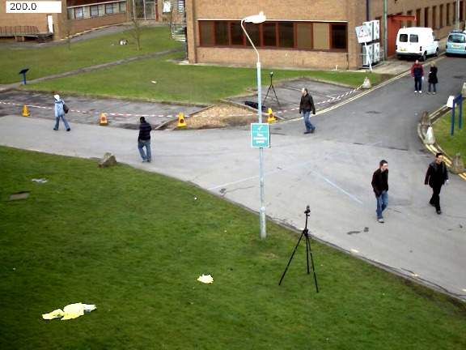
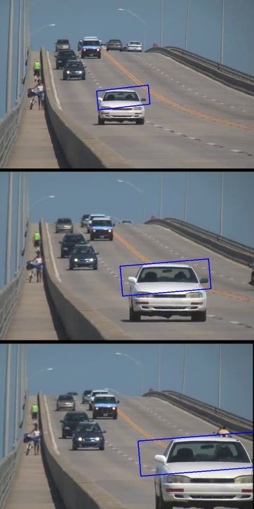

# 如何使用背景减法

在视频流算法上找到用途，例如：运动提取，特征跟踪和前景提取。

我们将学习如何从视频和图像序列中提取前景蒙版并显示它们。

- 背景减法（BS）是通过使用静态相机来生成前景蒙版（即，包含属于场景中的移动物体的像素的二进制图像）的通用且广泛使用的技术。
- 顾名思义，BS计算前景蒙板，在当前帧和背景模型之间执行减法运算，其中包含场景的静态部分，或者更一般而言，考虑到所观察场景的特征，可以将其视为背景的所有内容。


- 后台建模包括两个主要步骤：

  1.后台初始化
  2.后台更新
  第一步，计算背景的初始模型，而在第二步中，更新模型以适应场景中可能的变化。

在本教程中，我们将学习如何使用OpenCV执行BS。

## 目标

在本教程中，您将学习如何：

- 使用cv :: VideoCapture从视频或图像序列中读取数据；
- 通过使用cv :: BackgroundSubtractor类创建和更新背景模型；
- 通过使用cv :: imshow获取并显示前景蒙版；

## 示例代码

在下面，您可以找到源代码。我们将让用户选择处理视频文件或图像序列。

在此示例中，我们将使用`cv :: BackgroundSubtractorMOG2`生成前景蒙版。

结果和输入数据显示在屏幕上。

```python
from __future__ import print_function
import cv2 as cv
import argparse
parser = argparse.ArgumentParser(description='This program shows how to use background subtraction methods provided by \
                                              OpenCV. You can process both videos and images.')
parser.add_argument('--input', type=str, help='Path to a video or a sequence of image.', default='vtest.avi')
parser.add_argument('--algo', type=str, help='Background subtraction method (KNN, MOG2).', default='MOG2')
args = parser.parse_args()
if args.algo == 'MOG2':
    backSub = cv.createBackgroundSubtractorMOG2()
else:
    backSub = cv.createBackgroundSubtractorKNN()
capture = cv.VideoCapture(cv.samples.findFileOrKeep(args.input))
if not capture.isOpened:
    print('Unable to open: ' + args.input)
    exit(0)
while True:
    ret, frame = capture.read()
    if frame is None:
        break
    
    fgMask = backSub.apply(frame)
    
    
    cv.rectangle(frame, (10, 2), (100,20), (255,255,255), -1)
    cv.putText(frame, str(capture.get(cv.CAP_PROP_POS_FRAMES)), (15, 15),
               cv.FONT_HERSHEY_SIMPLEX, 0.5 , (0,0,0))
    
    
    cv.imshow('Frame', frame)
    cv.imshow('FG Mask', fgMask)
    
    keyboard = cv.waitKey(30)
    if keyboard == 'q' or keyboard == 27:
        break
```

## 说明

我们讨论上面代码的主要部分：

- 一个`cv :: BackgroundSubtractor`对象将用于生成前景蒙版。在此示例中，使用了默认参数，但是也可以在create函数中声明特定的参数。

```python
#create Background Subtractor objects
if args.algo == 'MOG2':
    backSub = cv.createBackgroundSubtractorMOG2()
else:
    backSub = cv.createBackgroundSubtractorKNN()
```

- CV :: VideoCapture对象用于读取输入的视频或输入图像序列。

```python
capture = cv.VideoCapture(cv.samples.findFileOrKeep(args.input))
if not capture.isOpened:
    print('Unable to open: ' + args.input)
    exit(0)
```

- 每帧都用于计算前景蒙版和更新背景。如果要更改用于更新背景模型的学习率，可以通过将参数传递给`apply`方法来设置特定的学习率。

```python
#update the background model
fgMask = backSub.apply(frame)
```

- 当前帧号可以从`cv :: VideoCapture`对象中提取，并标记在当前帧的左上角。白色矩形用于突出显示黑色的帧编号。

```python
#get the frame number and write it on the current frame
cv.rectangle(frame, (10, 2), (100,20), (255,255,255), -1)
cv.putText(frame, str(capture.get(cv.CAP_PROP_POS_FRAMES)), (15, 15),
            cv.FONT_HERSHEY_SIMPLEX, 0.5 , (0,0,0))
```

- 我们准备显示当前的输入框和结果。

```python
#show the current frame and the fg masks
cv.imshow('Frame', frame)
cv.imshow('FG Mask', fgMask)
```

## 结果

对于vtest.avi视频，适用于以下框架：



```python
MOG2方法的程序输出如下所示（检测到灰色区域有阴影）：
```


# Meanshift和Camshift

## 目标

在这一章当中，

- 我们将学习用于跟踪视频中对象的Meanshift和Camshift算法。

## 均值漂移

均值移位背后的直觉很简单。考虑一下你有几点。（它可以是像素分布，例如直方图反投影）。您会得到一个小窗口（可能是一个圆形），并且必须将该窗口移到最大像素密度（或最大点数）的区域。如下图所示：


初始窗口以蓝色圆圈显示，名称为“ C1”。其原始中心以蓝色矩形标记，名称为“ C1_o”。但是，如果您找到该窗口内点的质心，则会得到点“ C1_r”（标记为蓝色小圆圈），它是窗口的真实质心。当然，它们不匹配。因此，移动窗口，使新窗口的圆与上一个质心匹配。再次找到新的质心。很可能不会匹配。因此，再次移动它，并继续迭代，以使窗口的中心及其质心落在同一位置（或在很小的期望误差内）。因此，最终您获得的是一个具有最大像素分布的窗口。它带有一个绿色圆圈，名为“ C2”。正如您在图像中看到的，它具有最大的点数。


因此，我们通常会传递直方图反投影图像和初始目标位置。当对象移动时，显然该移动会反映在直方图反投影图像中。结果，meanshift算法将我们的窗口以最大密度移动到新位置。

## OpenCV中的Meanshift

要在OpenCV中使用均值偏移，首先我们需要设置目标，找到其直方图，以便我们可以将目标反投影到每帧上以计算均值偏移。我们还需要提供窗口的初始位置。对于直方图，此处仅考虑色相。另外，为避免由于光线不足而产生错误的值，可以使用`cv.inRange()`函数丢弃光线不足的值。

```python
import numpy as np
import cv2 as cv
import argparse
parser = argparse.ArgumentParser(description='This sample demonstrates the meanshift algorithm. \
                                              The example file can be downloaded from: \
                                              https://www.bogotobogo.com/python/OpenCV_Python/images/mean_shift_tracking/slow_traffic_small.mp4')
parser.add_argument('image', type=str, help='path to image file')
args = parser.parse_args()
cap = cv.VideoCapture(args.image)
# take first frame of the video
ret,frame = cap.read()
# setup initial location of window
x, y, w, h = 300, 200, 100, 50 # simply hardcoded the values
track_window = (x, y, w, h)
# set up the ROI for tracking
roi = frame[y:y+h, x:x+w]
hsv_roi =  cv.cvtColor(roi, cv.COLOR_BGR2HSV)
mask = cv.inRange(hsv_roi, np.array((0., 60.,32.)), np.array((180.,255.,255.)))
roi_hist = cv.calcHist([hsv_roi],[0],mask,[180],[0,180])
cv.normalize(roi_hist,roi_hist,0,255,cv.NORM_MINMAX)
# Setup the termination criteria, either 10 iteration or move by atleast 1 pt
term_crit = ( cv.TERM_CRITERIA_EPS | cv.TERM_CRITERIA_COUNT, 10, 1 )
while(1):
    ret, frame = cap.read()
    if ret == True:
        hsv = cv.cvtColor(frame, cv.COLOR_BGR2HSV)
        dst = cv.calcBackProject([hsv],[0],roi_hist,[0,180],1)
        # apply meanshift to get the new location
        ret, track_window = cv.meanShift(dst, track_window, term_crit)
        # Draw it on image
        x,y,w,h = track_window
        img2 = cv.rectangle(frame, (x,y), (x+w,y+h), 255,2)
        cv.imshow('img2',img2)
        k = cv.waitKey(30) & 0xff
        if k == 27:
            break
    else:
        break
```

我使用的视频中的三帧如下：


## Camshift

您是否密切关注了最后结果？有一个问题。无论汽车离相机很近或非常近，我们的窗口始终具有相同的大小。这是不好的。我们需要根据目标的大小和旋转来调整窗口大小。该解决方案再次来自“ OpenCV Labs”，它被称为CAMshift（连续自适应平均移位），由Gary Bradsky在其1998年的论文《用于感知用户界面中的计算机视觉面部跟踪》中发表,它首先应用均值移位。一旦均值收敛，它将更新窗口的大小,它还可以计算出最合适的椭圆的方向。再次将均值偏移应用于新的缩放搜索窗口和先前的窗口位置。该过程一直持续到达到要求的精度为止。


## OpenCV中的Camshift

它与meanshift相似，但返回一个旋转的矩形（即我们的结果）和box参数（用于在下一次迭代中作为搜索窗口传递）。请参见下面的代码：

```python
import numpy as np
import cv2 as cv
import argparse
parser = argparse.ArgumentParser(description='This sample demonstrates the camshift algorithm. \
                                              The example file can be downloaded from: \
                                              https://www.bogotobogo.com/python/OpenCV_Python/images/mean_shift_tracking/slow_traffic_small.mp4')
parser.add_argument('image', type=str, help='path to image file')
args = parser.parse_args()
cap = cv.VideoCapture(args.image)
# take first frame of the video
ret,frame = cap.read()
# setup initial location of window
x, y, w, h = 300, 200, 100, 50 # simply hardcoded the values
track_window = (x, y, w, h)
# set up the ROI for tracking
roi = frame[y:y+h, x:x+w]
hsv_roi =  cv.cvtColor(roi, cv.COLOR_BGR2HSV)
mask = cv.inRange(hsv_roi, np.array((0., 60.,32.)), np.array((180.,255.,255.)))
roi_hist = cv.calcHist([hsv_roi],[0],mask,[180],[0,180])
cv.normalize(roi_hist,roi_hist,0,255,cv.NORM_MINMAX)
# Setup the termination criteria, either 10 iteration or move by atleast 1 pt
term_crit = ( cv.TERM_CRITERIA_EPS | cv.TERM_CRITERIA_COUNT, 10, 1 )
while(1):
    ret, frame = cap.read()
    if ret == True:
        hsv = cv.cvtColor(frame, cv.COLOR_BGR2HSV)
        dst = cv.calcBackProject([hsv],[0],roi_hist,[0,180],1)
        # apply camshift to get the new location
        ret, track_window = cv.CamShift(dst, track_window, term_crit)
        # Draw it on image
        pts = cv.boxPoints(ret)
        pts = np.int0(pts)
        img2 = cv.polylines(frame,[pts],True, 255,2)
        cv.imshow('img2',img2)
        k = cv.waitKey(30) & 0xff
        if k == 27:
            break
    else:
        break
```

结果显示三帧：


# 光流

## 目标

在这一章当中，

- 我们将了解光流的概念及其使用`Lucas-Kanade`方法的估算。
- 我们将使用`cv.calcOpticalFlowPyrLK()`之类的函数来跟踪视频中的特征点。
- 我们将使用`cv.calcOpticalFlowFarneback()`方法创建一个密集的光流场。

## 光流

光流是图像对象在两个连续帧之间由对象或相机的运动力矩引起的视觉运动的模式。它是2D向量场，其中每个向量都是位移向量，表示点从第一帧到第二帧的运动。请看下面的图片（图片提供：Wikipedia关于Optical Flow的文章）。


它显示了一个球连续5帧运动。箭头显示其位移向量。光流在以下领域有许多应用：

- 运动结构
- 视频压缩
- 视频稳定...
  光流的工作基于以下几个假设：
- 物体的像素强度在连续的帧之间不改变。
- 相邻像素具有相似的运动。

## Lucas-Kanade方法

之前我们已经看到一个假设，即所有相邻像素将具有相似的运动。Lucas-Kanade方法在该点周围需要3x3色块。因此，所有9个点都具有相同的运动。（用Harris拐角检测器检查逆矩阵的相似性。这表示拐角是更好的跟踪点。）

因此，从用户的角度来看，这个想法很简单，我们给一些点进行跟踪，然后接收这些点的光流矢量。但是同样存在一些问题。到现在为止，我们只处理小动作，所以当大动作时它就失败了。为了解决这个问题，我们使用金字塔。当我们上金字塔时，较小的动作将被删除，较大的动作将变为较小的动作。因此，通过在此处应用Lucas-Kanade，我们可以获得与标尺一起的光流。

## OpenCV中的Lucas-Kanade光流

OpenCV在单个函数`cv.calcOpticalFlowPyrLK()`中提供所有这些功能。在这里，我们创建一个简单的应用程序来跟踪视频中的某些点。为了确定点，我们使用`cv.goodFeaturesToTrack()`。我们采用第一帧，检测其中的一些Shi-Tomasi角点，然后使用Lucas-Kanade光流迭代地跟踪这些点。对于函数`cv.calcOpticalFlowPyrLK()`，我们传递前一帧，前一点和下一帧。它返回下一个点以及一些状态编号，如果找到下一个点，则状态值为1，否则为零。我们迭代地将这些下一个点作为下一步中的上一个点传递。请参见下面的代码：

```python
import numpy as np
import cv2 as cv
import argparse
parser = argparse.ArgumentParser(description='This sample demonstrates Lucas-Kanade Optical Flow calculation. \
                                              The example file can be downloaded from: \
                                              https://www.bogotobogo.com/python/OpenCV_Python/images/mean_shift_tracking/slow_traffic_small.mp4')
parser.add_argument('image', type=str, help='path to image file')
args = parser.parse_args()
cap = cv.VideoCapture(args.image)
# params for ShiTomasi corner detection
feature_params = dict( maxCorners = 100,
                       qualityLevel = 0.3,
                       minDistance = 7,
                       blockSize = 7 )
# Parameters for lucas kanade optical flow
lk_params = dict( winSize  = (15,15),
                  maxLevel = 2,
                  criteria = (cv.TERM_CRITERIA_EPS | cv.TERM_CRITERIA_COUNT, 10, 0.03))
# Create some random colors
color = np.random.randint(0,255,(100,3))
# Take first frame and find corners in it
ret, old_frame = cap.read()
old_gray = cv.cvtColor(old_frame, cv.COLOR_BGR2GRAY)
p0 = cv.goodFeaturesToTrack(old_gray, mask = None, **feature_params)
# Create a mask image for drawing purposes
mask = np.zeros_like(old_frame)
while(1):
    ret,frame = cap.read()
    frame_gray = cv.cvtColor(frame, cv.COLOR_BGR2GRAY)
    # calculate optical flow
    p1, st, err = cv.calcOpticalFlowPyrLK(old_gray, frame_gray, p0, None, **lk_params)
    # Select good points
    good_new = p1[st==1]
    good_old = p0[st==1]
    # draw the tracks
    for i,(new,old) in enumerate(zip(good_new, good_old)):
        a,b = new.ravel()
        c,d = old.ravel()
        mask = cv.line(mask, (a,b),(c,d), color[i].tolist(), 2)
        frame = cv.circle(frame,(a,b),5,color[i].tolist(),-1)
    img = cv.add(frame,mask)
    cv.imshow('frame',img)
    k = cv.waitKey(30) & 0xff
    if k == 27:
        break
    # Now update the previous frame and previous points
    old_gray = frame_gray.copy()
    p0 = good_new.reshape(-1,1,2)
```

（此代码不会检查下一个关键点的正确性。因此，即使任何特征点在图像中消失了，光流也有可能找到下一个看起来可能与它接近的下一个点。因此，对于稳健的跟踪，实际上应该以特定的时间间隔检测点。OpenCV样本附带了这样一个样本，该样本每5帧发现一次特征点，并且还对光流点进行了后向检查，以仅选择良好的流点。 lk_track.py）。

查看我们得到的结果：


## OpenCV中的密集光流

Lucas-Kanade方法计算稀疏特征集的光流（在我们的示例中为使用Shi-Tomasi算法检测到的角）。OpenCV提供了另一种算法来查找密集的光流。它计算帧中所有点的光通量。它基于Gunner Farneback的算法，在2003年Gunner Farneback的“基于多项式展开的两帧运动估计”中对此进行了解释。

```python
import numpy as np
import cv2 as cv
cap = cv.VideoCapture(cv.samples.findFile("vtest.avi"))
ret, frame1 = cap.read()
prvs = cv.cvtColor(frame1,cv.COLOR_BGR2GRAY)
hsv = np.zeros_like(frame1)
hsv[...,1] = 255
while(1):
    ret, frame2 = cap.read()
    next = cv.cvtColor(frame2,cv.COLOR_BGR2GRAY)
    flow = cv.calcOpticalFlowFarneback(prvs,next, None, 0.5, 3, 15, 3, 5, 1.2, 0)
    mag, ang = cv.cartToPolar(flow[...,0], flow[...,1])
    hsv[...,0] = ang*180/np.pi/2
    hsv[...,2] = cv.normalize(mag,None,0,255,cv.NORM_MINMAX)
    bgr = cv.cvtColor(hsv,cv.COLOR_HSV2BGR)
    cv.imshow('frame2',bgr)
    k = cv.waitKey(30) & 0xff
    if k == 27:
        break
    elif k == ord('s'):
        cv.imwrite('opticalfb.png',frame2)
        cv.imwrite('opticalhsv.png',bgr)
    prvs = next
```

看到下面的结果：


