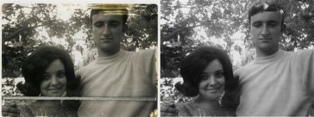

# 图像去噪

## 目标

- 您将了解有关去除图像中噪声的非局部均值去噪算法。
- 您将看到不同的函数，例如`cv.fastNlMeansDenoising()`，`cv.fastNlMeansDenoisingColored()`等。

## 理论

在前面的章节中，我们看到了许多图像平滑技术，例如高斯模糊，中值模糊等，它们在某种程度上可以消除少量噪声。在这些技术中，我们在像素周围采取了一个较小的邻域，并进行了一些操作（例如高斯加权平均值，值的中位数等）来替换中心元素。简而言之，在像素处去除噪声是其周围的局部现象。

有噪音的性质。通常认为噪声是零均值的随机变量。考虑一个有噪声的像素，，其中是像素的真实值，是该像素中的噪声。您可以从不同的图像中获取大量相同的像素（例如）并计算其平均值。

您可以通过简单的设置自己进行验证。将静态相机固定在某个位置几秒钟。这将为您提供很多帧或同一场景的很多图像。然后编写一段代码，找到视频中所有帧的平均值（这对您现在应该太简单了）。比较最终结果和第一帧。您会看到噪音降低。不幸的是，这种简单的方法对摄像机和场景的运动并不稳健。通常，只有一张嘈杂的图像可用。

因此想法很简单，我们需要一组相似的图像来平均噪声。考虑图像中的一个小窗口（例如5x5窗口）。很有可能同一修补程序可能位于图像中的其他位置。有时在它周围的一个小社区中。一起使用这些相似的补丁并找到它们的平均值怎么办？对于那个特定的窗口，这很好。请参阅下面的示例图片：


图像中的蓝色补丁看起来很相似。绿色补丁看起来很相似。因此，我们获取一个像素，在其周围获取一个小窗口，在图像中搜索相似的窗口，对所有窗口求平均，然后用得到的结果替换该像素。此方法是“非本地均值消噪”。与我们之前看到的模糊技术相比，它花费了更多时间，但是效果非常好。在更多资源的第一个链接中可以找到更多详细信息和在线演示。

对于彩色图像，图像将转换为CIELAB色彩空间，然后分别对L和AB分量进行降噪。

## OpenCV中的图像去噪

OpenCV提供了此技术的四个变体。

- `cv.fastNlMeansDenoising()` -使用单个灰度图像
- `cv.fastNlMeansDenoisingColored()` -使用彩色图像。
- `cv.fastNlMeansDenoisingMulti()` -处理在短时间内捕获的图像序列（灰度图像）
- `cv.fastNlMeansDenoisingColoredMulti()` -与上面相同，但用于彩色图像。
  常见的参数有：
- h：决定滤波器强度的参数。较高的h值可以更好地消除噪点，但同时也会消除图像细节。（10可以）
- hForColorComponents：与h相同，但仅适用于彩色图像。（通常与h相同）
- templateWindowSize：应为奇数。（推荐7）
- searchWindowSize：应该为奇数。（建议21）
  请访问其他资源中的第一个链接，以获取有关这些参数的更多详细信息。

我们将在此处演示2和3。剩下的留给您。

### 1. cv.fastNlMeansDenoisingColored()

如上所述，它用于消除彩色图像中的噪点。（噪声可能是高斯的）。请参阅以下示例：

```python
import numpy as np
import cv2 as cv
from matplotlib import pyplot as plt
img = cv.imread('die.png')
dst = cv.fastNlMeansDenoisingColored(img,None,10,10,7,21)
plt.subplot(121),plt.imshow(img)
plt.subplot(122),plt.imshow(dst)
plt.show()
```

以下是结果的放大版本。我的输入图像具有$σ$的高斯噪声= 25


### 2. cv.fastNlMeansDenoisingMulti()

现在，我们将对视频应用相同的方法。第一个参数是噪声帧列表。第二个参数`imgToDenoiseIndex`指定我们需要去噪的帧，为此我们在输入列表中传递帧的索引。第三是`temporalWindowSize`，它指定要用于降噪的附近帧的数量。应该很奇怪。在那种情况下，总共使用`temporalWindowSize`帧，其中中心帧是要去噪的帧。例如，您传递了一个5帧的列表作为输入。令`imgToDenoiseIndex = 2`，`temporalWindowSize =3`。然后使用frame-1，frame-2和frame-3去噪frame-2。让我们来看一个例子。

```python
import numpy as np
import cv2 as cv
from matplotlib import pyplot as plt
cap = cv.VideoCapture('vtest.avi')
# create a list of first 5 frames
img = [cap.read()[1] for i in xrange(5)]
# convert all to grayscale
gray = [cv.cvtColor(i, cv.COLOR_BGR2GRAY) for i in img]
# convert all to float64
gray = [np.float64(i) for i in gray]
# create a noise of variance 25
noise = np.random.randn(*gray[1].shape)*10
# Add this noise to images
noisy = [i+noise for i in gray]
# Convert back to uint8
noisy = [np.uint8(np.clip(i,0,255)) for i in noisy]
# Denoise 3rd frame considering all the 5 frames
dst = cv.fastNlMeansDenoisingMulti(noisy, 2, 5, None, 4, 7, 35)
plt.subplot(131),plt.imshow(gray[2],'gray')
plt.subplot(132),plt.imshow(noisy[2],'gray')
plt.subplot(133),plt.imshow(dst,'gray')
plt.show()
```

下图显示了我们得到的结果的放大版本：


计算需要花费大量时间。结果，第一个图像是原始帧，第二个是噪点图像，第三个是去噪图像。

## 其他资源

http://www.ipol.im/pub/art/2011/bcm_nlm/（包含详细信息，在线演示等。强烈建议访问。我们的测试图像是从此链接生成的）

# 图像修复

## 目标

在这一章当中，

- 我们将学习如何通过称为“修复”的方法消除旧照片中的小噪音，笔触等。
- 我们将在OpenCV中看到修复功能。

## 基础

你们大多数人家里都会有一些旧的退化照片，上面有黑点，一些笔触等。您是否曾经想过将其还原？我们不能简单地在绘画工具中擦除它们，因为它将简单地用白色结构代替黑色结构，这是没有用的。在这些情况下，将使用一种称为图像修复的技术。基本思想很简单：用附近的像素替换那些不良标记，使其看起来像附近。考虑下面显示的图像（摘自Wikipedia）：



为此目的设计了几种算法，OpenCV提供了其中两种。两者都可以通过相同的函数`cv.inpaint()`访问

第一种算法基于Alexandru Telea在2004年发表的论文“基于快速行进方法的图像修复技术” 。它基于快速行进方法。考虑图像中要修复的区域。算法从该区域的边界开始，并进入该区域内部，然后逐渐填充边界中的所有内容。在要修复的邻域上的像素周围需要一个小的邻域。该像素被附近所有已知像素的归一化加权总和所代替。权重的选择很重要。那些位于该点附近，边界法线附近的像素和那些位于边界轮廓线上的像素将获得更大的权重。修复像素后，将使用快速行进方法将其移动到下一个最近的像素。FMM确保首先修复已知像素附近的那些像素，以便像手动启发式操作一样工作。通过使用标志启用此算法，`cv.INPAINT_TELEA`。

第二种算法基于Bertalmio，Marcelo，Andrea L.Bertozzi和Guillermo Sapiro在2001年发表的论文“ Navier-Stokes，流体动力学以及图像和视频修补”。该算法基于流体动力学并利用了偏微分方程。基本原理是启发式的。它首先沿着边缘从已知区域移动到未知区域（因为边缘是连续的）。它延续了等渗线（线条连接具有相同强度的点，就像轮廓线连接具有相同高程的点一样），同时在修复区域的边界匹配梯度矢量。为此，使用了一些流体动力学方法。获得它们后，将填充颜色以减少该区域的最小差异。通过使用标志`cv.INPAINT_NS`启用此算法。

## 示例代码

我们需要创建一个与输入图像大小相同的蒙版，其中非零像素对应于要修复的区域。其他一切都很简单。我的图像因一些黑色笔画而退化（我手动添加了）。我使用“绘画”工具创建了相应的笔触。

```python
import numpy as np
import cv2 as cv
img = cv.imread('messi_2.jpg')
mask = cv.imread('mask2.png',0)
dst = cv.inpaint(img,mask,3,cv.INPAINT_TELEA)
cv.imshow('dst',dst)
cv.waitKey(0)
cv.destroyAllWindows()
```

请参阅下面的结果。第一张图片显示了降级的输入。第二个图像是蒙版。第三个图像是第一个算法的结果，最后一个图像是第二个算法的结果。


# 高动态范围（HDR）

## 目标

- 了解如何根据曝光顺序生成和显示HDR图像。
- 使用曝光融合来合并曝光序列。

## 理论

高动态范围成像（HDRI或HDR）是一种用于成像和摄影的技术，可比标准数字成像或摄影技术重现更大的动态光度范围。虽然人眼可以适应各种光照条件，但是大多数成像设备每个通道使用8位，因此我们仅限于256级。当我们拍摄现实世界的照片时，明亮的区域可能会曝光过度，而黑暗的区域可能会曝光不足，因此我们无法一次曝光就捕获所有细节。HDR成像适用于每个通道使用8位以上（通常为32位浮点值）的图像，从而允许更大的动态范围。

获取HDR图像的方法有多种，但是最常见的一种方法是使用以不同曝光值拍摄的场景照片。要组合这些曝光，了解相机的响应功能并有一些算法可以对其进行估计是很有用的。合并HDR图像后，必须将其转换回8位才能在常规显示器上查看。此过程称为音调映射。当场景或相机的对象在两次拍摄之间移动时，还会增加其他复杂性，因为应记录并调整具有不同曝光度的图像。

在本教程中，我们展示了两种算法（Debevec，Robertson）来根据曝光序列生成和显示HDR图像，并演示了另一种称为曝光融合（Mertens）的方法，该方法可以生成低动态范围图像，并且不需要曝光时间数据。此外，我们估计相机响应函数（CRF）对于许多计算机视觉算法都具有重要价值。HDR流水线的每个步骤都可以使用不同的算法和参数来实现，因此请查看参考手册以了解所有内容。

## 曝光顺序HDR

在本教程中，我们将查看以下场景，其中有4张曝光图像，曝光时间分别为15、2.5、1 / 4和1/30秒。（您可以从Wikipedia下载图像）


### 1.将曝光图像加载到列表中

第一步只是将所有图像加载到列表中。此外，我们将需要常规HDR算法的曝光时间。请注意数据类型，因为图像应为1通道或3通道8位（np.uint8），并且曝光时间必须为float32，以秒为单位。

```python
import cv2 as cv
import numpy as np
# Loading exposure images into a list
img_fn = ["img0.jpg", "img1.jpg", "img2.jpg", "img3.jpg"]
img_list = [cv.imread(fn) for fn in img_fn]
exposure_times = np.array([15.0, 2.5, 0.25, 0.0333], dtype=np.float32)
```

### 2.将曝光合并到HDR图像中

在此阶段，我们将曝光序列合并为一张HDR图像，显示了OpenCV中的两种可能性。第一种方法是Debevec，第二种方法是Robertson。请注意，HDR图像的类型为float32，而不是uint8，因为它包含所有曝光图像的完整动态范围。

```python
# Merge exposures to HDR image
merge_debevec = cv.createMergeDebevec()
hdr_debevec = merge_debevec.process(img_list, times=exposure_times.copy())
merge_robertson = cv.createMergeRobertson()
hdr_robertson = merge_robertson.process(img_list, times=exposure_times.copy())
```

### 3.色调图HDR图像

我们将32位浮点HDR数据映射到[0..1]范围内。实际上，在某些情况下，该值可以大于1或小于0，因此请注意，我们稍后将不得不裁剪数据以避免溢出。

```python
# Tonemap HDR image
tonemap1 = cv.createTonemap(gamma=2.2)
res_debevec = tonemap1.process(hdr_debevec.copy())
```

### 4.使用Mertens融合合并曝光

在这里，我们展示了一种替代算法，用于合并曝光图像，而我们不需要曝光时间。我们也不需要使用任何色调映射算法，因为Mertens算法已经为我们提供了[0..1]范围内的结果。

```python
# Exposure fusion using Mertens
merge_mertens = cv.createMergeMertens()
res_mertens = merge_mertens.process(img_list)
```

### 5.转换为8位并保存

为了保存或显示结果，我们需要将数据转换为[0..255]范围内的8位整数。

```python
# Convert datatype to 8-bit and save
res_debevec_8bit = np.clip(res_debevec*255, 0, 255).astype('uint8')
res_robertson_8bit = np.clip(res_robertson*255, 0, 255).astype('uint8')
res_mertens_8bit = np.clip(res_mertens*255, 0, 255).astype('uint8')
cv.imwrite("ldr_debevec.jpg", res_debevec_8bit)
cv.imwrite("ldr_robertson.jpg", res_robertson_8bit)
cv.imwrite("fusion_mertens.jpg", res_mertens_8bit)
```

## 结果

您可以看到不同的结果，但可以认为每种算法都有其他额外的参数，您应该将它们附加以达到期望的结果。最佳实践是尝试不同的方法，然后看看哪种方法最适合您的场景。

### Debevec:


### Robertson:


### Mertenes Fusion:


## 估计相机响应功能

摄像机响应功能（CRF）使我们可以将场景辐射度与测得的强度值联系起来。CRF在某些计算机视觉算法（包括HDR算法）中非常重要。在这里，我们估计逆相机响应函数并将其用于HDR合并。

```python
# Estimate camera response function (CRF)
cal_debevec = cv.createCalibrateDebevec()
crf_debevec = cal_debevec.process(img_list, times=exposure_times)
hdr_debevec = merge_debevec.process(img_list, times=exposure_times.copy(), response=crf_debevec.copy())
cal_robertson = cv.createCalibrateRobertson()
crf_robertson = cal_robertson.process(img_list, times=exposure_times)
hdr_robertson = merge_robertson.process(img_list, times=exposure_times.copy(), response=crf_robertson.copy())
```

相机响应功能由每个颜色通道的256长度向量表示。对于此序列，我们得到以下估计：
